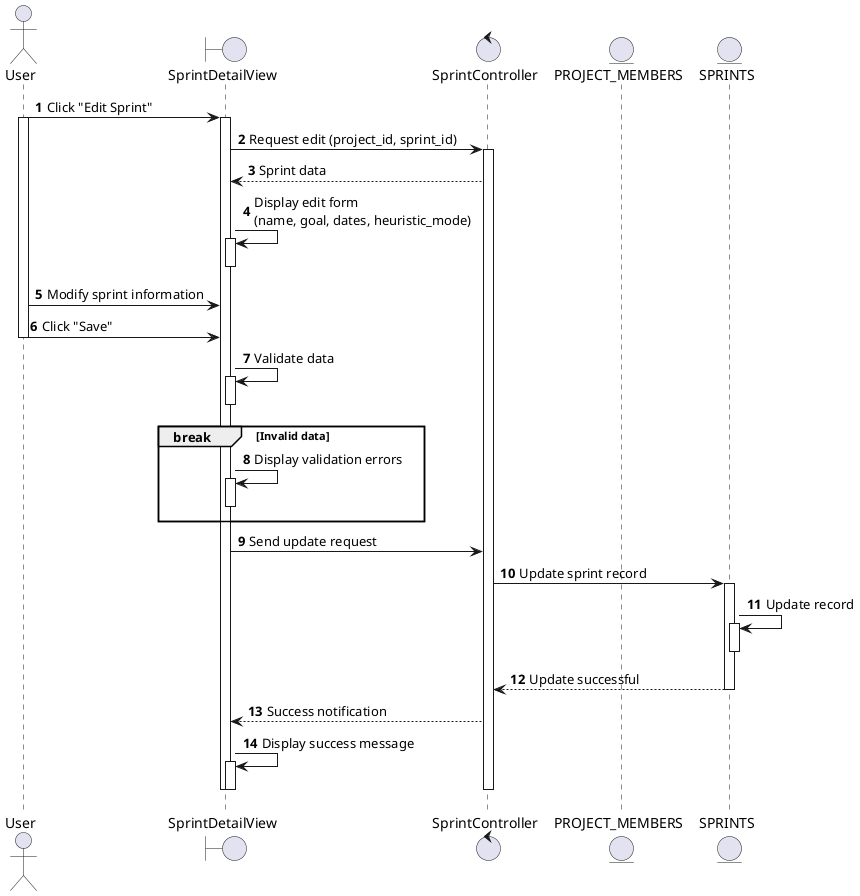

# Sequence Update Sprint Information

```plantuml
@startuml
autonumber

actor User as U
boundary SprintDetailView as SDV
control SprintController as SC
entity PROJECT_MEMBERS as PM
entity SPRINTS as SP

U -> SDV: Click "Edit Sprint"
activate U
activate SDV

SDV -> SC: Request edit (project_id, sprint_id)
activate SC

SDV <-- SC: Sprint data

SDV -> SDV: Display edit form\n(name, goal, dates, heuristic_mode)
activate SDV
deactivate SDV

U -> SDV: Modify sprint information
U -> SDV: Click "Save"
deactivate U

SDV -> SDV: Validate data
activate SDV
deactivate SDV

break Invalid data
    SDV -> SDV: Display validation errors
    activate SDV
    deactivate SDV
end

SDV -> SC: Send update request

SC -> SP: Update sprint record
activate SP
SP -> SP: Update record
activate SP
deactivate SP
SC <-- SP: Update successful
deactivate SP

SDV <-- SC: Success notification

SDV -> SDV: Display success message
activate SDV
deactivate SDV

deactivate SC
deactivate SDV

@enduml
```

<!-- diagram id="sequence-sprint-management-update-sprint-information" -->
