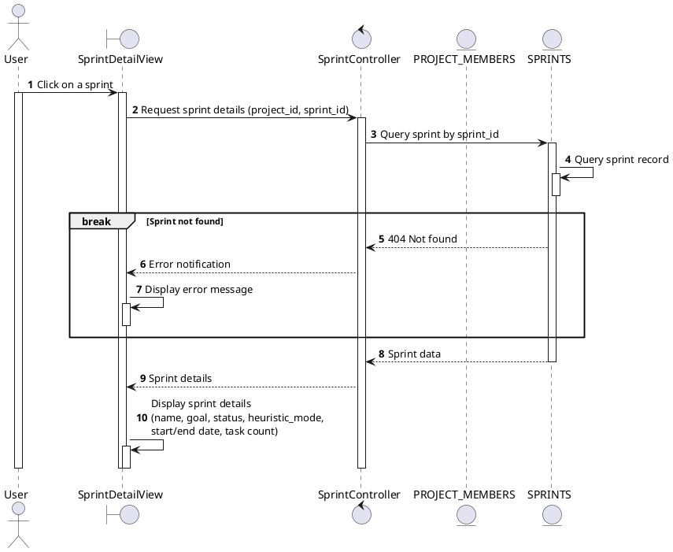

# Sequence View Sprint Details

```plantuml
@startuml
autonumber

actor User as U
boundary SprintDetailView as SDV
control SprintController as SC
entity PROJECT_MEMBERS as PM
entity SPRINTS as SP

U -> SDV: Click on a sprint
activate U
activate SDV

SDV -> SC: Request sprint details (project_id, sprint_id)
activate SC

SC -> SP: Query sprint by sprint_id
activate SP
SP -> SP: Query sprint record
activate SP
deactivate SP

break Sprint not found
    SC <-- SP: 404 Not found
    SDV <-- SC: Error notification
    SDV -> SDV: Display error message
    activate SDV
    deactivate SDV
end

SC <-- SP: Sprint data
deactivate SP
SDV <-- SC: Sprint details

SDV -> SDV: Display sprint details\n(name, goal, status, heuristic_mode,\nstart/end date, task count)
activate SDV
deactivate SDV

deactivate SC
deactivate SDV
deactivate U

@enduml
```

<!-- diagram id="sequence-sprint-management-view-sprint-details" -->
