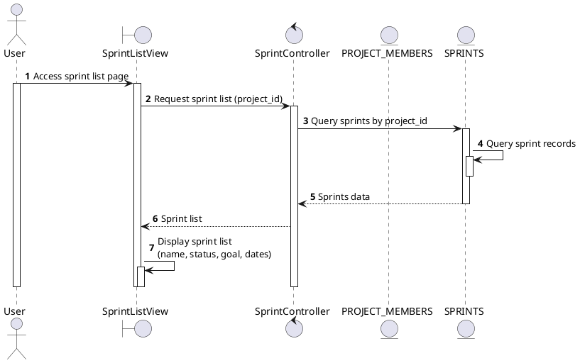

# Sequence View Sprint List

```plantuml
@startuml
autonumber

actor User as U
boundary SprintListView as SLV
control SprintController as SC
entity PROJECT_MEMBERS as PM
entity SPRINTS as SP

U -> SLV: Access sprint list page
activate U
activate SLV

SLV -> SC: Request sprint list (project_id)
activate SC

SC -> SP: Query sprints by project_id
activate SP
SP -> SP: Query sprint records
activate SP
deactivate SP
SC <-- SP: Sprints data
deactivate SP

SLV <-- SC: Sprint list

SLV -> SLV: Display sprint list\n(name, status, goal, dates)
activate SLV
deactivate SLV

deactivate SC
deactivate SLV
deactivate U

@enduml
```

<!-- diagram id="sequence-sprint-management-view-sprint-list" -->
