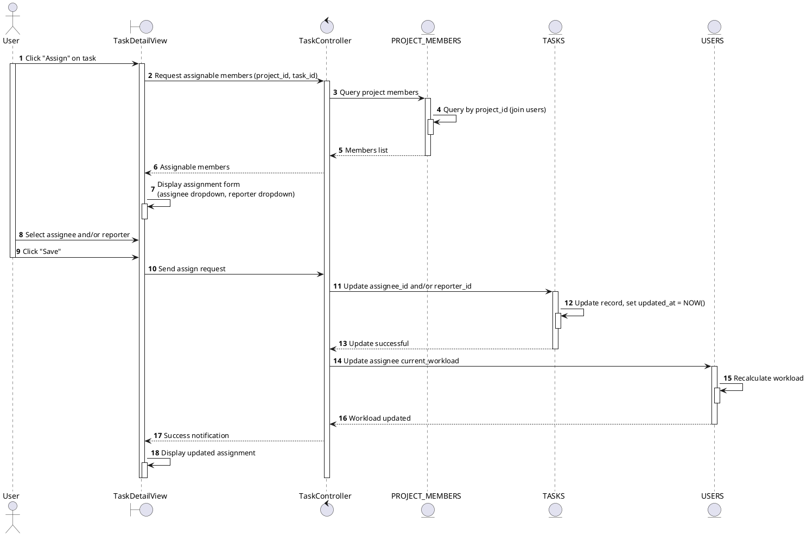

# Sequence Assign Assignee & Reporter

```plantuml
@startuml
autonumber

actor User as U
boundary TaskDetailView as TDV
control TaskController as TC
entity PROJECT_MEMBERS as PM
entity TASKS as T
entity USERS as US

U -> TDV: Click "Assign" on task
activate U
activate TDV

TDV -> TC: Request assignable members (project_id, task_id)
activate TC

TC -> PM: Query project members
activate PM
PM -> PM: Query by project_id (join users)
activate PM
deactivate PM
TC <-- PM: Members list
deactivate PM

TDV <-- TC: Assignable members

TDV -> TDV: Display assignment form\n(assignee dropdown, reporter dropdown)
activate TDV
deactivate TDV

U -> TDV: Select assignee and/or reporter
U -> TDV: Click "Save"
deactivate U

TDV -> TC: Send assign request

TC -> T: Update assignee_id and/or reporter_id
activate T
T -> T: Update record, set updated_at = NOW()
activate T
deactivate T
TC <-- T: Update successful
deactivate T

TC -> US: Update assignee current_workload
activate US
US -> US: Recalculate workload
activate US
deactivate US
TC <-- US: Workload updated
deactivate US

TDV <-- TC: Success notification

TDV -> TDV: Display updated assignment
activate TDV
deactivate TDV

deactivate TC
deactivate TDV

@enduml
```

<!-- diagram id="sequence-task-management-assign-assignee-reporter" -->
