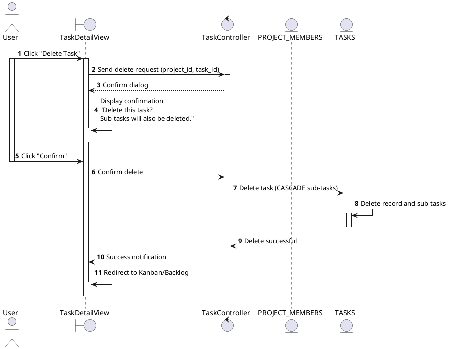

# Sequence Delete Task

```plantuml
@startuml
autonumber

actor User as U
boundary TaskDetailView as TDV
control TaskController as TC
entity PROJECT_MEMBERS as PM
entity TASKS as T

U -> TDV: Click "Delete Task"
activate U
activate TDV

TDV -> TC: Send delete request (project_id, task_id)
activate TC

TDV <-- TC: Confirm dialog

TDV -> TDV: Display confirmation\n"Delete this task?\nSub-tasks will also be deleted."
activate TDV
deactivate TDV

U -> TDV: Click "Confirm"
deactivate U

TDV -> TC: Confirm delete

TC -> T: Delete task (CASCADE sub-tasks)
activate T
T -> T: Delete record and sub-tasks
activate T
deactivate T
TC <-- T: Delete successful
deactivate T

TDV <-- TC: Success notification

TDV -> TDV: Redirect to Kanban/Backlog
activate TDV
deactivate TDV

deactivate TC
deactivate TDV

@enduml
```

<!-- diagram id="sequence-task-management-delete-task" -->
