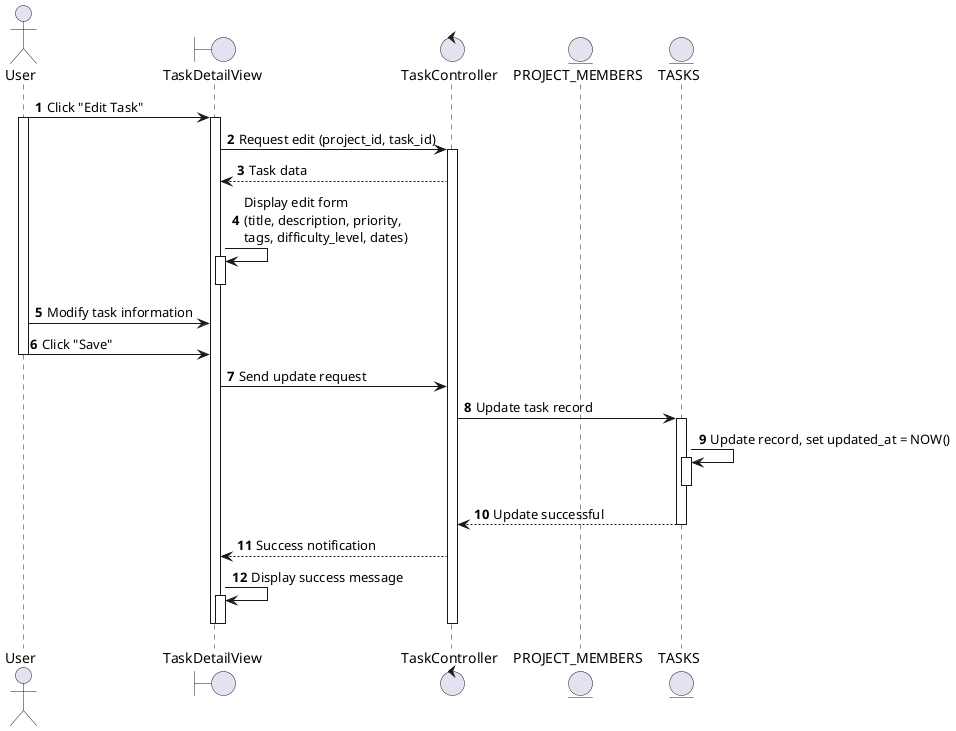

# Sequence Update Task Information

```plantuml
@startuml
autonumber

actor User as U
boundary TaskDetailView as TDV
control TaskController as TC
entity PROJECT_MEMBERS as PM
entity TASKS as T

U -> TDV: Click "Edit Task"
activate U
activate TDV

TDV -> TC: Request edit (project_id, task_id)
activate TC

TDV <-- TC: Task data

TDV -> TDV: Display edit form\n(title, description, priority,\ntags, difficulty_level, dates)
activate TDV
deactivate TDV

U -> TDV: Modify task information
U -> TDV: Click "Save"
deactivate U

TDV -> TC: Send update request

TC -> T: Update task record
activate T
T -> T: Update record, set updated_at = NOW()
activate T
deactivate T
TC <-- T: Update successful
deactivate T

TDV <-- TC: Success notification

TDV -> TDV: Display success message
activate TDV
deactivate TDV

deactivate TC
deactivate TDV

@enduml
```

<!-- diagram id="sequence-task-management-update-task-information" -->
