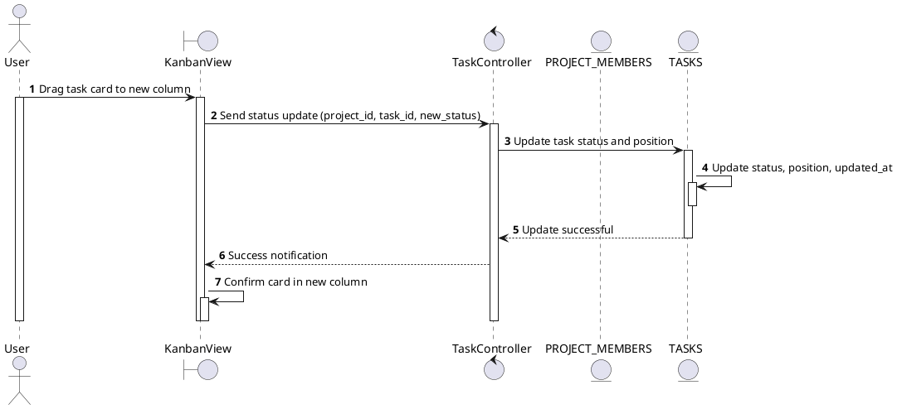

# Sequence Update Task Status (Drag & Drop)

```plantuml
@startuml
autonumber

actor User as U
boundary KanbanView as KV
control TaskController as TC
entity PROJECT_MEMBERS as PM
entity TASKS as T

U -> KV: Drag task card to new column
activate U
activate KV

KV -> TC: Send status update (project_id, task_id, new_status)
activate TC

TC -> T: Update task status and position
activate T
T -> T: Update status, position, updated_at
activate T
deactivate T
TC <-- T: Update successful
deactivate T

KV <-- TC: Success notification

KV -> KV: Confirm card in new column
activate KV
deactivate KV

deactivate TC
deactivate KV
deactivate U

@enduml
```

<!-- diagram id="sequence-task-management-update-task-status" -->
