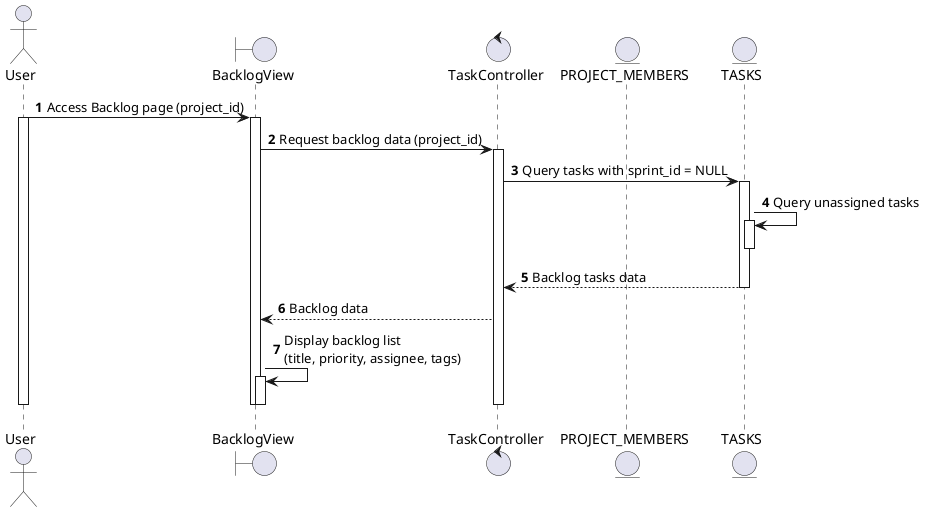

# Sequence View Backlog

```plantuml
@startuml
autonumber

actor User as U
boundary BacklogView as BV
control TaskController as TC
entity PROJECT_MEMBERS as PM
entity TASKS as T

U -> BV: Access Backlog page (project_id)
activate U
activate BV

BV -> TC: Request backlog data (project_id)
activate TC

TC -> T: Query tasks with sprint_id = NULL
activate T
T -> T: Query unassigned tasks
activate T
deactivate T
TC <-- T: Backlog tasks data
deactivate T

BV <-- TC: Backlog data

BV -> BV: Display backlog list\n(title, priority, assignee, tags)
activate BV
deactivate BV

deactivate TC
deactivate BV
deactivate U

@enduml
```

<!-- diagram id="sequence-task-management-view-backlog" -->
