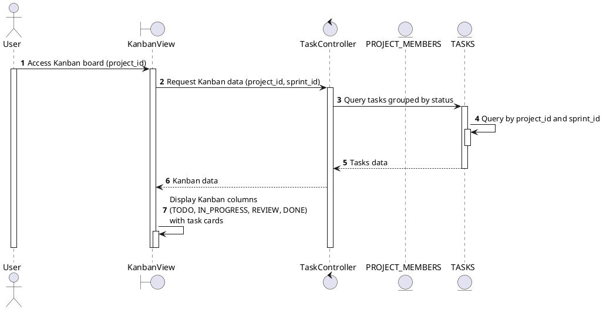

# Sequence View Kanban Board

```plantuml
@startuml
autonumber

actor User as U
boundary KanbanView as KV
control TaskController as TC
entity PROJECT_MEMBERS as PM
entity TASKS as T

U -> KV: Access Kanban board (project_id)
activate U
activate KV

KV -> TC: Request Kanban data (project_id, sprint_id)
activate TC

TC -> T: Query tasks grouped by status
activate T
T -> T: Query by project_id and sprint_id
activate T
deactivate T
TC <-- T: Tasks data
deactivate T

KV <-- TC: Kanban data

KV -> KV: Display Kanban columns\n(TODO, IN_PROGRESS, REVIEW, DONE)\nwith task cards
activate KV
deactivate KV

deactivate TC
deactivate KV
deactivate U

@enduml
```

<!-- diagram id="sequence-task-management-view-kanban-board" -->
