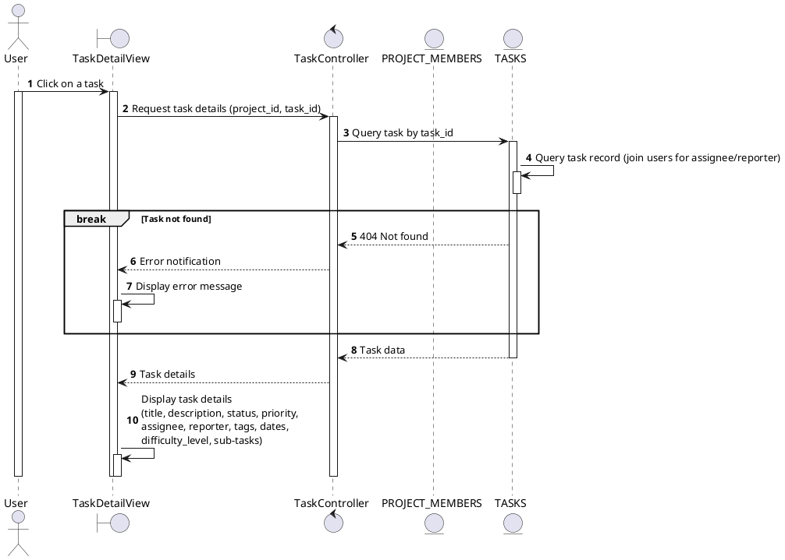

# Sequence View Task Details

```plantuml
@startuml
autonumber

actor User as U
boundary TaskDetailView as TDV
control TaskController as TC
entity PROJECT_MEMBERS as PM
entity TASKS as T

U -> TDV: Click on a task
activate U
activate TDV

TDV -> TC: Request task details (project_id, task_id)
activate TC

TC -> T: Query task by task_id
activate T
T -> T: Query task record (join users for assignee/reporter)
activate T
deactivate T

break Task not found
    TC <-- T: 404 Not found
    TDV <-- TC: Error notification
    TDV -> TDV: Display error message
    activate TDV
    deactivate TDV
end

TC <-- T: Task data
deactivate T
TDV <-- TC: Task details

TDV -> TDV: Display task details\n(title, description, status, priority,\nassignee, reporter, tags, dates,\ndifficulty_level, sub-tasks)
activate TDV
deactivate TDV

deactivate TC
deactivate TDV
deactivate U

@enduml
```

<!-- diagram id="sequence-task-management-view-task-details" -->
