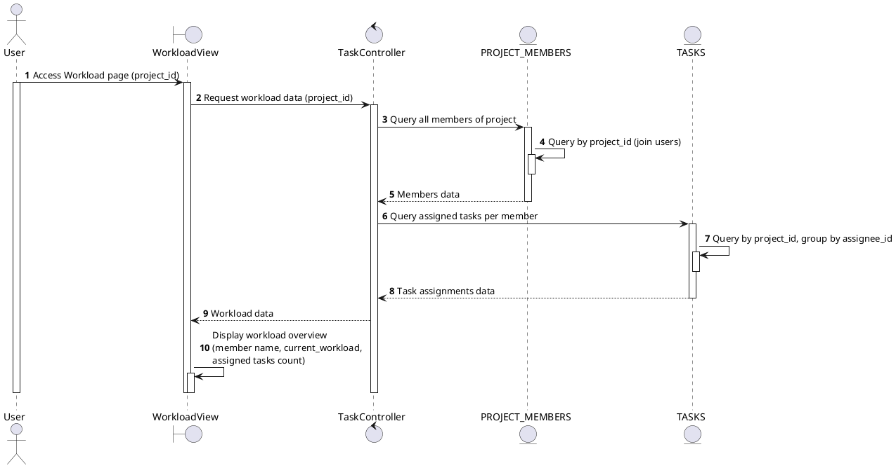

# Sequence View Workload

```plantuml
@startuml
autonumber

actor User as U
boundary WorkloadView as WV
control TaskController as TC
entity PROJECT_MEMBERS as PM
entity TASKS as T

U -> WV: Access Workload page (project_id)
activate U
activate WV

WV -> TC: Request workload data (project_id)
activate TC

TC -> PM: Query all members of project
activate PM
PM -> PM: Query by project_id (join users)
activate PM
deactivate PM
TC <-- PM: Members data
deactivate PM

TC -> T: Query assigned tasks per member
activate T
T -> T: Query by project_id, group by assignee_id
activate T
deactivate T
TC <-- T: Task assignments data
deactivate T

WV <-- TC: Workload data

WV -> WV: Display workload overview\n(member name, current_workload,\nassigned tasks count)
activate WV
deactivate WV

deactivate TC
deactivate WV
deactivate U

@enduml
```

<!-- diagram id="sequence-task-management-view-workload" -->
