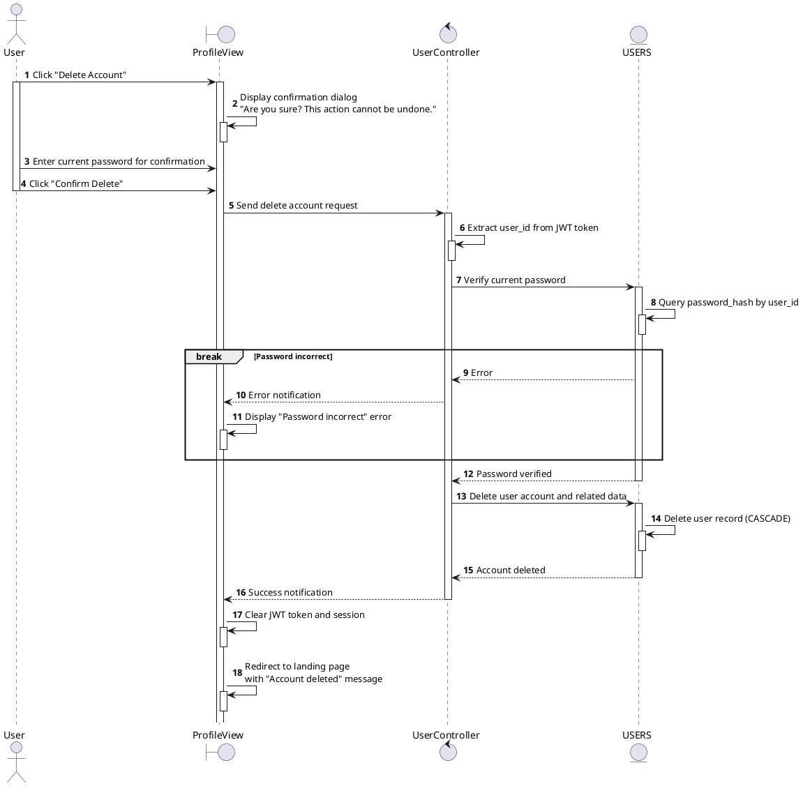

# Sequence Delete Personal Account

```plantuml
@startuml
autonumber

actor User as U
boundary ProfileView as PV
control UserController as UC
entity USERS as US

U -> PV: Click "Delete Account"
activate U
activate PV
PV -> PV: Display confirmation dialog\n"Are you sure? This action cannot be undone."
activate PV
deactivate PV

U -> PV: Enter current password for confirmation
U -> PV: Click "Confirm Delete"
deactivate U
PV -> UC: Send delete account request
activate UC
UC -> UC: Extract user_id from JWT token
activate UC
deactivate UC

UC -> US: Verify current password
activate US
US -> US: Query password_hash by user_id
activate US
deactivate US

break Password incorrect
  UC <-- US: Error
  PV <-- UC: Error notification
  PV -> PV: Display "Password incorrect" error
  activate PV
  deactivate PV
end

UC <-- US: Password verified
deactivate US

UC -> US: Delete user account and related data
activate US
US -> US: Delete user record (CASCADE)
activate US
deactivate US
UC <-- US: Account deleted
deactivate US

PV <-- UC: Success notification
deactivate UC
PV -> PV: Clear JWT token and session
activate PV
deactivate PV
PV -> PV: Redirect to landing page\nwith "Account deleted" message
activate PV
deactivate PV

@enduml
```

<!-- diagram id="sequence-user-profile-delete-personal-account" -->
