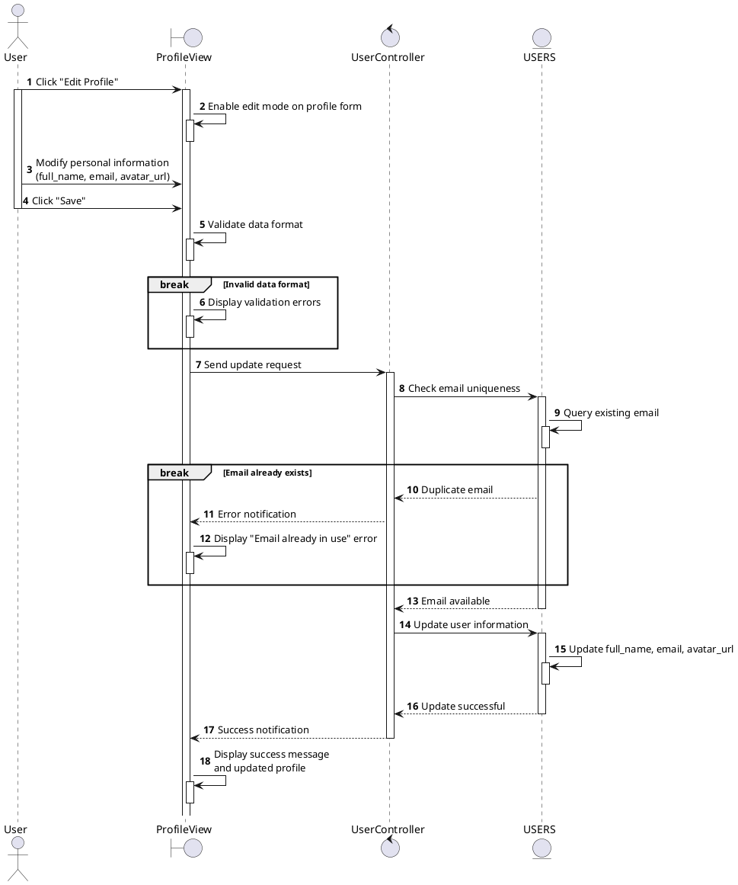

# Sequence Update Personal Information

```plantuml
@startuml
autonumber

actor User as U
boundary ProfileView as PV
control UserController as UC
entity USERS as US

U -> PV: Click "Edit Profile"
activate U
activate PV

PV -> PV: Enable edit mode on profile form
activate PV
deactivate PV

U -> PV: Modify personal information\n(full_name, email, avatar_url)
U -> PV: Click "Save"
deactivate U

PV -> PV: Validate data format
activate PV
deactivate PV

break Invalid data format
  PV -> PV: Display validation errors
  activate PV
  deactivate PV
end

PV -> UC: Send update request
activate UC

UC -> US: Check email uniqueness
activate US
US -> US: Query existing email
activate US
deactivate US

break Email already exists
  UC <-- US: Duplicate email
  PV <-- UC: Error notification
  PV -> PV: Display "Email already in use" error
  activate PV
  deactivate PV
end

UC <-- US: Email available
deactivate US

UC -> US: Update user information
activate US
US -> US: Update full_name, email, avatar_url
activate US
deactivate US
UC <-- US: Update successful
deactivate US

PV <-- UC: Success notification
deactivate UC

PV -> PV: Display success message\nand updated profile
activate PV
deactivate PV

@enduml
```

<!-- diagram id="sequence-user-profile-update-personal-information" -->
