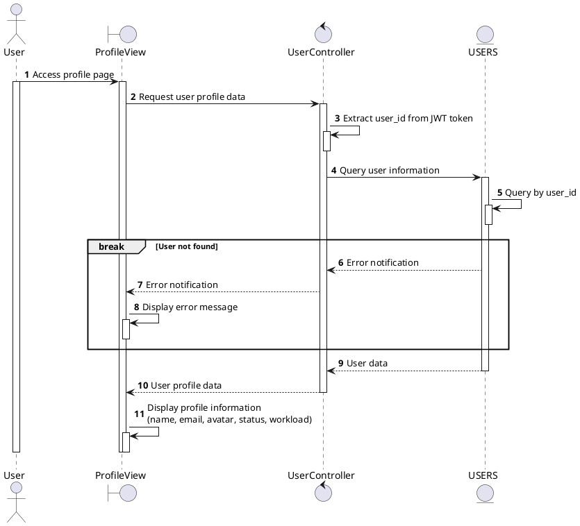

# Sequence View User Profile

```plantuml
@startuml
autonumber

actor User as U
boundary ProfileView as PV
control UserController as UC
entity USERS as US

U -> PV: Access profile page
activate U
activate PV
PV -> UC: Request user profile data
activate UC
UC -> UC: Extract user_id from JWT token
activate UC
deactivate UC
UC -> US: Query user information
activate US
US -> US: Query by user_id
activate US
deactivate US

break User not found
  UC <-- US: Error notification
  PV <-- UC: Error notification
  PV -> PV: Display error message
  activate PV
  deactivate PV
end

UC <-- US: User data
deactivate US
PV <-- UC: User profile data
deactivate UC
PV -> PV: Display profile information\n(name, email, avatar, status, workload)
activate PV
deactivate PV
deactivate PV
deactivate U

@enduml
```

<!-- diagram id="sequence-user-profile-view-user-profile" -->
