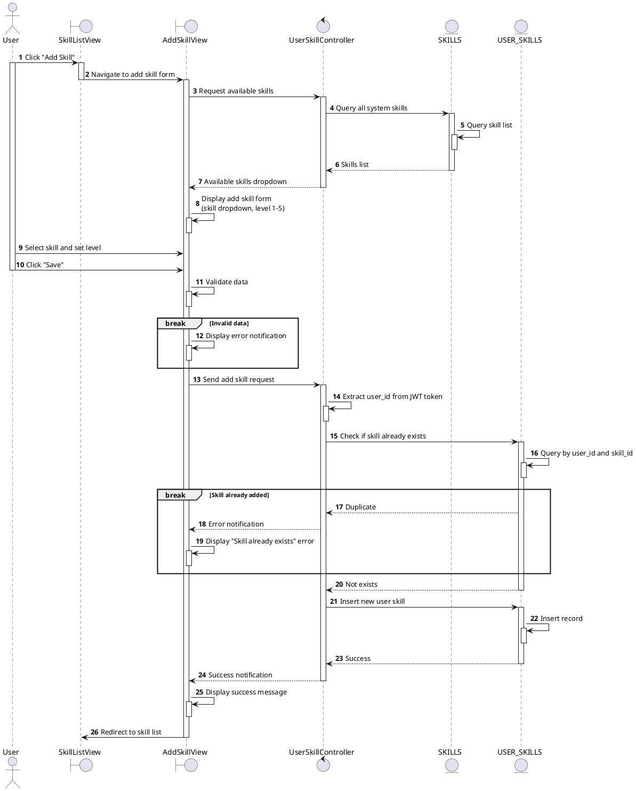

# Sequence Add Personal Skill

```plantuml
@startuml
autonumber

actor User as U
boundary SkillListView as SLV
boundary AddSkillView as ASV
control UserSkillController as USC
entity SKILLS as SK
entity USER_SKILLS as USK

U -> SLV: Click "Add Skill"
activate U
activate SLV
SLV -> ASV: Navigate to add skill form
deactivate SLV
activate ASV
ASV -> USC: Request available skills
activate USC
USC -> SK: Query all system skills
activate SK
SK -> SK: Query skill list
activate SK
deactivate SK
USC <-- SK: Skills list
deactivate SK
ASV <-- USC: Available skills dropdown
deactivate USC
ASV -> ASV: Display add skill form\n(skill dropdown, level 1-5)
activate ASV
deactivate ASV

U -> ASV: Select skill and set level
U -> ASV: Click "Save"
deactivate U
ASV -> ASV: Validate data
activate ASV
deactivate ASV

break Invalid data
  ASV -> ASV: Display error notification
  activate ASV
  deactivate ASV
end

ASV -> USC: Send add skill request
activate USC
USC -> USC: Extract user_id from JWT token
activate USC
deactivate USC

USC -> USK: Check if skill already exists
activate USK
USK -> USK: Query by user_id and skill_id
activate USK
deactivate USK

break Skill already added
  USC <-- USK: Duplicate
  ASV <-- USC: Error notification
  ASV -> ASV: Display "Skill already exists" error
  activate ASV
  deactivate ASV
end

USC <-- USK: Not exists
deactivate USK

USC -> USK: Insert new user skill
activate USK
USK -> USK: Insert record
activate USK
deactivate USK
USC <-- USK: Success
deactivate USK

ASV <-- USC: Success notification
deactivate USC
ASV -> ASV: Display success message
activate ASV
deactivate ASV
ASV -> SLV: Redirect to skill list
deactivate ASV

@enduml
```

<!-- diagram id="sequence-user-skills-add-personal-skill" -->
