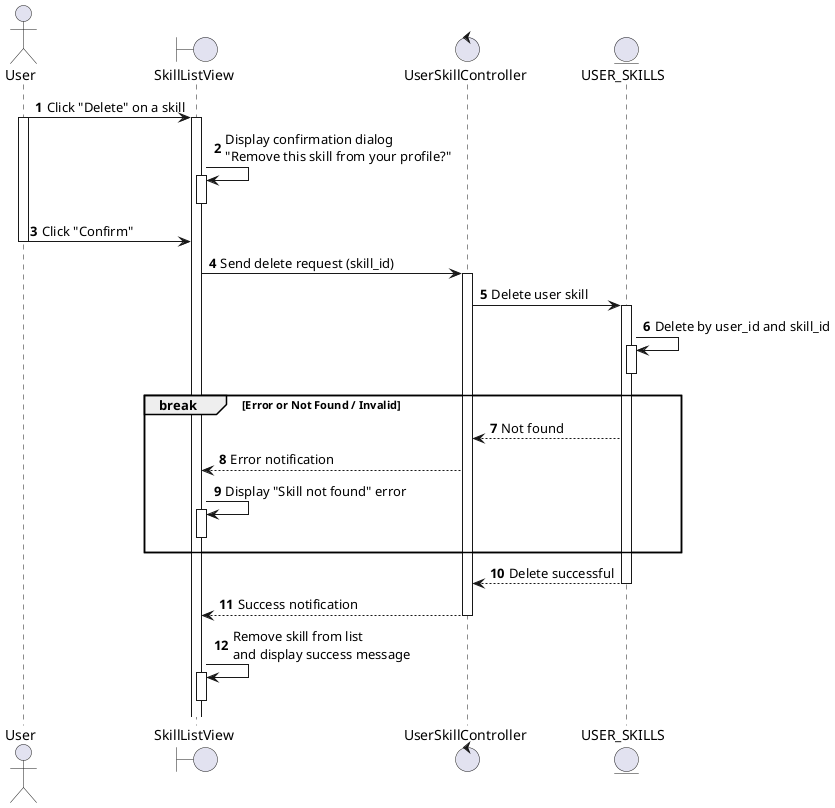

# Sequence Delete Personal Skill

```plantuml
@startuml
autonumber

actor User as U
boundary SkillListView as SLV
control UserSkillController as USC
entity USER_SKILLS as USK

U -> SLV: Click "Delete" on a skill
activate U
activate SLV

SLV -> SLV: Display confirmation dialog\n"Remove this skill from your profile?"
activate SLV
deactivate SLV

U -> SLV: Click "Confirm"
deactivate U

SLV -> USC: Send delete request (skill_id)
activate USC

USC -> USK: Delete user skill
activate USK
USK -> USK: Delete by user_id and skill_id
activate USK
deactivate USK

break Error or Not Found / Invalid
  USC <-- USK: Not found
  SLV <-- USC: Error notification
  SLV -> SLV: Display "Skill not found" error
  activate SLV
  deactivate SLV
end

USC <-- USK: Delete successful
deactivate USK

SLV <-- USC: Success notification
deactivate USC

SLV -> SLV: Remove skill from list\nand display success message
activate SLV
deactivate SLV

@enduml
```

<!-- diagram id="sequence-user-skills-delete-personal-skill" -->
