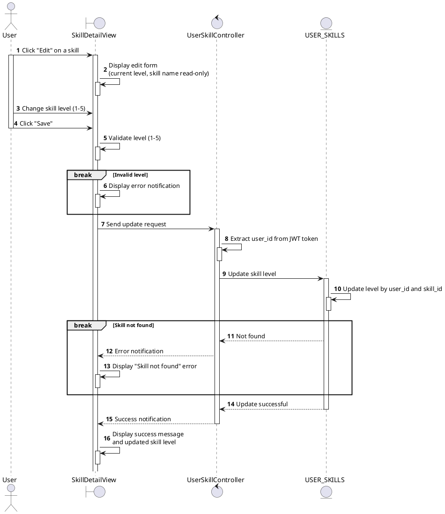

# Sequence Update Personal Skill

```plantuml
@startuml
autonumber

actor User as U
boundary SkillDetailView as SDV
control UserSkillController as USC
entity USER_SKILLS as USK

U -> SDV: Click "Edit" on a skill
activate U
activate SDV
SDV -> SDV: Display edit form\n(current level, skill name read-only)
activate SDV
deactivate SDV

U -> SDV: Change skill level (1-5)
U -> SDV: Click "Save"
deactivate U
SDV -> SDV: Validate level (1-5)
activate SDV
deactivate SDV

break Invalid level
  SDV -> SDV: Display error notification
  activate SDV
  deactivate SDV
end

SDV -> USC: Send update request
activate USC
USC -> USC: Extract user_id from JWT token
activate USC
deactivate USC

USC -> USK: Update skill level
activate USK
USK -> USK: Update level by user_id and skill_id
activate USK
deactivate USK

break Skill not found
  USC <-- USK: Not found
  SDV <-- USC: Error notification
  SDV -> SDV: Display "Skill not found" error
  activate SDV
  deactivate SDV
end

USC <-- USK: Update successful
deactivate USK
SDV <-- USC: Success notification
deactivate USC
SDV -> SDV: Display success message\nand updated skill level
activate SDV
deactivate SDV

@enduml
```

<!-- diagram id="sequence-user-skills-update-personal-skill" -->
