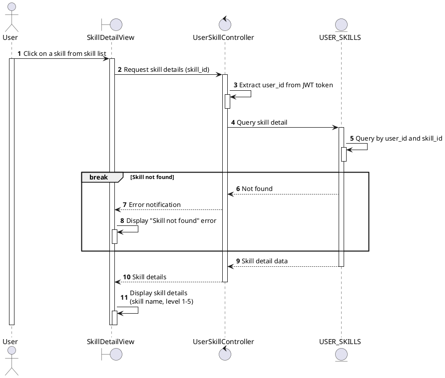

# Sequence View Personal Skill Details

```plantuml
@startuml
autonumber

actor User as U
boundary SkillDetailView as SDV
control UserSkillController as USC
entity USER_SKILLS as USK

U -> SDV: Click on a skill from skill list
activate U
activate SDV
SDV -> USC: Request skill details (skill_id)
activate USC
USC -> USC: Extract user_id from JWT token
activate USC
deactivate USC
USC -> USK: Query skill detail
activate USK
USK -> USK: Query by user_id and skill_id
activate USK
deactivate USK

break Skill not found
  USC <-- USK: Not found
  SDV <-- USC: Error notification
  SDV -> SDV: Display "Skill not found" error
  activate SDV
  deactivate SDV
end

USC <-- USK: Skill detail data
deactivate USK
SDV <-- USC: Skill details
deactivate USC
SDV -> SDV: Display skill details\n(skill name, level 1-5)
activate SDV
deactivate SDV
deactivate SDV
deactivate U

@enduml
```

<!-- diagram id="sequence-user-skills-view-personal-skill-details" -->
