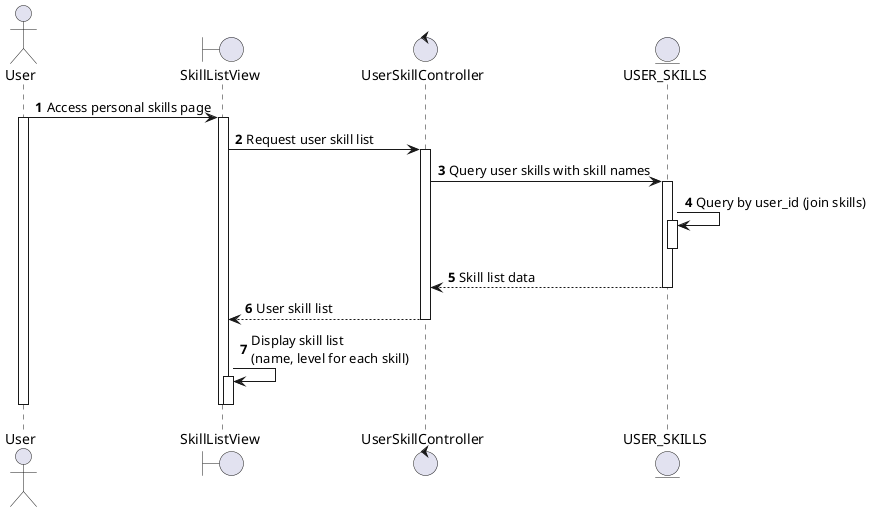

# Sequence View Personal Skill List

```plantuml
@startuml
autonumber

actor User as U
boundary SkillListView as SLV
control UserSkillController as USC
entity USER_SKILLS as USK

U -> SLV: Access personal skills page
activate U
activate SLV

SLV -> USC: Request user skill list
activate USC

USC -> USK: Query user skills with skill names
activate USK
USK -> USK: Query by user_id (join skills)
activate USK
deactivate USK
USC <-- USK: Skill list data
deactivate USK

SLV <-- USC: User skill list
deactivate USC

SLV -> SLV: Display skill list\n(name, level for each skill)
activate SLV
deactivate SLV

deactivate SLV
deactivate U

@enduml
```

<!-- diagram id="sequence-user-skills-view-personal-skill-list" -->
