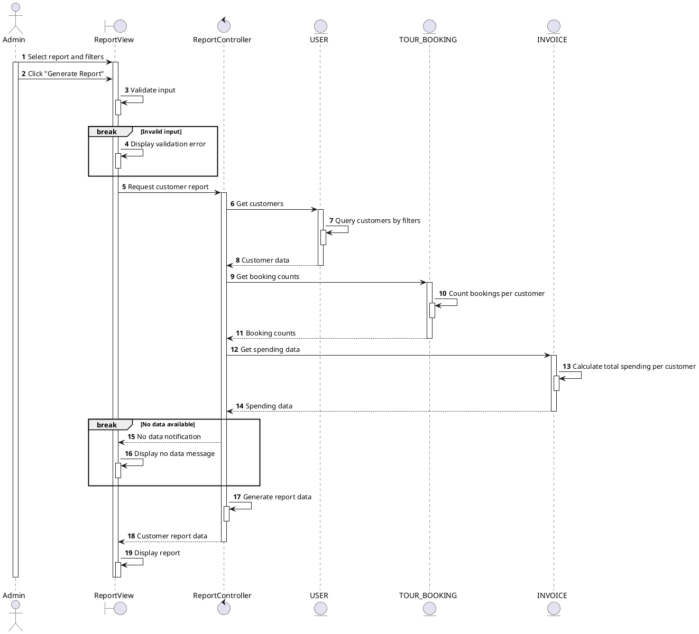

# Sequence Customer Report

```plantuml
@startuml
autonumber

actor Admin as A
boundary ReportView as RV
control ReportController as RC
entity USER as U
entity TOUR_BOOKING as TB
entity INVOICE as INV

A -> RV: Select report and filters
activate A
activate RV
A -> RV: Click "Generate Report"
RV -> RV: Validate input
activate RV
deactivate RV

break Invalid input
  RV -> RV: Display validation error
  activate RV
  deactivate RV
end

RV -> RC: Request customer report
activate RC
RC -> U: Get customers
activate U
U -> U: Query customers by filters
activate U
deactivate U
RC <-- U: Customer data
deactivate U

RC -> TB: Get booking counts
activate TB
TB -> TB: Count bookings per customer
activate TB
deactivate TB
RC <-- TB: Booking counts
deactivate TB

RC -> INV: Get spending data
activate INV
INV -> INV: Calculate total spending per customer
activate INV
deactivate INV
RC <-- INV: Spending data
deactivate INV

break No data available
  RV <-- RC: No data notification
  RV -> RV: Display no data message
  activate RV
  deactivate RV
end

RC -> RC: Generate report data
activate RC
deactivate RC

RV <-- RC: Customer report data
deactivate RC

RV -> RV: Display report
activate RV
deactivate RV

deactivate RV
deactivate A

@enduml
```

<!-- diagram id="sequence-view-reports-customer-report" -->
