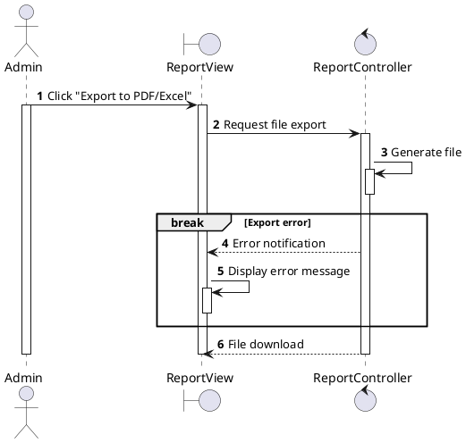

# Sequence Export Report

```plantuml
@startuml
autonumber

actor Admin as A
boundary ReportView as RV
control ReportController as RC

A -> RV: Click "Export to PDF/Excel"
activate A
activate RV
RV -> RC: Request file export
activate RC
RC -> RC: Generate file
activate RC
deactivate RC

break Export error
  RV <-- RC: Error notification
  RV -> RV: Display error message
  activate RV
  deactivate RV
end

RV <-- RC: File download
deactivate RC
deactivate RV
deactivate A

@enduml
```

<!-- diagram id="sequence-view-reports-export-report" -->
