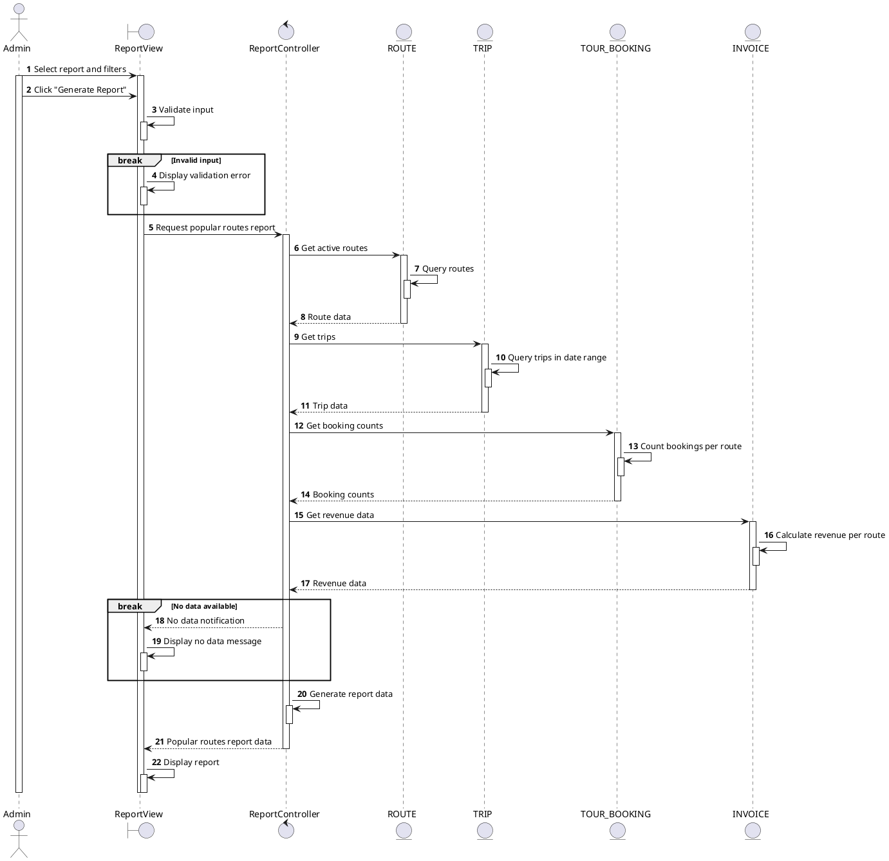

# Sequence Popular Routes Report

```plantuml
@startuml
autonumber

actor Admin as A
boundary ReportView as RV
control ReportController as RC
entity ROUTE as R
entity TRIP as TR
entity TOUR_BOOKING as TB
entity INVOICE as INV

A -> RV: Select report and filters
activate A
activate RV
A -> RV: Click "Generate Report"
RV -> RV: Validate input
activate RV
deactivate RV

break Invalid input
  RV -> RV: Display validation error
  activate RV
  deactivate RV
end

RV -> RC: Request popular routes report
activate RC
RC -> R: Get active routes
activate R
R -> R: Query routes
activate R
deactivate R
RC <-- R: Route data
deactivate R

RC -> TR: Get trips
activate TR
TR -> TR: Query trips in date range
activate TR
deactivate TR
RC <-- TR: Trip data
deactivate TR

RC -> TB: Get booking counts
activate TB
TB -> TB: Count bookings per route
activate TB
deactivate TB
RC <-- TB: Booking counts
deactivate TB

RC -> INV: Get revenue data
activate INV
INV -> INV: Calculate revenue per route
activate INV
deactivate INV
RC <-- INV: Revenue data
deactivate INV

break No data available
  RV <-- RC: No data notification
  RV -> RV: Display no data message
  activate RV
  deactivate RV
end

RC -> RC: Generate report data
activate RC
deactivate RC

RV <-- RC: Popular routes report data
deactivate RC

RV -> RV: Display report
activate RV
deactivate RV

deactivate RV
deactivate A

@enduml
```

<!-- diagram id="sequence-view-reports-popular-routes-report" -->
