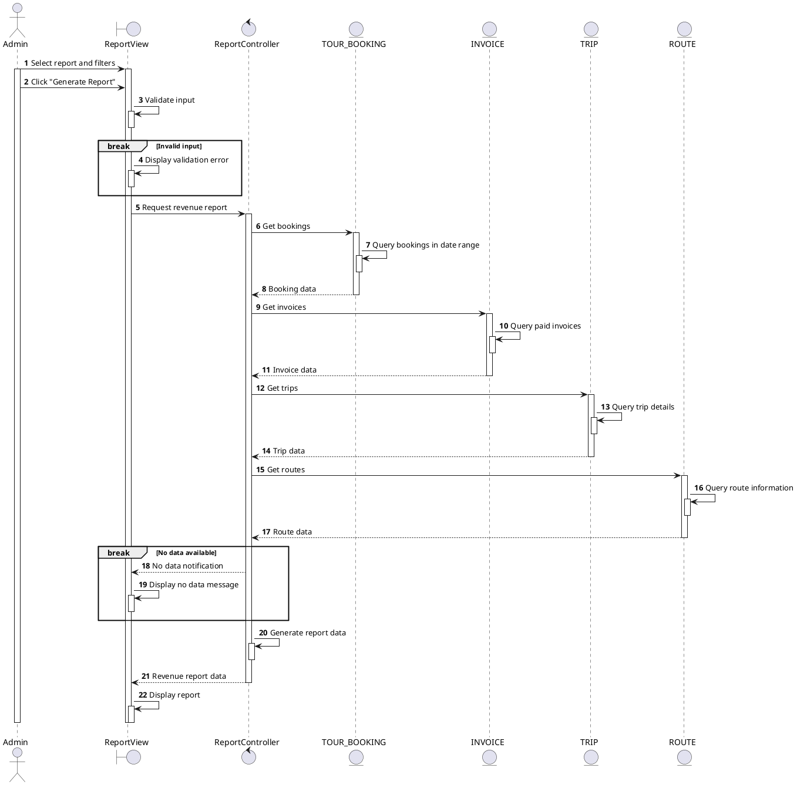

# Sequence Revenue Report

```plantuml
@startuml
autonumber

actor Admin as A
boundary ReportView as RV
control ReportController as RC
entity TOUR_BOOKING as TB
entity INVOICE as INV
entity TRIP as TR
entity ROUTE as R

A -> RV: Select report and filters
activate A
activate RV
A -> RV: Click "Generate Report"
RV -> RV: Validate input
activate RV
deactivate RV

break Invalid input
  RV -> RV: Display validation error
  activate RV
  deactivate RV
end

RV -> RC: Request revenue report
activate RC
RC -> TB: Get bookings
activate TB
TB -> TB: Query bookings in date range
activate TB
deactivate TB
RC <-- TB: Booking data
deactivate TB

RC -> INV: Get invoices
activate INV
INV -> INV: Query paid invoices
activate INV
deactivate INV
RC <-- INV: Invoice data
deactivate INV

RC -> TR: Get trips
activate TR
TR -> TR: Query trip details
activate TR
deactivate TR
RC <-- TR: Trip data
deactivate TR

RC -> R: Get routes
activate R
R -> R: Query route information
activate R
deactivate R
RC <-- R: Route data
deactivate R

break No data available
  RV <-- RC: No data notification
  RV -> RV: Display no data message
  activate RV
  deactivate RV
end

RC -> RC: Generate report data
activate RC
deactivate RC

RV <-- RC: Revenue report data
deactivate RC

RV -> RV: Display report
activate RV
deactivate RV

deactivate RV
deactivate A

@enduml
```

<!-- diagram id="sequence-view-reports-revenue-report" -->
