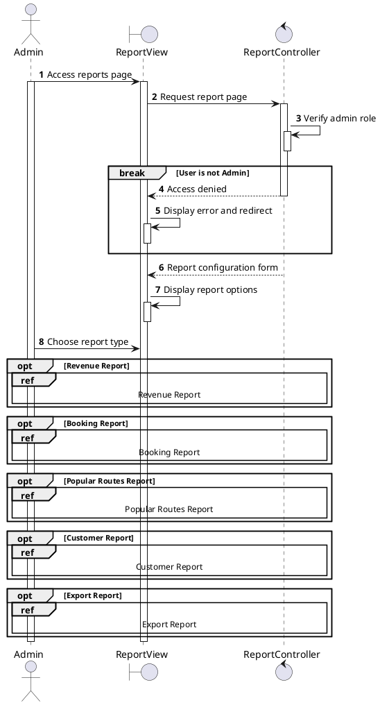

# Sequence View Reports

```plantuml
@startuml
autonumber

actor Admin as A
boundary ReportView as RV
control ReportController as RC

A -> RV: Access reports page
activate A
activate RV
RV -> RC: Request report page
activate RC
RC -> RC: Verify admin role
activate RC
deactivate RC

break User is not Admin
  RV <-- RC: Access denied
  deactivate RC
  RV -> RV: Display error and redirect
  activate RV
  deactivate RV
end

RV <-- RC: Report configuration form
deactivate RC
RV -> RV: Display report options
activate RV
deactivate RV

A -> RV: Choose report type

opt Revenue Report
  ref over A, RC: Revenue Report
end

opt Booking Report
  ref over A, RC: Booking Report
end

opt Popular Routes Report
  ref over A, RC: Popular Routes Report
end

opt Customer Report
  ref over A, RC: Customer Report
end

opt Export Report
  ref over A, RC: Export Report
end

deactivate RV
deactivate A

@enduml
```

<!-- diagram id="sequence-view-reports-view-reports" -->
