# SRS / Use Case Specifications

This page is the English extended SRS reference for the Vietnamese TaskPilot report appendix. It preserves the 59 use cases used by the report and links each use case to existing sequence diagrams, activity diagrams, UI specification pages, and database tables where those artefacts exist.

## System overview

TaskPilot is an intelligent project and task management system with AI Copilot support. The core scope covers project/member/sprint/task management, Kanban collaboration, realtime notification, AI Copilot with controlled tool calling, and assignment recommendation based on weighted heuristic scoring.

## Actors

| Actor | Description |
| --- | --- |
| Guest | Unauthenticated user who can register, sign in, or recover/reset a password. |
| System Administrator (ad) | Manages users, system skill directory, AI/system settings and audit views. |
| Project Manager (pm) | Creates and manages projects, members, sprints, tasks and assignment decisions. |
| Project Member (mem) | Works on tasks, comments, notifications, sprint/backlog views and AI Copilot within granted project permissions. |
| AI Copilot | Internal assistant component that proposes answers/actions through controlled tool calling; it is not a direct human actor. |

## Use case group count verification

| # | Group | Range | Count |
| --- | --- | --- | --- |
| 1 | Authentication | UC01–UC04 | 4 |
| 2 | User Profile | UC05–UC07 | 3 |
| 3 | User Skills | UC08–UC12 | 5 |
| 4 | System Administration | UC13–UC21 | 9 |
| 5 | Project Management | UC22–UC28 | 7 |
| 6 | Project Members | UC29–UC33 | 5 |
| 7 | Sprint Management | UC34–UC39 | 6 |
| 8 | Task Management | UC40–UC48 | 9 |
| 9 | Interaction & Communication | UC49–UC52 | 4 |
| 10 | Notification Management | UC53–UC54 | 2 |
| 11 | AI Assistant | UC55–UC59 | 5 |

**Total: 59 use cases across 11 groups.**

## Use case catalogue

| ID | Name | Actor(s) | Subsystem | UI | Sequence | Activity | Database table(s) |
| --- | --- | --- | --- | --- | --- | --- | --- |
| UC01 | Sign In | ad, pm, mem | Authentication | [Login screen](/docs/ui-specification#login-screen) | [sequence diagram](/docs/sequence/auth/login) | [activity diagram](/docs/activity/auth/login) | users |
| UC02 | Register / Sign Up | ad, pm, mem | Authentication | [Register screen](/docs/ui-specification#register-screen) | [sequence diagram](/docs/sequence/auth/register) | [activity diagram](/docs/activity/auth/register) | users |
| UC03 | Forgot Password | ad, pm, mem | Authentication | [Forgot password screen](/docs/ui-specification#forgot-password-screen) | [sequence diagram](/docs/sequence/auth/forgot-password) | [activity diagram](/docs/activity/auth/forgot-password) | users, password_reset_tokens |
| UC04 | Reset Password | ad, pm, mem | Authentication | [Forgot password screen](/docs/ui-specification#forgot-password-screen) | [sequence diagram](/docs/sequence/auth/reset-password) | [activity diagram](/docs/activity/auth/reset-password) | users, password_reset_tokens |
| UC05 | Update Personal Information | ad, pm, mem | User Profile | [Profile screen](/docs/ui-specification#profile-screen) | [sequence diagram](/docs/sequence/user-profile/update-personal-information) | [activity diagram](/docs/activity/user-profile/update-personal-information) | users |
| UC06 | View User Profile | ad, pm, mem | User Profile | [Profile screen](/docs/ui-specification#profile-screen) | [sequence diagram](/docs/sequence/user-profile/view-user-profile) | [activity diagram](/docs/activity/user-profile/view-user-profile) | users |
| UC07 | Delete Personal Account | ad, pm, mem | User Profile | [Profile screen](/docs/ui-specification#profile-screen) | [sequence diagram](/docs/sequence/user-profile/delete-personal-account) | [activity diagram](/docs/activity/user-profile/delete-personal-account) | users |
| UC08 | View Personal Skill List | pm, mem | User Skills | [Profile screen](/docs/ui-specification#profile-screen) | [sequence diagram](/docs/sequence/user-skills/view-personal-skill-list) | [activity diagram](/docs/activity/user-skills/view-personal-skill-list) | user_skills, skills |
| UC09 | View Personal Skill Details | pm, mem | User Skills | [Profile screen](/docs/ui-specification#profile-screen) | [sequence diagram](/docs/sequence/user-skills/view-personal-skill-details) | [activity diagram](/docs/activity/user-skills/view-personal-skill-details) | user_skills, skills |
| UC10 | Add Personal Skill | pm, mem | User Skills | [Profile screen](/docs/ui-specification#profile-screen) | [sequence diagram](/docs/sequence/user-skills/add-personal-skill) | [activity diagram](/docs/activity/user-skills/add-personal-skill) | user_skills, skills |
| UC11 | Update Personal Skill | pm, mem | User Skills | [Profile screen](/docs/ui-specification#profile-screen) | [sequence diagram](/docs/sequence/user-skills/update-personal-skill) | [activity diagram](/docs/activity/user-skills/update-personal-skill) | user_skills, skills |
| UC12 | Delete Personal Skill | pm, mem | User Skills | [Profile screen](/docs/ui-specification#profile-screen) | [sequence diagram](/docs/sequence/user-skills/delete-personal-skill) | [activity diagram](/docs/activity/user-skills/delete-personal-skill) | user_skills, skills |
| UC13 | Configure System Parameters | ad | System Administration | [Admin system configuration](/docs/ui-specification#admin-system-configuration) | [sequence diagram](/docs/sequence/admin/configure-system-parameters) | [activity diagram](/docs/activity/admin/configure-system-parameters) | system_settings |
| UC14 | View System Skill Directory | ad | System Administration | [Admin skill directory](/docs/ui-specification#admin-skill-directory) | [sequence diagram](/docs/sequence/admin/view-system-skill-directory) | [activity diagram](/docs/activity/admin/view-system-skill-directory) | skills |
| UC15 | Add System Skill | ad | System Administration | [Admin skill directory](/docs/ui-specification#admin-skill-directory) | [sequence diagram](/docs/sequence/admin/add-system-skill) | [activity diagram](/docs/activity/admin/add-system-skill) | skills |
| UC16 | Edit System Skill | ad | System Administration | [Admin skill directory](/docs/ui-specification#admin-skill-directory) | [sequence diagram](/docs/sequence/admin/edit-system-skill) | [activity diagram](/docs/activity/admin/edit-system-skill) | skills |
| UC17 | Delete System Skill | ad | System Administration | [Admin skill directory](/docs/ui-specification#admin-skill-directory) | [sequence diagram](/docs/sequence/admin/delete-system-skill) | [activity diagram](/docs/activity/admin/delete-system-skill) | skills |
| UC18 | View Global User List | ad | System Administration | [Admin user management](/docs/ui-specification#admin-user-management) | [sequence diagram](/docs/sequence/admin/view-global-user-list) | [activity diagram](/docs/activity/admin/view-global-user-list) | users |
| UC19 | Add System User | ad | System Administration | [Admin user management](/docs/ui-specification#admin-user-management) | [sequence diagram](/docs/sequence/admin/add-system-user) | [activity diagram](/docs/activity/admin/add-system-user) | users |
| UC20 | Edit System User | ad | System Administration | [Admin user management](/docs/ui-specification#admin-user-management) | [sequence diagram](/docs/sequence/admin/edit-system-user) | [activity diagram](/docs/activity/admin/edit-system-user) | users |
| UC21 | Delete System User | ad | System Administration | [Admin user management](/docs/ui-specification#admin-user-management) | [sequence diagram](/docs/sequence/admin/delete-system-user) | [activity diagram](/docs/activity/admin/delete-system-user) | users |
| UC22 | View Joined Projects | pm, mem | Project Management | [Project dashboard / project list](/docs/ui-specification#project-dashboard--project-list) | [sequence diagram](/docs/sequence/project-management/view-joined-projects) | [activity diagram](/docs/activity/project-management/view-joined-projects) | projects, project_members |
| UC23 | Create New Project | pm | Project Management | [Create project screen](/docs/ui-specification#create-project-screen) | [sequence diagram](/docs/sequence/project-management/create-new-project) | [activity diagram](/docs/activity/project-management/create-new-project) | projects, project_members |
| UC24 | View Project Details / Summary | pm, mem | Project Management | [Project workspace](/docs/ui-specification#project-workspace) [Project overview](/docs/ui-specification#project-overview) [Timeline](/docs/ui-specification#timeline) | [sequence diagram](/docs/sequence/project-management/view-project-details) | [activity diagram](/docs/activity/project-management/view-project-details) | projects |
| UC25 | Update Project Information | pm | Project Management | [Project settings general](/docs/ui-specification#project-settings-general) | [sequence diagram](/docs/sequence/project-management/update-project-information) | [activity diagram](/docs/activity/project-management/update-project-information) | projects |
| UC26 | Join Project | pm, mem | Project Management | [Project dashboard / project list](/docs/ui-specification#project-dashboard--project-list) | [sequence diagram](/docs/sequence/project-management/join-project) | [activity diagram](/docs/activity/project-management/join-project) | project_members |
| UC27 | Leave Project | pm, mem | Project Management | [Project workspace](/docs/ui-specification#project-workspace) | [sequence diagram](/docs/sequence/project-management/leave-project) | [activity diagram](/docs/activity/project-management/leave-project) | project_members |
| UC28 | Close / Archive Project | pm | Project Management | [Project settings general](/docs/ui-specification#project-settings-general) | [sequence diagram](/docs/sequence/project-management/close-archive-project) | [activity diagram](/docs/activity/project-management/close-archive-project) | projects |
| UC29 | View Project Member List | pm, mem | Project Members | [Project settings members](/docs/ui-specification#project-settings-members) | [sequence diagram](/docs/sequence/project-members/view-project-member-list) | [activity diagram](/docs/activity/project-members/view-project-member-list) | project_members, users |
| UC30 | View Member Details | pm, mem | Project Members | [Project settings members](/docs/ui-specification#project-settings-members) | [sequence diagram](/docs/sequence/project-members/view-member-details) | [activity diagram](/docs/activity/project-members/view-member-details) | project_members, users, user_skills |
| UC31 | Add Member to Project | pm, mem | Project Members | [Project settings members](/docs/ui-specification#project-settings-members) | [sequence diagram](/docs/sequence/project-members/add-member-to-project) | [activity diagram](/docs/activity/project-members/add-member-to-project) | project_members |
| UC32 | Update Member Role | pm | Project Members | [Project settings members](/docs/ui-specification#project-settings-members) | [sequence diagram](/docs/sequence/project-members/update-member-role) | [activity diagram](/docs/activity/project-members/update-member-role) | project_members |
| UC33 | Remove Member from Project | pm, mem | Project Members | [Project settings members](/docs/ui-specification#project-settings-members) | [sequence diagram](/docs/sequence/project-members/remove-member-from-project) | [activity diagram](/docs/activity/project-members/remove-member-from-project) | project_members |
| UC34 | View Sprint List | pm, mem | Sprint Management | [Sprint backlog](/docs/ui-specification#sprint-backlog) | [sequence diagram](/docs/sequence/sprint-management/view-sprint-list) | [activity diagram](/docs/activity/sprint-management/view-sprint-list) | sprints |
| UC35 | View Sprint Details | pm, mem | Sprint Management | [Sprint backlog](/docs/ui-specification#sprint-backlog) | [sequence diagram](/docs/sequence/sprint-management/view-sprint-details) | [activity diagram](/docs/activity/sprint-management/view-sprint-details) | sprints |
| UC36 | Create New Sprint | pm, mem | Sprint Management | [Sprint backlog](/docs/ui-specification#sprint-backlog) | [sequence diagram](/docs/sequence/sprint-management/create-new-sprint) | [activity diagram](/docs/activity/sprint-management/create-new-sprint) | sprints |
| UC37 | Update Sprint Information | pm, mem | Sprint Management | [Sprint backlog](/docs/ui-specification#sprint-backlog) | [sequence diagram](/docs/sequence/sprint-management/update-sprint-information) | [activity diagram](/docs/activity/sprint-management/update-sprint-information) | sprints |
| UC38 | Start / Complete Sprint | pm, mem | Sprint Management | [Sprint backlog](/docs/ui-specification#sprint-backlog) | [sequence diagram](/docs/sequence/sprint-management/start-complete-sprint) | [activity diagram](/docs/activity/sprint-management/start-complete-sprint) | sprints |
| UC39 | Delete Sprint | pm, mem | Sprint Management | [Sprint backlog](/docs/ui-specification#sprint-backlog) | [sequence diagram](/docs/sequence/sprint-management/delete-sprint) | [activity diagram](/docs/activity/sprint-management/delete-sprint) | sprints, tasks |
| UC40 | View Kanban Board | pm, mem | Task Management | [Kanban board](/docs/ui-specification#kanban-board) | [sequence diagram](/docs/sequence/task-management/view-kanban-board) | [activity diagram](/docs/activity/task-management/view-kanban-board) | tasks |
| UC41 | View Backlog | pm, mem | Task Management | [Sprint backlog](/docs/ui-specification#sprint-backlog) | [sequence diagram](/docs/sequence/task-management/view-backlog) | [activity diagram](/docs/activity/task-management/view-backlog) | tasks, sprints |
| UC42 | View Workload | pm, mem | Task Management | [Project settings members](/docs/ui-specification#project-settings-members) [Task detail](/docs/ui-specification#task-detail) | [sequence diagram](/docs/sequence/task-management/view-workload) | [activity diagram](/docs/activity/task-management/view-workload) | tasks, users |
| UC43 | View Task Details | pm, mem | Task Management | [Task detail](/docs/ui-specification#task-detail) | [sequence diagram](/docs/sequence/task-management/view-task-details) | [activity diagram](/docs/activity/task-management/view-task-details) | tasks, task_required_skills, task_labels |
| UC44 | Create Task or Sub-task | pm, mem | Task Management | [Kanban board](/docs/ui-specification#kanban-board) [Task detail](/docs/ui-specification#task-detail) | [sequence diagram](/docs/sequence/task-management/create-new-task) | [activity diagram](/docs/activity/task-management/create-new-task) | tasks, task_required_skills, task_labels |
| UC45 | Update Task Information | pm, mem | Task Management | [Task detail](/docs/ui-specification#task-detail) | [sequence diagram](/docs/sequence/task-management/update-task-information) | [activity diagram](/docs/activity/task-management/update-task-information) | tasks, task_required_skills, task_labels |
| UC46 | Update Task Status / Drag and Drop on Kanban | pm, mem | Task Management | [Kanban board](/docs/ui-specification#kanban-board) | [sequence diagram](/docs/sequence/task-management/update-task-status) | [activity diagram](/docs/activity/task-management/update-task-status) | tasks |
| UC47 | Assign Assignee and Reporter | pm, mem | Task Management | [Task detail](/docs/ui-specification#task-detail) | [sequence diagram](/docs/sequence/task-management/assign-assignee-reporter) | [activity diagram](/docs/activity/task-management/assign-assignee-reporter) | tasks, users, user_skills, project_members |
| UC48 | Delete Task | pm, mem | Task Management | [Kanban board](/docs/ui-specification#kanban-board) [Task detail](/docs/ui-specification#task-detail) | [sequence diagram](/docs/sequence/task-management/delete-task) | [activity diagram](/docs/activity/task-management/delete-task) | tasks |
| UC49 | View Comments | pm, mem | Interaction & Communication | [Comment](/docs/ui-specification#comment) | [sequence diagram](/docs/sequence/interaction-communication/view-comments) | [activity diagram](/docs/activity/interaction-communication/view-comments) | comments |
| UC50 | Write Comment | pm, mem | Interaction & Communication | [Comment](/docs/ui-specification#comment) | [sequence diagram](/docs/sequence/interaction-communication/write-comment) | [activity diagram](/docs/activity/interaction-communication/write-comment) | comments, comment_mentions, notifications |
| UC51 | Edit Comment | pm, mem | Interaction & Communication | [Comment](/docs/ui-specification#comment) | [sequence diagram](/docs/sequence/interaction-communication/edit-comment) | [activity diagram](/docs/activity/interaction-communication/edit-comment) | comments, comment_mentions |
| UC52 | Delete Comment | pm, mem | Interaction & Communication | [Comment](/docs/ui-specification#comment) | [sequence diagram](/docs/sequence/interaction-communication/delete-comment) | [activity diagram](/docs/activity/interaction-communication/delete-comment) | comments |
| UC53 | Receive Notification | ad, pm, mem | Notification Management | [Notification panel](/docs/ui-specification#notification-panel) | [sequence diagram](/docs/sequence/notification-management/receive-notification) | [activity diagram](/docs/activity/notification-management/receive-notification) | notifications |
| UC54 | Mark Notification as Read | ad, pm, mem | Notification Management | [Notification panel](/docs/ui-specification#notification-panel) | [sequence diagram](/docs/sequence/notification-management/mark-notification-as-read) | [activity diagram](/docs/activity/notification-management/mark-notification-as-read) | notifications |
| UC55 | Create New AI Chat Session | pm, mem | AI Assistant | [AI chat](/docs/ui-specification#ai-chat) | [sequence diagram](/docs/sequence/ai-assistant/create-new-ai-chat-session) | [activity diagram](/docs/activity/ai-assistant/create-new-ai-chat-session) | chat_sessions |
| UC56 | Chat with AI | pm, mem | AI Assistant | [AI chat](/docs/ui-specification#ai-chat) [Pending action confirmation](/docs/ui-specification#pending-action-confirmation) | [sequence diagram](/docs/sequence/ai-assistant/chat-with-ai) | [activity diagram](/docs/activity/ai-assistant/chat-with-ai) | chat_sessions, chat_messages, ai_logs |
| UC57 | View AI Chat History | pm, mem | AI Assistant | [AI chat](/docs/ui-specification#ai-chat) | [sequence diagram](/docs/sequence/ai-assistant/view-ai-chat-history) | [activity diagram](/docs/activity/ai-assistant/view-ai-chat-history) | chat_sessions, chat_messages |
| UC58 | View AI Activity Logs | ad, pm, mem | AI Assistant | [AI chat](/docs/ui-specification#ai-chat) | [sequence diagram](/docs/sequence/ai-assistant/view-ai-activity-logs) | [activity diagram](/docs/activity/ai-assistant/view-ai-activity-logs) | ai_logs |
| UC59 | Request AI Task Assignment Recommendation | pm | AI Assistant | [AI assignment recommendation](/docs/ui-specification#ai-assignment-recommendation) [Pending action confirmation](/docs/ui-specification#pending-action-confirmation) | [sequence diagram](/docs/sequence/ai-assistant/request-ai-auto-assignment) | [activity diagram](/docs/activity/ai-assistant/request-ai-auto-assignment) | tasks, users, user_skills, project_members, system_settings, ai_logs |

## Representative use cases

The following six use cases are completed from the current report and existing PlantUML sequence/activity diagrams: UC01, UC23, UC44, UC46, UC47 and UC59.

### UC01 — Sign In

#### Sequence diagram

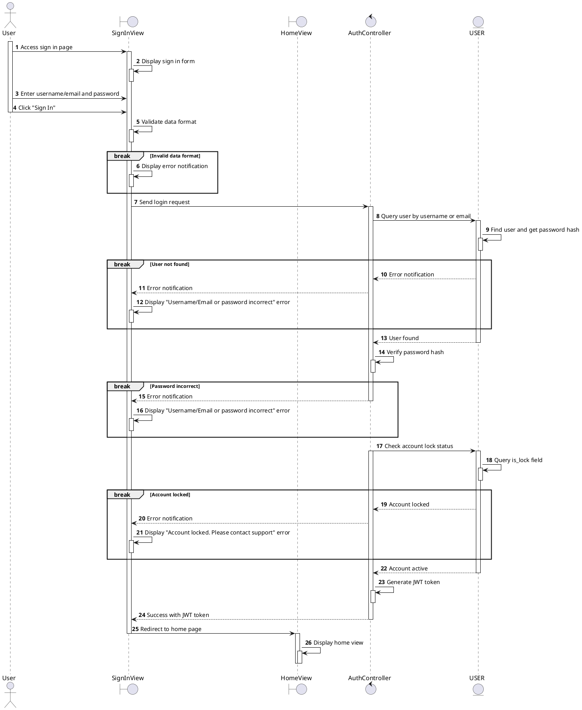
```plantuml
@startuml
autonumber

actor User as U
boundary SignInView as SIV
boundary HomeView as HV
control AuthController as AC
entity USER as US

activate U
U -> SIV: Access sign in page
activate SIV
SIV -> SIV: Display sign in form
activate SIV
deactivate SIV

U -> SIV: Enter username/email and password
U -> SIV: Click "Sign In"
deactivate U
SIV -> SIV: Validate data format
activate SIV
deactivate SIV

break Invalid data format
  SIV -> SIV: Display error notification
  activate SIV
  deactivate SIV
end

SIV -> AC: Send login request
activate AC
AC -> US: Query user by username or email
activate US
US -> US: Find user and get password hash
activate US
deactivate US

break User not found
  AC <-- US: Error notification
  SIV <-- AC: Error notification
  SIV -> SIV: Display "Username/Email or password incorrect" error
  activate SIV
  deactivate SIV
end

AC <-- US: User found
deactivate US

AC -> AC: Verify password hash
activate AC
deactivate AC

break Password incorrect
  SIV <-- AC: Error notification
  deactivate AC
  SIV -> SIV: Display "Username/Email or password incorrect" error
  activate SIV
  deactivate SIV
end

AC -> US: Check account lock status
activate US
activate AC
US -> US: Query is_lock field
activate US
deactivate US

break Account locked
  AC <-- US: Account locked
  SIV <-- AC: Error notification
  SIV -> SIV: Display "Account locked. Please contact support" error
  activate SIV
  deactivate SIV
end

AC <-- US: Account active
deactivate US
AC -> AC: Generate JWT token
activate AC
deactivate AC

SIV <-- AC: Success with JWT token
deactivate AC
deactivate AC
SIV -> HV: Redirect to home page
deactivate SIV
activate HV
HV -> HV: Display home view
activate HV
deactivate HV
deactivate HV

@enduml
```

<!-- diagram id="srs-sequence-auth-login" -->

#### Activity diagram

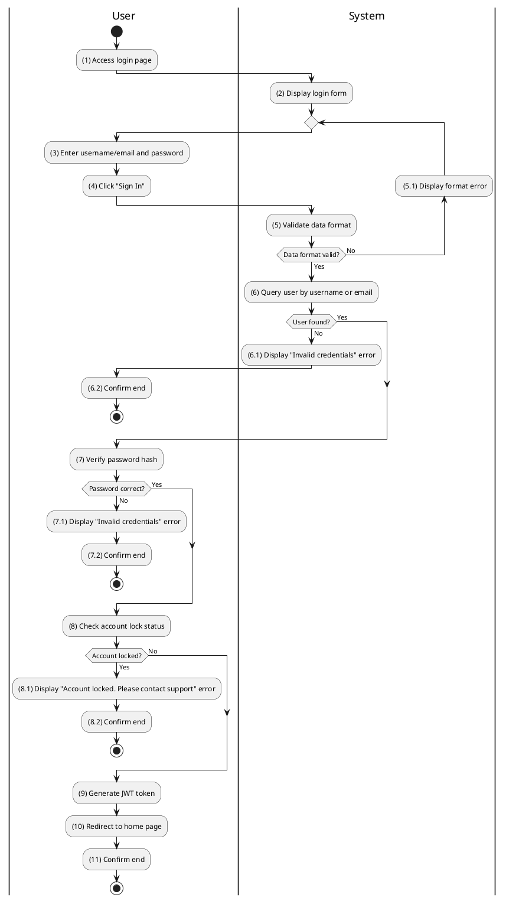
```plantuml
@startuml
|U|User
|S|System

|U|
start
:(1) Access login page;

|S|
:(2) Display login form;

repeat
  |U|
  :(3) Enter username/email and password;
  :(4) Click "Sign In";

  |S|
  :(5) Validate data format;
  backward: (5.1) Display format error;
repeat while (Data format valid?) is (No) not (Yes)

:(6) Query user by username or email;

if (User found?) then (No)
  :(6.1) Display "Invalid credentials" error;
  |U|
  :(6.2) Confirm end;
  stop
else (Yes)
endif

:(7) Verify password hash;

if (Password correct?) then (No)
  :(7.1) Display "Invalid credentials" error;
  |U|
  :(7.2) Confirm end;
  stop
else (Yes)
endif

:(8) Check account lock status;

if (Account locked?) then (Yes)
  :(8.1) Display "Account locked. Please contact support" error;
  |U|
  :(8.2) Confirm end;
  stop
else (No)
endif

:(9) Generate JWT token;
:(10) Redirect to home page;

|U|
:(11) Confirm end;

stop
@enduml
```

<!-- diagram id="srs-activity-auth-login" -->

| Field | Value |
| --- | --- |
| ID | UC01 |
| Name | Sign In |
| Actor(s) | ad, pm, mem |
| Priority | High |
| Trigger | Access login page |
| Pre-condition(s) | An active account exists and the authentication service is operational. |
| Post-condition(s) | Generate JWT token Redirect to home page |
| Basic Flow | 1. Access login page 2. Display login form 3. Enter username/email and password 4. Click "Sign In" 5. Validate data format 6. Query user by username or email 7. Verify password hash 8. Check account lock status 9. Generate JWT token 10. Redirect to home page |
| Alternate Flow | 1. User may correct invalid input and resubmit until the validation checks pass. 2. Conditional branches in the activity diagram handle allowed business-state differences. |
| Exception Flow | 1. Display format error 2. Display "Invalid credentials" error 3. Display "Account locked. Please contact support" error |
| Related UI screen(s) | [Login screen](/docs/ui-specification#login-screen) |
| Related sequence diagram(s) | [sequence diagram](/docs/sequence/auth/login) |
| Related activity diagram(s) | [activity diagram](/docs/activity/auth/login) |
| Related database table(s) | users |

### UC23 — Create New Project

#### Sequence diagram

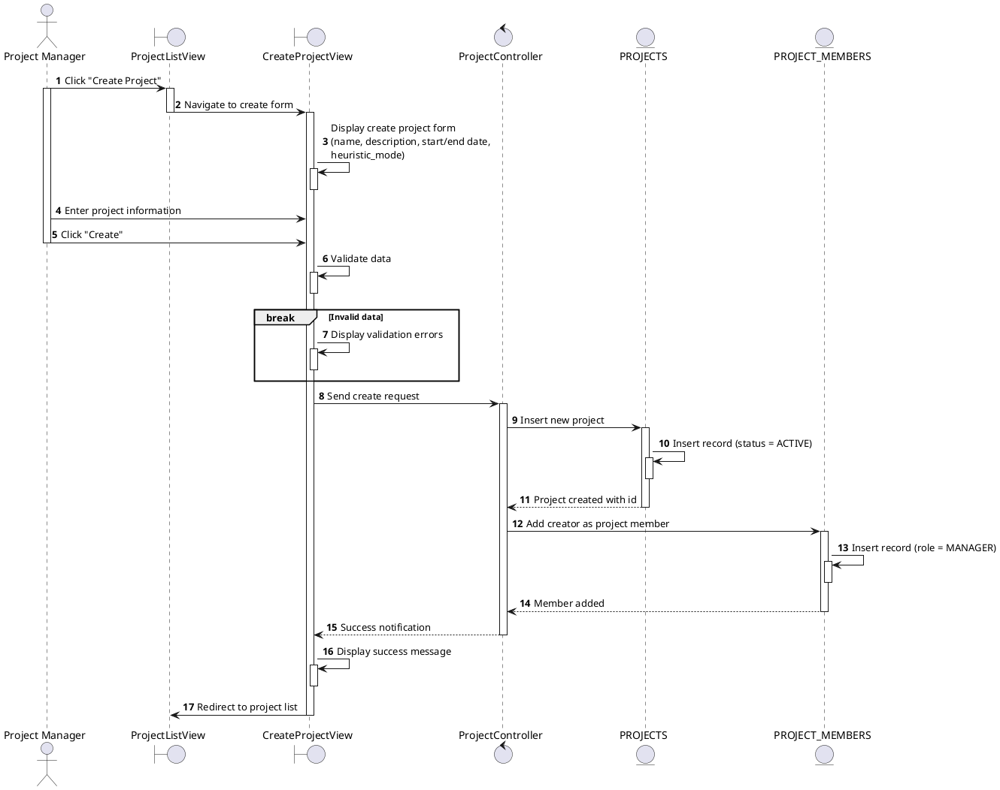
```plantuml
@startuml
autonumber

actor "Project Manager" as PM
boundary ProjectListView as PLV
boundary CreateProjectView as CPV
control ProjectController as PC
entity PROJECTS as P
entity PROJECT_MEMBERS as PME

PM -> PLV: Click "Create Project"
activate PM
activate PLV
PLV -> CPV: Navigate to create form
deactivate PLV
activate CPV
CPV -> CPV: Display create project form\n(name, description, start/end date,\nheuristic_mode)
activate CPV
deactivate CPV

PM -> CPV: Enter project information
PM -> CPV: Click "Create"
deactivate PM
CPV -> CPV: Validate data
activate CPV
deactivate CPV

break Invalid data
  CPV -> CPV: Display validation errors
  activate CPV
  deactivate CPV
end

CPV -> PC: Send create request
activate PC
PC -> P: Insert new project
activate P
P -> P: Insert record (status = ACTIVE)
activate P
deactivate P
PC <-- P: Project created with id
deactivate P

PC -> PME: Add creator as project member
activate PME
PME -> PME: Insert record (role = MANAGER)
activate PME
deactivate PME
PC <-- PME: Member added
deactivate PME

CPV <-- PC: Success notification
deactivate PC
CPV -> CPV: Display success message
activate CPV
deactivate CPV
CPV -> PLV: Redirect to project list
deactivate CPV

@enduml
```

<!-- diagram id="srs-sequence-project-management-create-new-project" -->

#### Activity diagram

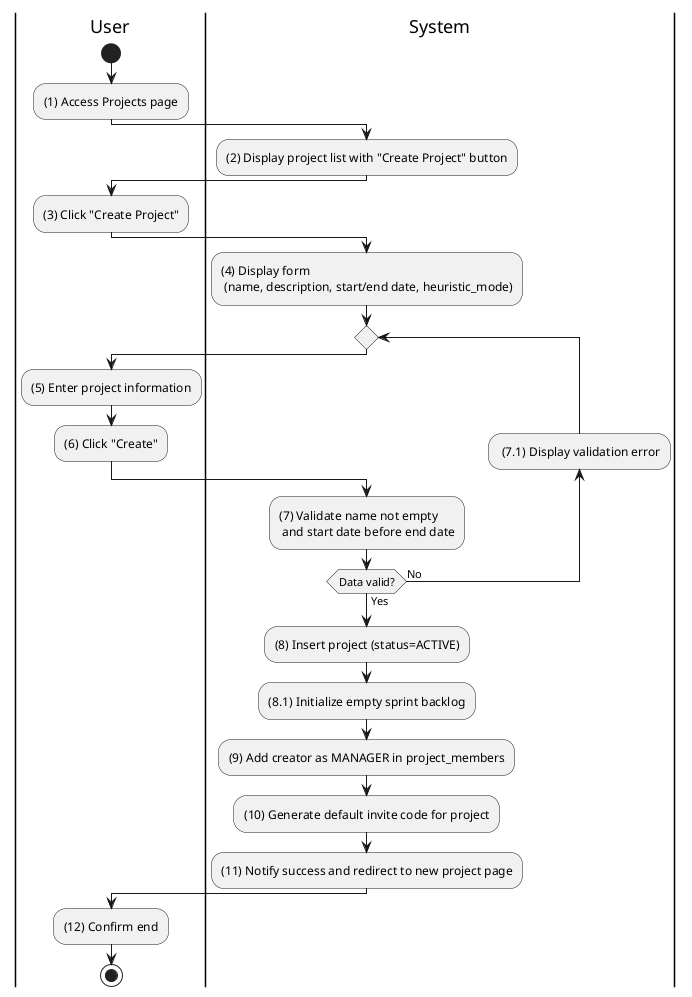
```plantuml
@startuml

|U|User
|S|System

|U|
start
:(1) Access Projects page;

|S|
:(2) Display project list with "Create Project" button;

|U|
:(3) Click "Create Project";

|S|
:(4) Display form \n (name, description, start/end date, heuristic_mode);

repeat
  |U|
  :(5) Enter project information;
  :(6) Click "Create";

  |S|
  :(7) Validate name not empty \n and start date before end date;
  backward: (7.1) Display validation error;
repeat while (Data valid?) is (No) not (Yes)

:(8) Insert project (status=ACTIVE);
:(8.1) Initialize empty sprint backlog;
:(9) Add creator as MANAGER in project_members;
:(10) Generate default invite code for project;
:(11) Notify success and redirect to new project page;

|U|
:(12) Confirm end;

stop
@enduml
```

<!-- diagram id="srs-activity-project-management-create-new-project" -->

| Field | Value |
| --- | --- |
| ID | UC23 |
| Name | Create New Project |
| Actor(s) | pm |
| Priority | High |
| Trigger | Access Projects page |
| Pre-condition(s) | User is authenticated and has access to the target project/resource. |
| Post-condition(s) | Generate default invite code for project Notify success and redirect to new project page |
| Basic Flow | 1. Access Projects page 2. Display project list with "Create Project" button 3. Click "Create Project" 4. Display form (name, description, start/end date, heuristic_mode) 5. Enter project information 6. Click "Create" 7. Validate name not empty and start date before end date 8. Insert project (status=ACTIVE) 9. Initialize empty sprint backlog 10. Add creator as MANAGER in project_members 11. Generate default invite code for project 12. Notify success and redirect to new project page |
| Alternate Flow | 1. User may correct invalid input and resubmit until the validation checks pass. |
| Exception Flow | 1. Display validation error |
| Related UI screen(s) | [Create project screen](/docs/ui-specification#create-project-screen) |
| Related sequence diagram(s) | [sequence diagram](/docs/sequence/project-management/create-new-project) |
| Related activity diagram(s) | [activity diagram](/docs/activity/project-management/create-new-project) |
| Related database table(s) | projects, project_members |

### UC44 — Create Task or Sub-task

#### Sequence diagram

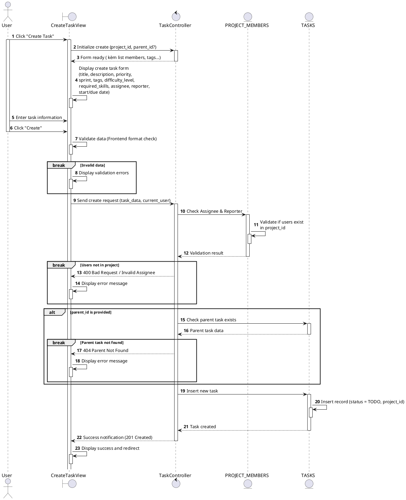
```plantuml
@startuml
autonumber

actor User as U
boundary CreateTaskView as CTV
control TaskController as TC
entity PROJECT_MEMBERS as PM
entity TASKS as T

U -> CTV: Click "Create Task"
activate U
activate CTV

CTV -> TC: Initialize create (project_id, parent_id?)
activate TC
CTV <-- TC: Form ready ( kèm list members, tags...)
deactivate TC

CTV -> CTV: Display create task form\n(title, description, priority,\nsprint, tags, difficulty_level,\nrequired_skills, assignee, reporter,\nstart/due date)
activate CTV
deactivate CTV

U -> CTV: Enter task information
U -> CTV: Click "Create"
deactivate U

CTV -> CTV: Validate data (Frontend format check)
activate CTV
deactivate CTV

break Invalid data
    CTV -> CTV: Display validation errors
    activate CTV
    deactivate CTV
end

CTV -> TC: Send create request (task_data, current_user)
activate TC

' Bắt đầu validate Business Logic ở Backend
TC -> PM: Check Assignee & Reporter
activate PM
PM -> PM: Validate if users exist\nin project_id
activate PM
deactivate PM
TC <-- PM: Validation result
deactivate PM

break Users not in project
    CTV <-- TC: 400 Bad Request / Invalid Assignee
    CTV -> CTV: Display error message
    activate CTV
    deactivate CTV
end

' Nếu là tạo Sub-task thì check thêm Parent
alt parent_id is provided
    TC -> T: Check parent task exists
    activate T
    TC <-- T: Parent task data
    deactivate T
    
    break Parent task not found
        CTV <-- TC: 404 Parent Not Found
        CTV -> CTV: Display error message
        activate CTV
        deactivate CTV
    end
end

' Mọi thứ pass hết mới cho Insert
TC -> T: Insert new task
activate T
T -> T: Insert record (status = TODO, project_id)
activate T
deactivate T
TC <-- T: Task created
deactivate T

CTV <-- TC: Success notification (201 Created)
deactivate TC

CTV -> CTV: Display success and redirect
activate CTV
deactivate CTV

@enduml
```

<!-- diagram id="srs-sequence-task-management-create-new-task" -->

#### Activity diagram

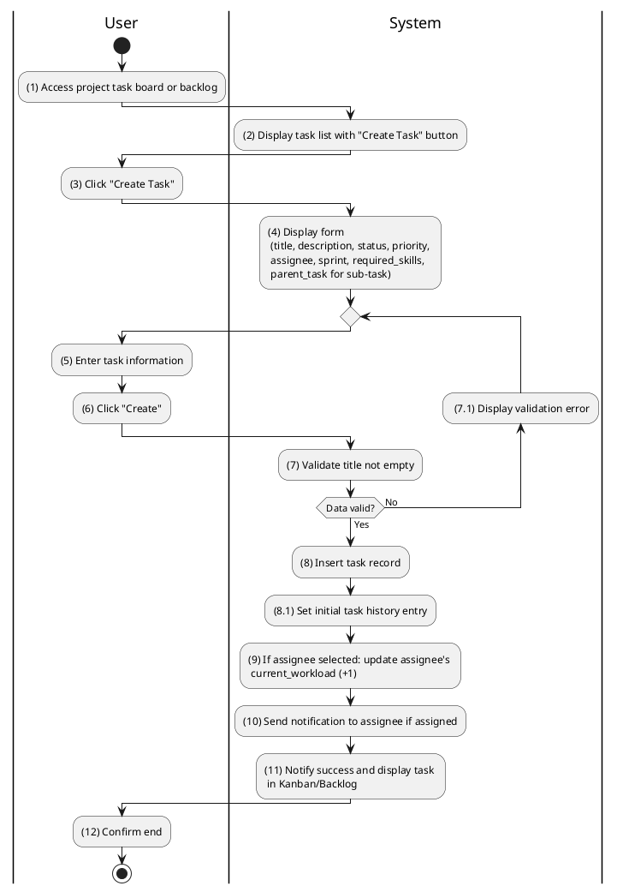
```plantuml
@startuml

|U|User
|S|System

|U|
start
:(1) Access project task board or backlog;

|S|
:(2) Display task list with "Create Task" button;

|U|
:(3) Click "Create Task";

|S|
:(4) Display form \n (title, description, status, priority, \n assignee, sprint, required_skills, \n parent_task for sub-task);

repeat
  |U|
  :(5) Enter task information;
  :(6) Click "Create";

  |S|
  :(7) Validate title not empty;
  backward: (7.1) Display validation error;
repeat while (Data valid?) is (No) not (Yes)

:(8) Insert task record;
:(8.1) Set initial task history entry;
:(9) If assignee selected: update assignee's \n current_workload (+1);
:(10) Send notification to assignee if assigned;
:(11) Notify success and display task \n in Kanban/Backlog;

|U|
:(12) Confirm end;

stop
@enduml
```

<!-- diagram id="srs-activity-task-management-create-new-task" -->

| Field | Value |
| --- | --- |
| ID | UC44 |
| Name | Create Task or Sub-task |
| Actor(s) | pm, mem |
| Priority | High |
| Trigger | Access project task board or backlog |
| Pre-condition(s) | User is authenticated and has access to the target project/resource. |
| Post-condition(s) | Send notification to assignee if assigned Notify success and display task in Kanban/Backlog |
| Basic Flow | 1. Access project task board or backlog 2. Display task list with "Create Task" button 3. Click "Create Task" 4. Display form (title, description, status, priority, assignee, sprint, required_skills, parent_task for sub-task) 5. Enter task information 6. Click "Create" 7. Validate title not empty 8. Insert task record 9. Set initial task history entry 10. If assignee selected: update assignee's current_workload (+1) 11. Send notification to assignee if assigned 12. Notify success and display task in Kanban/Backlog |
| Alternate Flow | 1. User may correct invalid input and resubmit until the validation checks pass. |
| Exception Flow | 1. Display validation error |
| Related UI screen(s) | [Kanban board](/docs/ui-specification#kanban-board) [Task detail](/docs/ui-specification#task-detail) |
| Related sequence diagram(s) | [sequence diagram](/docs/sequence/task-management/create-new-task) |
| Related activity diagram(s) | [activity diagram](/docs/activity/task-management/create-new-task) |
| Related database table(s) | tasks, task_required_skills, task_labels |

### UC46 — Update Task Status / Drag and Drop on Kanban

#### Sequence diagram

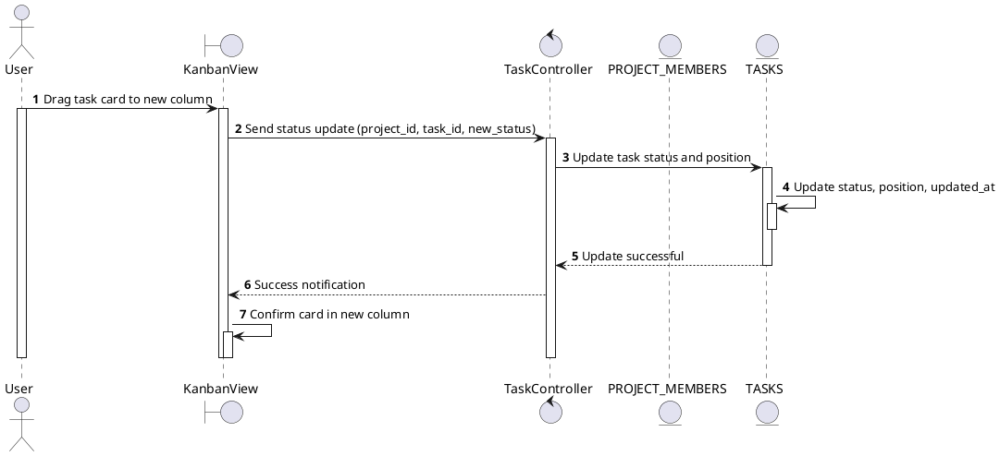
```plantuml
@startuml
autonumber

actor User as U
boundary KanbanView as KV
control TaskController as TC
entity PROJECT_MEMBERS as PM
entity TASKS as T

U -> KV: Drag task card to new column
activate U
activate KV

KV -> TC: Send status update (project_id, task_id, new_status)
activate TC

TC -> T: Update task status and position
activate T
T -> T: Update status, position, updated_at
activate T
deactivate T
TC <-- T: Update successful
deactivate T

KV <-- TC: Success notification

KV -> KV: Confirm card in new column
activate KV
deactivate KV

deactivate TC
deactivate KV
deactivate U

@enduml
```

<!-- diagram id="srs-sequence-task-management-update-task-status" -->

#### Activity diagram

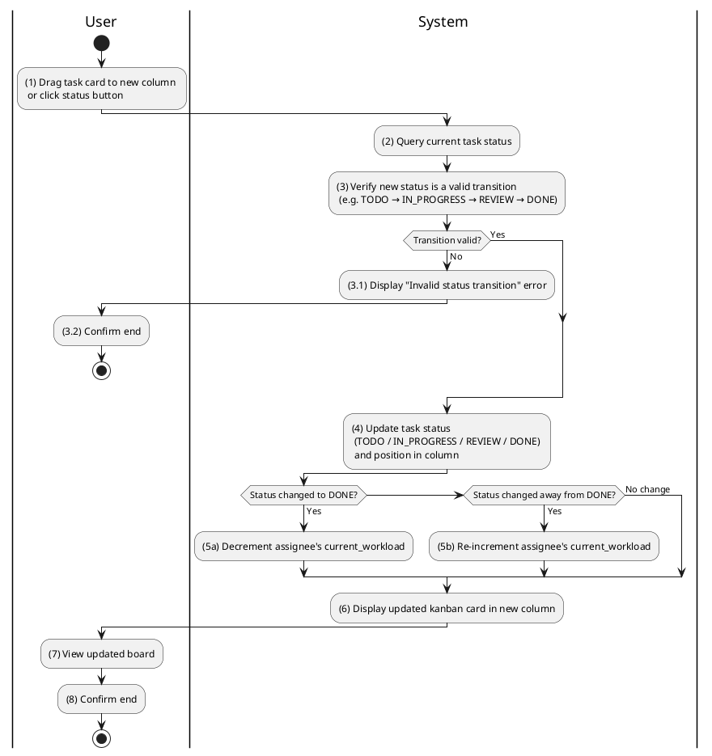
```plantuml
@startuml
|U|User
|S|System

|U|
start
:(1) Drag task card to new column \n or click status button;

|S|
:(2) Query current task status;
:(3) Verify new status is a valid transition \n (e.g. TODO → IN_PROGRESS → REVIEW → DONE);

if (Transition valid?) then (No)
  :(3.1) Display "Invalid status transition" error;
  |U|
  :(3.2) Confirm end;
  stop
else (Yes)
endif

|S|
:(4) Update task status \n (TODO / IN_PROGRESS / REVIEW / DONE) \n and position in column;

if (Status changed to DONE?) then (Yes)
  :(5a) Decrement assignee's current_workload;
elseif (Status changed away from DONE?) then (Yes)
  :(5b) Re-increment assignee's current_workload;
else (No change)
endif

:(6) Display updated kanban card in new column;

|U|
:(7) View updated board;
:(8) Confirm end;

stop
@enduml
```

<!-- diagram id="srs-activity-task-management-update-task-status" -->

| Field | Value |
| --- | --- |
| ID | UC46 |
| Name | Update Task Status / Drag and Drop on Kanban |
| Actor(s) | pm, mem |
| Priority | High |
| Trigger | Drag task card to new column or click status button |
| Pre-condition(s) | User is authenticated and has access to the target project/resource. |
| Post-condition(s) | Display updated kanban card in new column View updated board |
| Basic Flow | 1. Drag task card to new column or click status button 2. Query current task status 3. Verify new status is a valid transition (e.g. TODO → IN_PROGRESS → REVIEW → DONE) 4. Update task status (TODO / IN_PROGRESS / REVIEW / DONE) and position in column 5. Display updated kanban card in new column 6. View updated board |
| Alternate Flow | 1. Conditional branches in the activity diagram handle allowed business-state differences. 2. Status can be updated either by drag and drop on Kanban or from task detail controls. |
| Exception Flow | 1. Display "Invalid status transition" error 2. Decrement assignee's current_workload 3. Re-increment assignee's current_workload |
| Related UI screen(s) | [Kanban board](/docs/ui-specification#kanban-board) |
| Related sequence diagram(s) | [sequence diagram](/docs/sequence/task-management/update-task-status) |
| Related activity diagram(s) | [activity diagram](/docs/activity/task-management/update-task-status) |
| Related database table(s) | tasks |

### UC47 — Assign Assignee and Reporter

#### Sequence diagram

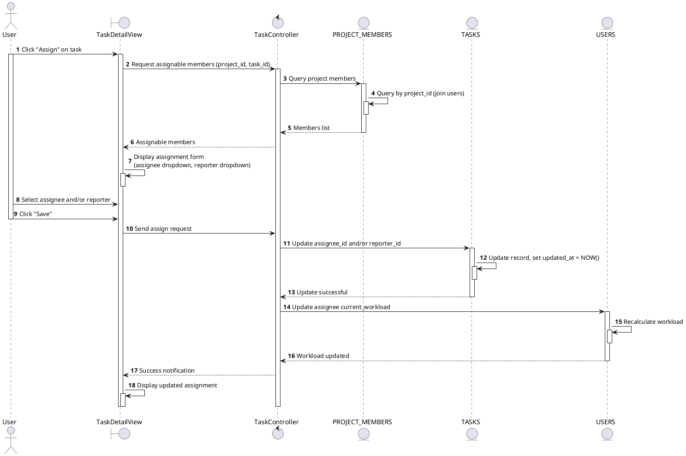
```plantuml
@startuml
autonumber

actor User as U
boundary TaskDetailView as TDV
control TaskController as TC
entity PROJECT_MEMBERS as PM
entity TASKS as T
entity USERS as US

U -> TDV: Click "Assign" on task
activate U
activate TDV

TDV -> TC: Request assignable members (project_id, task_id)
activate TC

TC -> PM: Query project members
activate PM
PM -> PM: Query by project_id (join users)
activate PM
deactivate PM
TC <-- PM: Members list
deactivate PM

TDV <-- TC: Assignable members

TDV -> TDV: Display assignment form\n(assignee dropdown, reporter dropdown)
activate TDV
deactivate TDV

U -> TDV: Select assignee and/or reporter
U -> TDV: Click "Save"
deactivate U

TDV -> TC: Send assign request

TC -> T: Update assignee_id and/or reporter_id
activate T
T -> T: Update record, set updated_at = NOW()
activate T
deactivate T
TC <-- T: Update successful
deactivate T

TC -> US: Update assignee current_workload
activate US
US -> US: Recalculate workload
activate US
deactivate US
TC <-- US: Workload updated
deactivate US

TDV <-- TC: Success notification

TDV -> TDV: Display updated assignment
activate TDV
deactivate TDV

deactivate TC
deactivate TDV

@enduml
```

<!-- diagram id="srs-sequence-task-management-assign-assignee-reporter" -->

#### Activity diagram

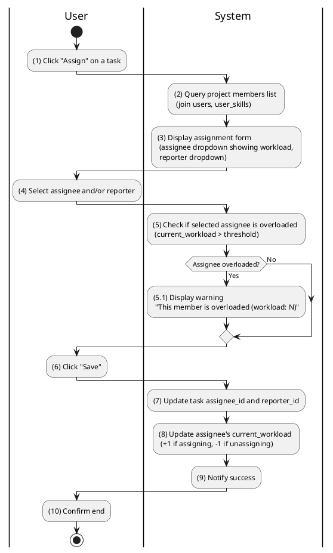
```plantuml
@startuml
|U|User
|S|System

|U|
start
:(1) Click "Assign" on a task;

|S|
:(2) Query project members list \n (join users, user_skills);
:(3) Display assignment form \n (assignee dropdown showing workload, \n reporter dropdown);

|U|
:(4) Select assignee and/or reporter;

|S|
:(5) Check if selected assignee is overloaded \n (current_workload > threshold);

if (Assignee overloaded?) then (Yes)
  :(5.1) Display warning \n "This member is overloaded (workload: N)";
else (No)
endif

|U|
:(6) Click "Save";

|S|
:(7) Update task assignee_id and reporter_id;
:(8) Update assignee's current_workload \n (+1 if assigning, -1 if unassigning);
:(9) Notify success;

|U|
:(10) Confirm end;

stop
@enduml
```

<!-- diagram id="srs-activity-task-management-assign-assignee-reporter" -->

| Field | Value |
| --- | --- |
| ID | UC47 |
| Name | Assign Assignee and Reporter |
| Actor(s) | pm, mem |
| Priority | High |
| Trigger | Click "Assign" on a task |
| Pre-condition(s) | User is authenticated and has access to the target project/resource. |
| Post-condition(s) | Update assignee's current_workload (+1 if assigning, -1 if unassigning) Notify success |
| Basic Flow | 1. Click "Assign" on a task 2. Query project members list (join users, user_skills) 3. Display assignment form (assignee dropdown showing workload, reporter dropdown) 4. Select assignee and/or reporter 5. Check if selected assignee is overloaded (current_workload > threshold) 6. Display warning "This member is overloaded (workload: N)" 7. Click "Save" 8. Update task assignee_id and reporter_id 9. Update assignee's current_workload (+1 if assigning, -1 if unassigning) 10. Notify success |
| Alternate Flow | 1. Conditional branches in the activity diagram handle allowed business-state differences. 2. The user may update only assignee, only reporter, or both fields. |
| Exception Flow | 1. Check if selected assignee is overloaded (current_workload > threshold) 2. Display warning "This member is overloaded (workload: N)" |
| Related UI screen(s) | [Task detail](/docs/ui-specification#task-detail) |
| Related sequence diagram(s) | [sequence diagram](/docs/sequence/task-management/assign-assignee-reporter) |
| Related activity diagram(s) | [activity diagram](/docs/activity/task-management/assign-assignee-reporter) |
| Related database table(s) | tasks, users, user_skills, project_members |

### UC59 — Request AI Task Assignment Recommendation

#### Sequence diagram

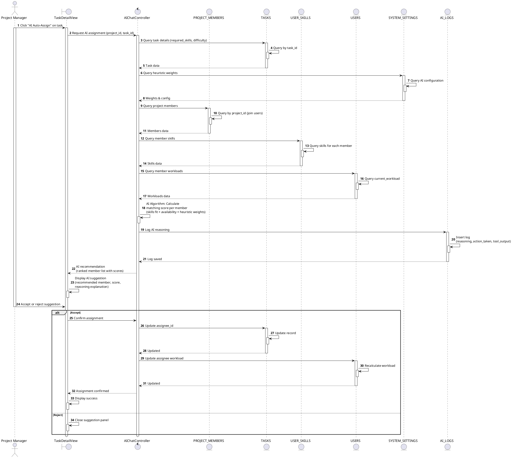
```plantuml
@startuml
autonumber

actor "Project Manager" as PM
boundary TaskDetailView as TDV
control AIChatController as ACC
entity PROJECT_MEMBERS as PME
entity TASKS as T
entity USER_SKILLS as USK
entity USERS as US
entity SYSTEM_SETTINGS as SS
entity AI_LOGS as AL

PM -> TDV: Click "AI Auto-Assign" on task
activate PM
activate TDV

TDV -> ACC: Request AI assignment (project_id, task_id)
activate ACC

ACC -> T: Query task details (required_skills, difficulty)
activate T
T -> T: Query by task_id
activate T
deactivate T
ACC <-- T: Task data
deactivate T

ACC -> SS: Query heuristic weights
activate SS
SS -> SS: Query AI configuration
activate SS
deactivate SS
ACC <-- SS: Weights & config
deactivate SS

ACC -> PME: Query project members
activate PME
PME -> PME: Query by project_id (join users)
activate PME
deactivate PME
ACC <-- PME: Members data
deactivate PME

ACC -> USK: Query member skills
activate USK
USK -> USK: Query skills for each member
activate USK
deactivate USK
ACC <-- USK: Skills data
deactivate USK

ACC -> US: Query member workloads
activate US
US -> US: Query current_workload
activate US
deactivate US
ACC <-- US: Workloads data
deactivate US

ACC -> ACC: AI Algorithm: Calculate\nmatching score per member\n(skills fit × availability × heuristic weights)
activate ACC
deactivate ACC

ACC -> AL: Log AI reasoning
activate AL
AL -> AL: Insert log\n(reasoning, action_taken, tool_output)
activate AL
deactivate AL
ACC <-- AL: Log saved
deactivate AL

TDV <-- ACC: AI recommendation\n(ranked member list with scores)

TDV -> TDV: Display AI suggestion\n(recommended member, score,\nreasoning explanation)
activate TDV
deactivate TDV

PM -> TDV: Accept or reject suggestion
deactivate PM

alt Accept
    TDV -> ACC: Confirm assignment

    ACC -> T: Update assignee_id
    activate T
    T -> T: Update record
    activate T
    deactivate T
    ACC <-- T: Updated
    deactivate T

    ACC -> US: Update assignee workload
    activate US
    US -> US: Recalculate workload
    activate US
    deactivate US
    ACC <-- US: Updated
    deactivate US

    TDV <-- ACC: Assignment confirmed
    TDV -> TDV: Display success
    activate TDV
    deactivate TDV
else Reject
    TDV -> TDV: Close suggestion panel
    activate TDV
    deactivate TDV
end

deactivate ACC
deactivate TDV

@enduml
```

<!-- diagram id="srs-sequence-ai-assistant-request-ai-auto-assignment" -->

#### Activity diagram

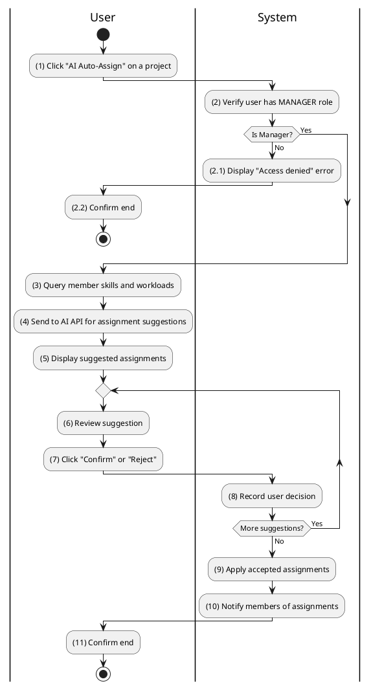
```plantuml
@startuml
|U|User
|S|System

|U|
start
:(1) Click "AI Auto-Assign" on a project;

|S|
:(2) Verify user has MANAGER role;

if (Is Manager?) then (No)
  :(2.1) Display "Access denied" error;
  |U|
  :(2.2) Confirm end;
  stop
else (Yes)
endif

:(3) Query member skills and workloads;
:(4) Send to AI API for assignment suggestions;
:(5) Display suggested assignments;

repeat
  |U|
  :(6) Review suggestion;
  :(7) Click "Confirm" or "Reject";

  |S|
  :(8) Record user decision;
repeat while (More suggestions?) is (Yes) not (No)

:(9) Apply accepted assignments;
:(10) Notify members of assignments;

|U|
:(11) Confirm end;

stop
@enduml
```

<!-- diagram id="srs-activity-ai-assistant-request-ai-auto-assignment" -->

| Field | Value |
| --- | --- |
| ID | UC59 |
| Name | Request AI Task Assignment Recommendation |
| Actor(s) | pm |
| Priority | High |
| Trigger | Click "AI Auto-Assign" on a project |
| Pre-condition(s) | User is authenticated and has an available AI chat/session or project context as required by the action. |
| Post-condition(s) | Apply accepted assignments Notify members of assignments |
| Basic Flow | 1. Click "AI Auto-Assign" on a project 2. Verify user has MANAGER role 3. Query member skills and workloads 4. Send to AI API for assignment suggestions 5. Display suggested assignments 6. Review suggestion 7. Click "Confirm" or "Reject" 8. Record user decision 9. Apply accepted assignments 10. Notify members of assignments |
| Alternate Flow | 1. User may correct invalid input and resubmit until the validation checks pass. 2. Conditional branches in the activity diagram handle allowed business-state differences. 3. The Project Manager may reject the recommendation, leaving task assignment unchanged. |
| Exception Flow | 1. Display "Access denied" error |
| Related UI screen(s) | [AI assignment recommendation](/docs/ui-specification#ai-assignment-recommendation) [Pending action confirmation](/docs/ui-specification#pending-action-confirmation) |
| Related sequence diagram(s) | [sequence diagram](/docs/sequence/ai-assistant/request-ai-auto-assignment) |
| Related activity diagram(s) | [activity diagram](/docs/activity/ai-assistant/request-ai-auto-assignment) |
| Related database table(s) | tasks, users, user_skills, project_members, system_settings, ai_logs |

## Full use case specifications

The remaining use cases retain the required SRS fields. Textual flows are derived from the existing PlantUML activity diagrams where those diagrams exist, so the SRS stays traceable to the current diagram source.

### UC02 — Register / Sign Up

#### Sequence diagram

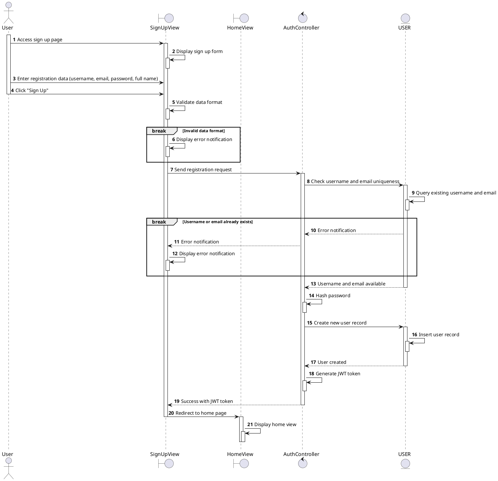
```plantuml
@startuml
autonumber

actor User as U
boundary SignUpView as SUV
boundary HomeView as HV
control AuthController as AC
entity USER as US

activate U
U -> SUV: Access sign up page
activate SUV
SUV -> SUV: Display sign up form
activate SUV
deactivate SUV

U -> SUV: Enter registration data (username, email, password, full name)
U -> SUV: Click "Sign Up"
deactivate U
SUV -> SUV: Validate data format
activate SUV
deactivate SUV

break Invalid data format
  SUV -> SUV: Display error notification
  activate SUV
  deactivate SUV
end

SUV -> AC: Send registration request
activate AC
AC -> US: Check username and email uniqueness
activate US
US -> US: Query existing username and email
activate US
deactivate US

break Username or email already exists
  AC <-- US: Error notification
  SUV <-- AC: Error notification
  SUV -> SUV: Display error notification
  activate SUV
  deactivate SUV
end

AC <-- US: Username and email available
deactivate US

AC -> AC: Hash password
activate AC
deactivate AC
AC -> US: Create new user record
activate US
US -> US: Insert user record
activate US
deactivate US
AC <-- US: User created
deactivate US

AC -> AC: Generate JWT token
activate AC
deactivate AC

SUV <-- AC: Success with JWT token
deactivate AC
SUV -> HV: Redirect to home page
deactivate SUV
activate HV
HV -> HV: Display home view
activate HV
deactivate HV
deactivate HV

@enduml
```

<!-- diagram id="srs-sequence-auth-register" -->

#### Activity diagram

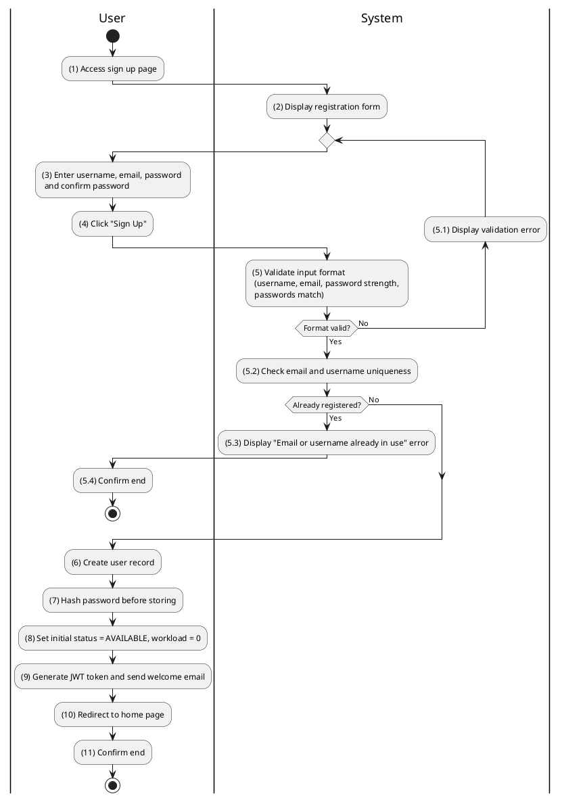
```plantuml
@startuml
|U|User
|S|System

|U|
start
:(1) Access sign up page;

|S|
:(2) Display registration form;

repeat
  |U|
  :(3) Enter username, email, password \n and confirm password;
  :(4) Click "Sign Up";

  |S|
  :(5) Validate input format \n (username, email, password strength, \n passwords match);
  backward: (5.1) Display validation error;
repeat while (Format valid?) is (No) not (Yes)

:(5.2) Check email and username uniqueness;

if (Already registered?) then (Yes)
  :(5.3) Display "Email or username already in use" error;
  |U|
  :(5.4) Confirm end;
  stop
else (No)
endif

:(6) Create user record;
:(7) Hash password before storing;
:(8) Set initial status = AVAILABLE, workload = 0;
:(9) Generate JWT token and send welcome email;
:(10) Redirect to home page;

|U|
:(11) Confirm end;

stop
@enduml
```

<!-- diagram id="srs-activity-auth-register" -->

| Field | Value |
| --- | --- |
| ID | UC02 |
| Name | Register / Sign Up |
| Actor(s) | ad, pm, mem |
| Priority | Medium |
| Trigger | Access sign up page |
| Pre-condition(s) | User is not required to be authenticated and the authentication service is operational. |
| Post-condition(s) | Generate JWT token and send welcome email Redirect to home page |
| Basic Flow | 1. Access sign up page 2. Display registration form 3. Enter username, email, password and confirm password 4. Click "Sign Up" 5. Validate input format (username, email, password strength, passwords match) 6. Check email and username uniqueness 7. Create user record 8. Hash password before storing 9. Set initial status = AVAILABLE, workload = 0 10. Generate JWT token and send welcome email 11. Redirect to home page |
| Alternate Flow | 1. User may correct invalid input and resubmit until the validation checks pass. 2. Conditional branches in the activity diagram handle allowed business-state differences. |
| Exception Flow | 1. Display validation error 2. Display "Email or username already in use" error |
| Related UI screen(s) | [Register screen](/docs/ui-specification#register-screen) |
| Related sequence diagram(s) | [sequence diagram](/docs/sequence/auth/register) |
| Related activity diagram(s) | [activity diagram](/docs/activity/auth/register) |
| Related database table(s) | users |

### UC03 — Forgot Password

#### Sequence diagram

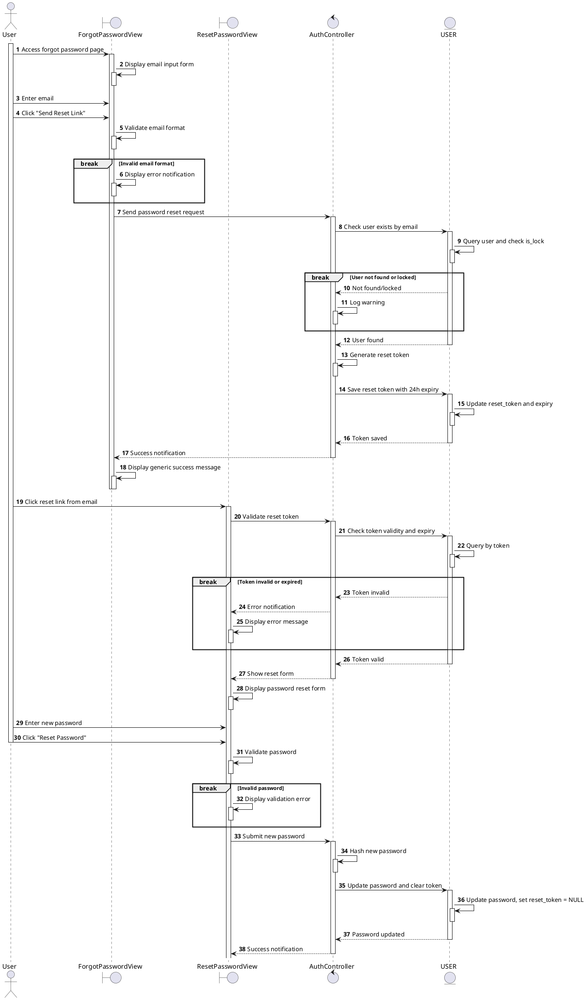
```plantuml
@startuml
autonumber

actor User as U
boundary ForgotPasswordView as FPV
boundary ResetPasswordView as RPV
control AuthController as AC
entity USER as US

activate U
U -> FPV: Access forgot password page
activate FPV
FPV -> FPV: Display email input form
activate FPV
deactivate FPV

U -> FPV: Enter email
U -> FPV: Click "Send Reset Link"
FPV -> FPV: Validate email format
activate FPV
deactivate FPV

break Invalid email format
  FPV -> FPV: Display error notification
  activate FPV
  deactivate FPV
end

FPV -> AC: Send password reset request
activate AC
AC -> US: Check user exists by email
activate US
US -> US: Query user and check is_lock
activate US
deactivate US

break User not found or locked
  AC <-- US: Not found/locked
  AC -> AC: Log warning
  activate AC
  deactivate AC
end

AC <-- US: User found
deactivate US

AC -> AC: Generate reset token
activate AC
deactivate AC
AC -> US: Save reset token with 24h expiry
activate US
US -> US: Update reset_token and expiry
activate US
deactivate US
AC <-- US: Token saved
deactivate US

FPV <-- AC: Success notification
deactivate AC
deactivate AC
FPV -> FPV: Display generic success message
activate FPV
deactivate FPV
deactivate FPV

U -> RPV: Click reset link from email
activate RPV
RPV -> AC: Validate reset token
activate AC
AC -> US: Check token validity and expiry
activate US
US -> US: Query by token
activate US
deactivate US

break Token invalid or expired
  AC <-- US: Token invalid
  RPV <-- AC: Error notification
  RPV -> RPV: Display error message
  activate RPV
  deactivate RPV
end

AC <-- US: Token valid
deactivate US

RPV <-- AC: Show reset form
deactivate AC
RPV -> RPV: Display password reset form
activate RPV
deactivate RPV

U -> RPV: Enter new password
U -> RPV: Click "Reset Password"
deactivate U
RPV -> RPV: Validate password
activate RPV
deactivate RPV

break Invalid password
  RPV -> RPV: Display validation error
  activate RPV
  deactivate RPV
end

RPV -> AC: Submit new password
activate AC
AC -> AC: Hash new password
activate AC
deactivate AC
AC -> US: Update password and clear token
activate US
US -> US: Update password, set reset_token = NULL
activate US
deactivate US
AC <-- US: Password updated
deactivate US

RPV <-- AC: Success notification
deactivate AC
deactivate AC


@enduml
```

<!-- diagram id="srs-sequence-auth-forgot-password" -->

#### Activity diagram

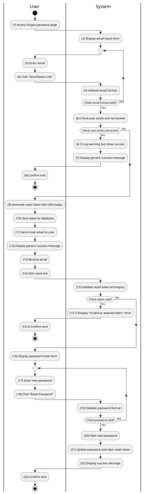
```plantuml
@startuml
|U|User
|S|System

|U|
start

:(1) Access forgot password page;

|S|
:(2) Display email input form;

repeat
  |U|
  :(3) Enter email;
  :(4) Click "Send Reset Link";

  |S|
  :(5) Validate email format;
repeat while (Check email format valid?) is (No) not (Yes)

:(6) Check user exists and not locked;

if (Check user exists and active?) then (No)
  :(6.1) Log warning but show success;
  :(7) Display generic success message;
  |U|
  :(8) Confirm end;
  stop
else (Yes)
endif

:(9) Generate reset token with 24h expiry;
:(10) Save token to database;
:(11) Send reset email to user;
:(12) Display generic success message;

|U|
:(13) Receive email;
:(14) Click reset link;

|S|
:(15) Validate reset token and expiry;

if (Check token valid?) then (No)
  :(15.1) Display "Invalid or expired token" error;
  |U|
  :(15.2) Confirm end;
  stop
else (Yes)
endif

:(16) Display password reset form;

repeat
  |U|
  :(17) Enter new password;
  :(18) Click "Reset Password";

  |S|
  :(19) Validate password format;
repeat while (Check password valid?) is (No) not (Yes)

:(20) Hash new password;
:(21) Update password and clear reset token;
:(22) Display success message;

|U|
:(23) Confirm end;

stop

@enduml
```

<!-- diagram id="srs-activity-auth-forgot-password" -->

| Field | Value |
| --- | --- |
| ID | UC03 |
| Name | Forgot Password |
| Actor(s) | ad, pm, mem |
| Priority | High |
| Trigger | Access forgot password page |
| Pre-condition(s) | A registered account and password reset flow are available. |
| Post-condition(s) | Update password and clear reset token Display success message |
| Basic Flow | 1. Access forgot password page 2. Display email input form 3. Enter email 4. Click "Send Reset Link" 5. Validate email format 6. Check user exists and not locked 7. Log warning but show success 8. Display generic success message 9. Generate reset token with 24h expiry 10. Save token to database 11. Send reset email to user 12. Display generic success message 13. Receive email 14. Click reset link 15. Validate reset token and expiry 16. Display password reset form 17. Enter new password 18. Click "Reset Password" 19. Validate password format 20. Hash new password 21. Update password and clear reset token 22. Display success message |
| Alternate Flow | 1. User may correct invalid input and resubmit until the validation checks pass. 2. Conditional branches in the activity diagram handle allowed business-state differences. |
| Exception Flow | 1. Check user exists and not locked 2. Display "Invalid or expired token" error |
| Related UI screen(s) | [Forgot password screen](/docs/ui-specification#forgot-password-screen) |
| Related sequence diagram(s) | [sequence diagram](/docs/sequence/auth/forgot-password) |
| Related activity diagram(s) | [activity diagram](/docs/activity/auth/forgot-password) |
| Related database table(s) | users, password_reset_tokens |

### UC04 — Reset Password

#### Sequence diagram

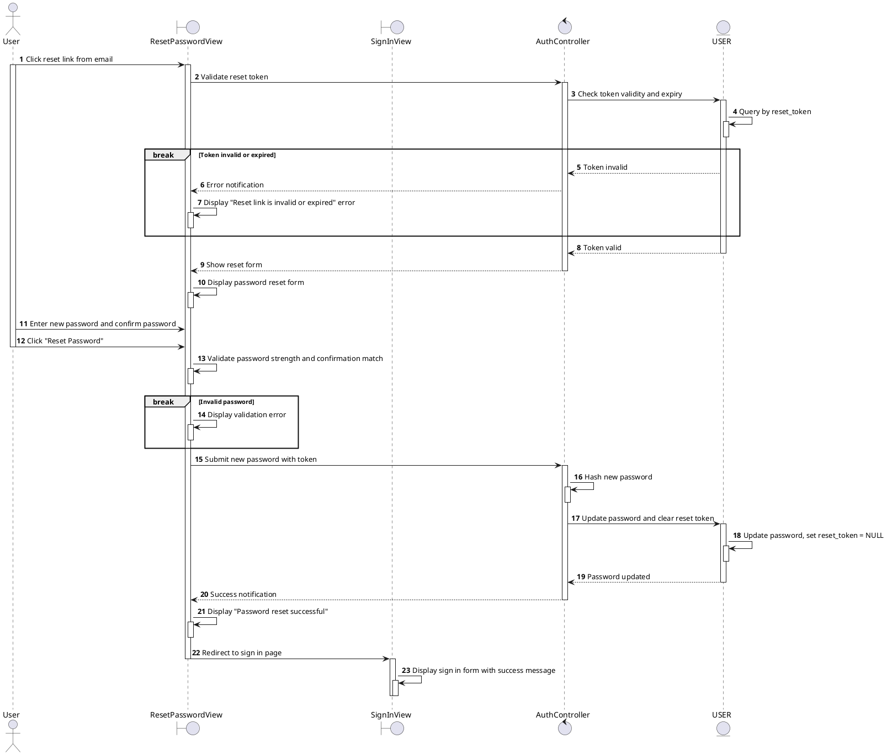
```plantuml
@startuml
autonumber

actor User as U
boundary ResetPasswordView as RPV
boundary SignInView as SIV
control AuthController as AC
entity USER as US

U -> RPV: Click reset link from email
activate U
activate RPV
RPV -> AC: Validate reset token
activate AC
AC -> US: Check token validity and expiry
activate US
US -> US: Query by reset_token
activate US
deactivate US

break Token invalid or expired
  AC <-- US: Token invalid
  RPV <-- AC: Error notification
  RPV -> RPV: Display "Reset link is invalid or expired" error
  activate RPV
  deactivate RPV
end

AC <-- US: Token valid
deactivate US

RPV <-- AC: Show reset form
deactivate AC
RPV -> RPV: Display password reset form
activate RPV
deactivate RPV

U -> RPV: Enter new password and confirm password
U -> RPV: Click "Reset Password"
deactivate U
RPV -> RPV: Validate password strength and confirmation match
activate RPV
deactivate RPV

break Invalid password
  RPV -> RPV: Display validation error
  activate RPV
  deactivate RPV
end

RPV -> AC: Submit new password with token
activate AC
AC -> AC: Hash new password
activate AC
deactivate AC
AC -> US: Update password and clear reset token
activate US
US -> US: Update password, set reset_token = NULL
activate US
deactivate US
AC <-- US: Password updated
deactivate US

RPV <-- AC: Success notification
deactivate AC
RPV -> RPV: Display "Password reset successful"
activate RPV
deactivate RPV
RPV -> SIV: Redirect to sign in page
deactivate RPV
activate SIV
SIV -> SIV: Display sign in form with success message
activate SIV
deactivate SIV
deactivate SIV

@enduml
```

<!-- diagram id="srs-sequence-auth-reset-password" -->

#### Activity diagram

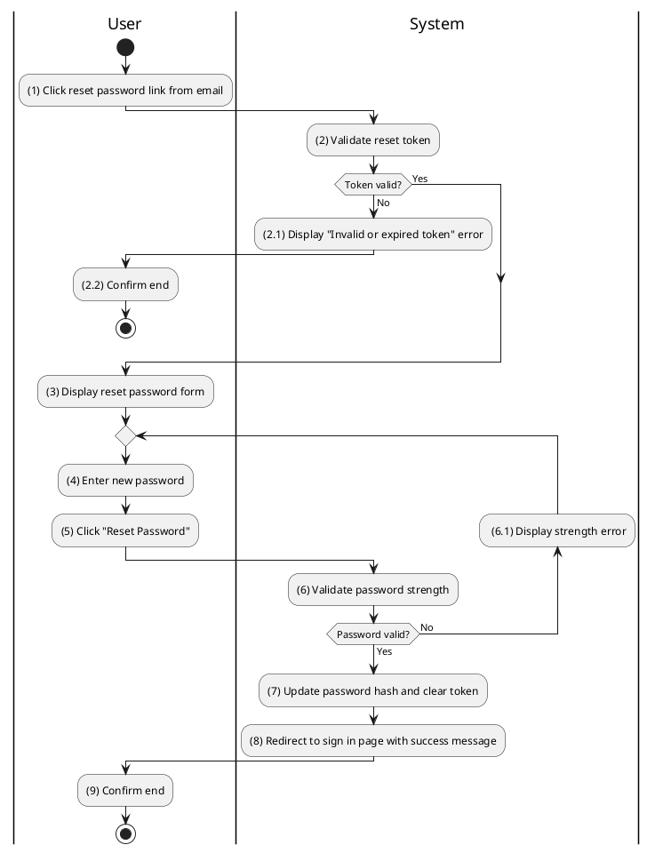
```plantuml
@startuml
|U|User
|S|System

|U|
start
:(1) Click reset password link from email;

|S|
:(2) Validate reset token;

if (Token valid?) then (No)
  :(2.1) Display "Invalid or expired token" error;
  |U|
  :(2.2) Confirm end;
  stop
else (Yes)
endif

:(3) Display reset password form;

repeat
  |U|
  :(4) Enter new password;
  :(5) Click "Reset Password";

  |S|
  :(6) Validate password strength;
  backward: (6.1) Display strength error;
repeat while (Password valid?) is (No) not (Yes)

:(7) Update password hash and clear token;
:(8) Redirect to sign in page with success message;

|U|
:(9) Confirm end;

stop
@enduml
```

<!-- diagram id="srs-activity-auth-reset-password" -->

| Field | Value |
| --- | --- |
| ID | UC04 |
| Name | Reset Password |
| Actor(s) | ad, pm, mem |
| Priority | High |
| Trigger | Click reset password link from email |
| Pre-condition(s) | A registered account and password reset flow are available. |
| Post-condition(s) | Update password hash and clear token Redirect to sign in page with success message |
| Basic Flow | 1. Click reset password link from email 2. Validate reset token 3. Display reset password form 4. Enter new password 5. Click "Reset Password" 6. Validate password strength 7. Update password hash and clear token 8. Redirect to sign in page with success message |
| Alternate Flow | 1. User may correct invalid input and resubmit until the validation checks pass. 2. Conditional branches in the activity diagram handle allowed business-state differences. |
| Exception Flow | 1. Display "Invalid or expired token" error 2. Display strength error |
| Related UI screen(s) | [Forgot password screen](/docs/ui-specification#forgot-password-screen) |
| Related sequence diagram(s) | [sequence diagram](/docs/sequence/auth/reset-password) |
| Related activity diagram(s) | [activity diagram](/docs/activity/auth/reset-password) |
| Related database table(s) | users, password_reset_tokens |

### UC05 — Update Personal Information

#### Sequence diagram

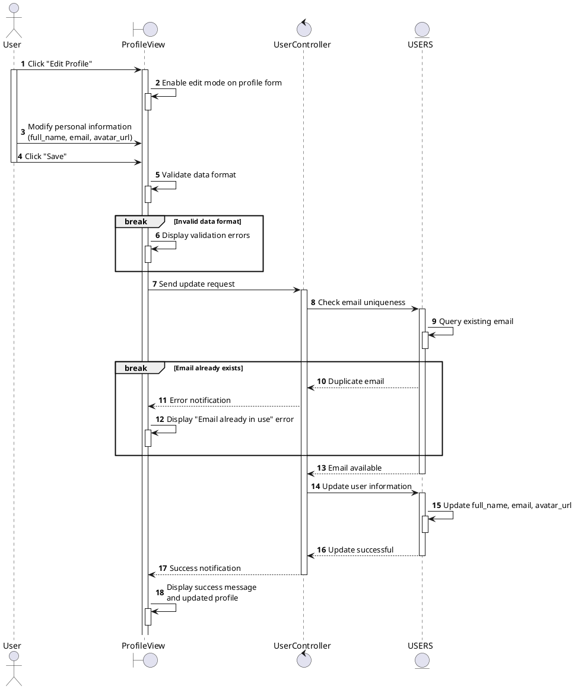
```plantuml
@startuml
autonumber

actor User as U
boundary ProfileView as PV
control UserController as UC
entity USERS as US

U -> PV: Click "Edit Profile"
activate U
activate PV

PV -> PV: Enable edit mode on profile form
activate PV
deactivate PV

U -> PV: Modify personal information\n(full_name, email, avatar_url)
U -> PV: Click "Save"
deactivate U

PV -> PV: Validate data format
activate PV
deactivate PV

break Invalid data format
  PV -> PV: Display validation errors
  activate PV
  deactivate PV
end

PV -> UC: Send update request
activate UC

UC -> US: Check email uniqueness
activate US
US -> US: Query existing email
activate US
deactivate US

break Email already exists
  UC <-- US: Duplicate email
  PV <-- UC: Error notification
  PV -> PV: Display "Email already in use" error
  activate PV
  deactivate PV
end

UC <-- US: Email available
deactivate US

UC -> US: Update user information
activate US
US -> US: Update full_name, email, avatar_url
activate US
deactivate US
UC <-- US: Update successful
deactivate US

PV <-- UC: Success notification
deactivate UC

PV -> PV: Display success message\nand updated profile
activate PV
deactivate PV

@enduml
```

<!-- diagram id="srs-sequence-user-profile-update-personal-information" -->

#### Activity diagram

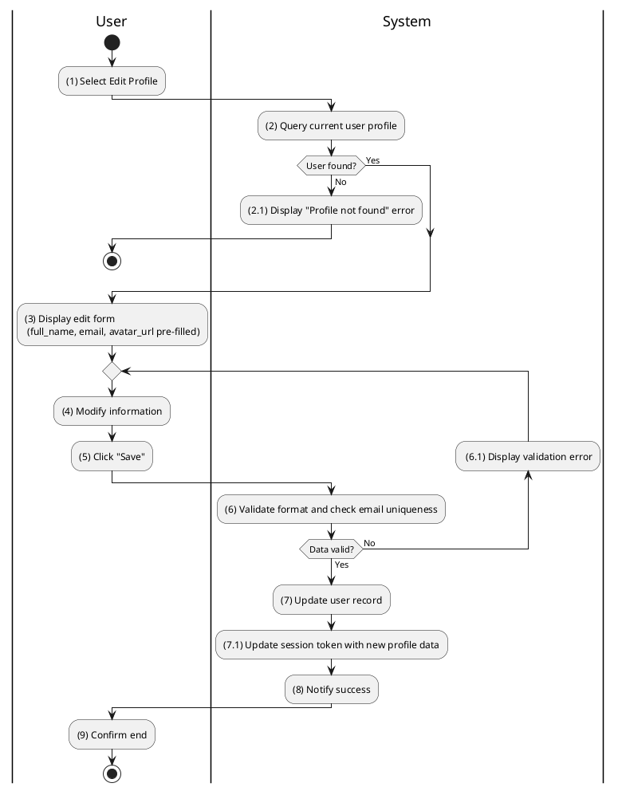
```plantuml
@startuml
|U|User
|S|System

|U|
start
:(1) Select Edit Profile;

|S|
:(2) Query current user profile;

if (User found?) then (No)
  :(2.1) Display "Profile not found" error;
  |U|
  stop
else (Yes)
endif

:(3) Display edit form \n (full_name, email, avatar_url pre-filled);

repeat
  |U|
  :(4) Modify information;
  :(5) Click "Save";

  |S|
  :(6) Validate format and check email uniqueness;
  backward: (6.1) Display validation error;
repeat while (Data valid?) is (No) not (Yes)

:(7) Update user record;
:(7.1) Update session token with new profile data;
:(8) Notify success;

|U|
:(9) Confirm end;

stop
@enduml
```

<!-- diagram id="srs-activity-user-profile-update-personal-information" -->

| Field | Value |
| --- | --- |
| ID | UC05 |
| Name | Update Personal Information |
| Actor(s) | ad, pm, mem |
| Priority | Medium |
| Trigger | Select Edit Profile |
| Pre-condition(s) | User is authenticated and the required subsystem data exists. |
| Post-condition(s) | Update session token with new profile data Notify success |
| Basic Flow | 1. Select Edit Profile 2. Query current user profile 3. Display edit form (full_name, email, avatar_url pre-filled) 4. Modify information 5. Click "Save" 6. Validate format and check email uniqueness 7. Update user record 8. Update session token with new profile data 9. Notify success |
| Alternate Flow | 1. User may correct invalid input and resubmit until the validation checks pass. 2. Conditional branches in the activity diagram handle allowed business-state differences. |
| Exception Flow | 1. Display "Profile not found" error 2. Display validation error |
| Related UI screen(s) | [Profile screen](/docs/ui-specification#profile-screen) |
| Related sequence diagram(s) | [sequence diagram](/docs/sequence/user-profile/update-personal-information) |
| Related activity diagram(s) | [activity diagram](/docs/activity/user-profile/update-personal-information) |
| Related database table(s) | users |

### UC06 — View User Profile

#### Sequence diagram

```plantuml
@startuml
autonumber

actor User as U
boundary ProfileView as PV
control UserController as UC
entity USERS as US

U -> PV: Access profile page
activate U
activate PV

PV -> UC: Request user profile data
activate UC

UC -> US: Query user information
activate US
US -> US: Query by user_id
activate US
deactivate US

break Error or Not Found / Invalid
  UC <-- US: Error notification
  PV <-- UC: Error notification
  PV -> PV: Display error message
  activate PV
  deactivate PV
end

UC <-- US: User data
deactivate US

PV <-- UC: User profile data
deactivate UC

PV -> PV: Display profile information\n(name, email, avatar, status, workload)
activate PV
deactivate PV

deactivate PV
deactivate U

@enduml
```

<!-- diagram id="srs-sequence-user-profile-view-user-profile" -->

#### Activity diagram

```plantuml
@startuml
|U|User
|S|System

|U|
start
:(1) Select "My Profile" from menu;

|S|
:(2) Query user info by user_id \n (full_name, email, avatar_url, \n role, status, current_workload);

if (User found?) then (No)
  :(2.1) Display "User not found" error;
  |U|
  :(2.2) Confirm end;
  stop
else (Yes)
endif

:(3) Query user's skill list \n (join user_skills + skills table, \n ordered by level DESC);
:(4) Query user's active project memberships \n (projects where user is member and \n project status != ARCHIVED);
:(5) Display profile page \n (full_name, email, avatar, role, status, \n current_workload, skills list, \n active projects list, \n edit profile / delete account buttons);

|U|
:(6) View profile details;
:(7) Confirm end;

stop
@enduml
```

<!-- diagram id="srs-activity-user-profile-view-user-profile" -->

| Field | Value |
| --- | --- |
| ID | UC06 |
| Name | View User Profile |
| Actor(s) | ad, pm, mem |
| Priority | Medium |
| Trigger | Select "My Profile" from menu |
| Pre-condition(s) | User is authenticated and the required subsystem data exists. |
| Post-condition(s) | Display profile page (full_name, email, avatar, role, status, current_workload, skills list, active projects list, edit profile / delete account buttons) |
| Basic Flow | 1. Select "My Profile" from menu 2. Query user info by user_id (full_name, email, avatar_url, role, status, current_workload) 3. Query user's skill list (join user_skills + skills table, ordered by level DESC) 4. Query user's active project memberships (projects where user is member and project status != ARCHIVED) 5. Display profile page (full_name, email, avatar, role, status, current_workload, skills list, active projects list, edit profile / delete account buttons) 6. View profile details |
| Alternate Flow | 1. Conditional branches in the activity diagram handle allowed business-state differences. |
| Exception Flow | 1. Display "User not found" error |
| Related UI screen(s) | [Profile screen](/docs/ui-specification#profile-screen) |
| Related sequence diagram(s) | [sequence diagram](/docs/sequence/user-profile/view-user-profile) |
| Related activity diagram(s) | [activity diagram](/docs/activity/user-profile/view-user-profile) |
| Related database table(s) | users |

### UC07 — Delete Personal Account

#### Sequence diagram

```plantuml
@startuml
autonumber

actor User as U
boundary ProfileView as PV
control UserController as UC
entity USERS as US

U -> PV: Click "Delete Account"
activate U
activate PV

PV -> PV: Display confirmation dialog\n"Are you sure? This action cannot be undone."
activate PV
deactivate PV

U -> PV: Enter current password for confirmation
U -> PV: Click "Confirm Delete"
deactivate U

PV -> UC: Send delete account request
activate UC

break Password incorrect
  UC <-- US: Error
  PV <-- UC: Error notification
  PV -> PV: Display "Password incorrect" error
  activate PV
  deactivate PV
end

UC <-- US: Password verified
deactivate US

UC -> US: Delete user account and related data
activate US
US -> US: Delete user record (CASCADE)
activate US
deactivate US
UC <-- US: Account deleted
deactivate US

PV <-- UC: Success notification
deactivate UC

PV -> PV: Clear session
activate PV
deactivate PV

PV -> PV: Redirect to landing page\nwith "Account deleted" message
activate PV
deactivate PV

@enduml
```

<!-- diagram id="srs-sequence-user-profile-delete-personal-account" -->

#### Activity diagram

```plantuml
@startuml
|U|User
|S|System

|U|
start
:(1) Click "Delete Account";

|S|
:(2) Display confirmation dialog;

|U|
:(3) Enter current password;
:(4) Click "Confirm Delete";

|S|
:(5) Verify current password;

if (Password correct?) then (No)
  :(5.1) Display "Incorrect password" error;
  |U|
  :(5.2) Confirm end;
  stop
else (Yes)
endif

:(6) Delete user and cascade data;
:(7) Clear session;
:(8) Redirect to landing page;

|U|
:(9) Confirm end;

stop
@enduml
```

<!-- diagram id="srs-activity-user-profile-delete-personal-account" -->

| Field | Value |
| --- | --- |
| ID | UC07 |
| Name | Delete Personal Account |
| Actor(s) | ad, pm, mem |
| Priority | Medium-High |
| Trigger | Click "Delete Account" |
| Pre-condition(s) | User is authenticated and the required subsystem data exists. |
| Post-condition(s) | Delete user and cascade data Redirect to landing page |
| Basic Flow | 1. Click "Delete Account" 2. Display confirmation dialog 3. Enter current password 4. Click "Confirm Delete" 5. Verify current password 6. Delete user and cascade data 7. Clear session 8. Redirect to landing page |
| Alternate Flow | 1. Conditional branches in the activity diagram handle allowed business-state differences. |
| Exception Flow | 1. Display "Incorrect password" error |
| Related UI screen(s) | [Profile screen](/docs/ui-specification#profile-screen) |
| Related sequence diagram(s) | [sequence diagram](/docs/sequence/user-profile/delete-personal-account) |
| Related activity diagram(s) | [activity diagram](/docs/activity/user-profile/delete-personal-account) |
| Related database table(s) | users |

### UC08 — View Personal Skill List

#### Sequence diagram

```plantuml
@startuml
autonumber

actor User as U
boundary SkillListView as SLV
control UserSkillController as USC
entity USER_SKILLS as USK

U -> SLV: Access personal skills page
activate U
activate SLV

SLV -> USC: Request user skill list
activate USC

USC -> USK: Query user skills with skill names
activate USK
USK -> USK: Query by user_id (join skills)
activate USK
deactivate USK
USC <-- USK: Skill list data
deactivate USK

SLV <-- USC: User skill list
deactivate USC

SLV -> SLV: Display skill list\n(name, level for each skill)
activate SLV
deactivate SLV

deactivate SLV
deactivate U

@enduml
```

<!-- diagram id="srs-sequence-user-skills-view-personal-skill-list" -->

#### Activity diagram

```plantuml
@startuml
|U|User
|S|System

|U|
start
:(1) Access Skills page;

|S|
:(2) Query user skills \n (join user_skills with skills tables);

if (Check has skills?) then (No)
  :(2.1) Display "No skills added yet" notification \n with add skill button;
  |U|
  :(2.2) Confirm end;
  stop
else (Yes)
endif

:(3) Display skill list \n (skill name, level 1-5);

|U|
:(4) Enter filter criteria \n (keyword: skill name, level: 1-5);
:(5) Click "Filter";

|S|
:(6) Apply filter criteria to query;

if (Has results?) then (No)
  :(6.1) Display "No results found" notification;
  |U|
else (Yes)
  |S|
  :(7) Display filtered skill list \n (skill name, level 1-5);
  |U|
endif

:(8) Confirm end;

stop
@enduml
```

<!-- diagram id="srs-activity-user-skills-view-personal-skill-list" -->

| Field | Value |
| --- | --- |
| ID | UC08 |
| Name | View Personal Skill List |
| Actor(s) | pm, mem |
| Priority | Medium |
| Trigger | Access Skills page |
| Pre-condition(s) | User is authenticated and the required subsystem data exists. |
| Post-condition(s) | Display "No results found" notification Display filtered skill list (skill name, level 1-5) |
| Basic Flow | 1. Access Skills page 2. Query user skills (join user_skills with skills tables) 3. Display "No skills added yet" notification with add skill button 4. Display skill list (skill name, level 1-5) 5. Enter filter criteria (keyword: skill name, level: 1-5) 6. Click "Filter" 7. Apply filter criteria to query 8. Display "No results found" notification 9. Display filtered skill list (skill name, level 1-5) |
| Alternate Flow | 1. Conditional branches in the activity diagram handle allowed business-state differences. |
| Exception Flow | 1. Unauthorized or insufficient permission rejects the request. 2. Invalid input or missing target resource returns an error and leaves data unchanged. |
| Related UI screen(s) | [Profile screen](/docs/ui-specification#profile-screen) |
| Related sequence diagram(s) | [sequence diagram](/docs/sequence/user-skills/view-personal-skill-list) |
| Related activity diagram(s) | [activity diagram](/docs/activity/user-skills/view-personal-skill-list) |
| Related database table(s) | user_skills, skills |

### UC09 — View Personal Skill Details

#### Sequence diagram

```plantuml
@startuml
autonumber

actor User as U
boundary SkillDetailView as SDV
control UserSkillController as USC
entity USER_SKILLS as USK

U -> SDV: Click on a skill from skill list
activate U
activate SDV

SDV -> USC: Request skill details (skill_id)
activate USC

USC -> USK: Query skill detail
activate USK
USK -> USK: Query by user_id and skill_id
activate USK
deactivate USK

break Error or Not Found / Invalid
  USC <-- USK: Not found
  SDV <-- USC: Error notification
  SDV -> SDV: Display "Skill not found" error
  activate SDV
  deactivate SDV
end

USC <-- USK: Skill detail data
deactivate USK

SDV <-- USC: Skill details
deactivate USC

SDV -> SDV: Display skill details\n(skill name, level 1-5)
activate SDV
deactivate SDV

deactivate SDV
deactivate U

@enduml
```

<!-- diagram id="srs-sequence-user-skills-view-personal-skill-details" -->

#### Activity diagram

```plantuml
@startuml
|U|User
|S|System

|U|
start
:(1) Click on a skill from personal skill list;

|S|
:(2) Query user skill record \n (level, date added) \n by user_id + skill_id;

if (Skill found in profile?) then (No)
  :(2.1) Display "Skill not found" error;
  |U|
  :(2.2) Confirm end;
  stop
else (Yes)
endif

:(3) Query system skill info by skill_id \n (name, description if available);
:(4) Display skill details \n (skill name, level 1–5, skill description, \n date added to profile, edit / delete buttons);

|U|
:(5) View skill details;
:(6) Confirm end;

stop
@enduml
```

<!-- diagram id="srs-activity-user-skills-view-personal-skill-details" -->

| Field | Value |
| --- | --- |
| ID | UC09 |
| Name | View Personal Skill Details |
| Actor(s) | pm, mem |
| Priority | Medium-High |
| Trigger | Click on a skill from personal skill list |
| Pre-condition(s) | User is authenticated and the required subsystem data exists. |
| Post-condition(s) | Query user skill record (level, date added) by user_id + skill_id Display skill details (skill name, level 1–5, skill description, date added to profile, edit / delete buttons) |
| Basic Flow | 1. Click on a skill from personal skill list 2. Query user skill record (level, date added) by user_id + skill_id 3. Query system skill info by skill_id (name, description if available) 4. Display skill details (skill name, level 1–5, skill description, date added to profile, edit / delete buttons) 5. View skill details |
| Alternate Flow | 1. Conditional branches in the activity diagram handle allowed business-state differences. |
| Exception Flow | 1. Display "Skill not found" error |
| Related UI screen(s) | [Profile screen](/docs/ui-specification#profile-screen) |
| Related sequence diagram(s) | [sequence diagram](/docs/sequence/user-skills/view-personal-skill-details) |
| Related activity diagram(s) | [activity diagram](/docs/activity/user-skills/view-personal-skill-details) |
| Related database table(s) | user_skills, skills |

### UC10 — Add Personal Skill

#### Sequence diagram

```plantuml
@startuml
autonumber

actor User as U
boundary SkillListView as SLV
boundary AddSkillView as ASV
control UserSkillController as USC
entity SKILLS as SK
entity USER_SKILLS as USK

U -> SLV: Click "Add Skill"
activate U
activate SLV

SLV -> ASV: Navigate to add skill form
deactivate SLV
activate ASV

ASV -> USC: Request available skills
activate USC

USC -> SK: Query all system skills
activate SK
SK -> SK: Query skill list
activate SK
deactivate SK
USC <-- SK: Skills list
deactivate SK

ASV <-- USC: Available skills dropdown
deactivate USC

ASV -> ASV: Display add skill form\n(skill dropdown, level 1-5)
activate ASV
deactivate ASV

U -> ASV: Select skill and set level
U -> ASV: Click "Save"
deactivate U

ASV -> ASV: Validate data
activate ASV
deactivate ASV

break Invalid data
  ASV -> ASV: Display error notification
  activate ASV
  deactivate ASV
end

ASV -> USC: Send add skill request
activate USC

USC -> USK: Check if skill already exists
activate USK
USK -> USK: Query by user_id and skill_id
activate USK
deactivate USK

break Skill already added
  USC <-- USK: Duplicate
  ASV <-- USC: Error notification
  ASV -> ASV: Display "Skill already exists" error
  activate ASV
  deactivate ASV
end

USC <-- USK: Not exists
deactivate USK

USC -> USK: Insert new user skill
activate USK
USK -> USK: Insert record
activate USK
deactivate USK
USC <-- USK: Success
deactivate USK

ASV <-- USC: Success notification
deactivate USC

ASV -> ASV: Display success message
activate ASV
deactivate ASV
ASV -> SLV: Redirect to skill list
deactivate ASV

@enduml
```

<!-- diagram id="srs-sequence-user-skills-add-personal-skill" -->

#### Activity diagram

```plantuml
@startuml
|U|User
|S|System

|U|
start
:(1) Click "Add Skill";

|S|
:(2) Query available system skills \n not yet added by user;

if (Has available skills?) then (No)
  :(2.1) Display "You have added all available skills" notification;
  |U|
  stop
else (Yes)
endif

:(3) Display form (skill dropdown, level 1-5);

repeat
  |U|
  :(4) Select skill and level;
  :(5) Click "Save";

  |S|
  :(6) Validate and check for duplicate skill;
  backward: (6.1) Display validation error;
repeat while (Data valid?) is (No) not (Yes)

:(7) Insert new user_skill record;
:(7.1) Update user's skill profile summary;
:(8) Notify success;

|U|
:(9) Confirm end;

stop
@enduml
```

<!-- diagram id="srs-activity-user-skills-add-personal-skill" -->

| Field | Value |
| --- | --- |
| ID | UC10 |
| Name | Add Personal Skill |
| Actor(s) | pm, mem |
| Priority | Medium |
| Trigger | Click "Add Skill" |
| Pre-condition(s) | User is authenticated and the required subsystem data exists. |
| Post-condition(s) | Update user's skill profile summary Notify success |
| Basic Flow | 1. Click "Add Skill" 2. Query available system skills not yet added by user 3. Display "You have added all available skills" notification 4. Display form (skill dropdown, level 1-5) 5. Select skill and level 6. Click "Save" 7. Validate and check for duplicate skill 8. Insert new user_skill record 9. Update user's skill profile summary 10. Notify success |
| Alternate Flow | 1. User may correct invalid input and resubmit until the validation checks pass. 2. Conditional branches in the activity diagram handle allowed business-state differences. |
| Exception Flow | 1. Display validation error |
| Related UI screen(s) | [Profile screen](/docs/ui-specification#profile-screen) |
| Related sequence diagram(s) | [sequence diagram](/docs/sequence/user-skills/add-personal-skill) |
| Related activity diagram(s) | [activity diagram](/docs/activity/user-skills/add-personal-skill) |
| Related database table(s) | user_skills, skills |

### UC11 — Update Personal Skill

#### Sequence diagram

```plantuml
@startuml
autonumber

actor User as U
boundary SkillDetailView as SDV
control UserSkillController as USC
entity USER_SKILLS as USK

U -> SDV: Click "Edit" on a skill
activate U
activate SDV

SDV -> SDV: Display edit form\n(current level, skill name read-only)
activate SDV
deactivate SDV

U -> SDV: Change skill level (1-5)
U -> SDV: Click "Save"
deactivate U

SDV -> SDV: Validate level (1-5)
activate SDV
deactivate SDV

break Invalid level
  SDV -> SDV: Display error notification
  activate SDV
  deactivate SDV
end

SDV -> USC: Send update request
activate USC

USC -> USK: Update skill level
activate USK
USK -> USK: Update level by user_id and skill_id
activate USK
deactivate USK

break Error or Not Found / Invalid
  USC <-- USK: Not found
  SDV <-- USC: Error notification
  SDV -> SDV: Display "Skill not found" error
  activate SDV
  deactivate SDV
end

USC <-- USK: Update successful
deactivate USK

SDV <-- USC: Success notification
deactivate USC

SDV -> SDV: Display success message\nand updated skill level
activate SDV
deactivate SDV

@enduml
```

<!-- diagram id="srs-sequence-user-skills-update-personal-skill" -->

#### Activity diagram

```plantuml
@startuml
|U|User
|S|System

|U|
start
:(1) Click "Edit" on a skill in personal skill list;

|S|
:(2) Query skill details by user_id + skill_id \n (name, current level, date added);

if (Skill found in profile?) then (No)
  :(2.1) Display "Skill not found" error;
  |U|
  :(2.2) Confirm end;
  stop
else (Yes)
endif

:(3) Display edit form \n (skill name read-only, level 1–5 editable, \n current level pre-filled);

repeat
  |U|
  :(4) Adjust skill level using slider or input;
  :(5) Click "Save";

  |S|
  :(6) Validate level range (1–5 integer);
  backward: (6.1) Display "Level must be between 1 and 5" error;
repeat while (Level valid?) is (No) not (Yes)

:(7) Update user_skill record \n (set level, update updated_at = NOW());
:(8) Notify success and reload skill details;

|U|
:(9) View updated skill level;
:(10) Confirm end;

stop
@enduml
```

<!-- diagram id="srs-activity-user-skills-update-personal-skill" -->

| Field | Value |
| --- | --- |
| ID | UC11 |
| Name | Update Personal Skill |
| Actor(s) | pm, mem |
| Priority | Medium |
| Trigger | Click "Edit" on a skill in personal skill list |
| Pre-condition(s) | User is authenticated and the required subsystem data exists. |
| Post-condition(s) | Notify success and reload skill details View updated skill level |
| Basic Flow | 1. Click "Edit" on a skill in personal skill list 2. Query skill details by user_id + skill_id (name, current level, date added) 3. Display edit form (skill name read-only, level 1–5 editable, current level pre-filled) 4. Adjust skill level using slider or input 5. Click "Save" 6. Validate level range (1–5 integer) 7. Update user_skill record (set level, update updated_at = NOW()) 8. Notify success and reload skill details 9. View updated skill level |
| Alternate Flow | 1. User may correct invalid input and resubmit until the validation checks pass. 2. Conditional branches in the activity diagram handle allowed business-state differences. |
| Exception Flow | 1. Display "Skill not found" error 2. Display "Level must be between 1 and 5" error |
| Related UI screen(s) | [Profile screen](/docs/ui-specification#profile-screen) |
| Related sequence diagram(s) | [sequence diagram](/docs/sequence/user-skills/update-personal-skill) |
| Related activity diagram(s) | [activity diagram](/docs/activity/user-skills/update-personal-skill) |
| Related database table(s) | user_skills, skills |

### UC12 — Delete Personal Skill

#### Sequence diagram

```plantuml
@startuml
autonumber

actor User as U
boundary SkillListView as SLV
control UserSkillController as USC
entity USER_SKILLS as USK

U -> SLV: Click "Delete" on a skill
activate U
activate SLV

SLV -> SLV: Display confirmation dialog\n"Remove this skill from your profile?"
activate SLV
deactivate SLV

U -> SLV: Click "Confirm"
deactivate U

SLV -> USC: Send delete request (skill_id)
activate USC

USC -> USK: Delete user skill
activate USK
USK -> USK: Delete by user_id and skill_id
activate USK
deactivate USK

break Error or Not Found / Invalid
  USC <-- USK: Not found
  SLV <-- USC: Error notification
  SLV -> SLV: Display "Skill not found" error
  activate SLV
  deactivate SLV
end

USC <-- USK: Delete successful
deactivate USK

SLV <-- USC: Success notification
deactivate USC

SLV -> SLV: Remove skill from list\nand display success message
activate SLV
deactivate SLV

@enduml
```

<!-- diagram id="srs-sequence-user-skills-delete-personal-skill" -->

#### Activity diagram

```plantuml
@startuml
|U|User
|S|System

|U|
start
:(1) Click "Delete" on a skill;

|S|
:(2) Verify skill exists in user's profile \n (lookup user_skill by user_id + skill_id);

if (Skill found?) then (No)
  :(2.1) Display "Skill not found" error;
  |U|
  :(2.2) Confirm end;
  stop
else (Yes)
endif

|S|
:(3) Display confirmation dialog \n "Remove this skill from your profile?";

|U|
:(4) Click "Confirm";

|S|
:(5) Delete user_skill record;
:(6) Update skill list display;
:(7) Notify success;

|U|
:(8) Confirm end;

stop
@enduml
```

<!-- diagram id="srs-activity-user-skills-delete-personal-skill" -->

| Field | Value |
| --- | --- |
| ID | UC12 |
| Name | Delete Personal Skill |
| Actor(s) | pm, mem |
| Priority | Medium-High |
| Trigger | Click "Delete" on a skill |
| Pre-condition(s) | User is authenticated and the required subsystem data exists. |
| Post-condition(s) | Update skill list display Notify success |
| Basic Flow | 1. Click "Delete" on a skill 2. Verify skill exists in user's profile (lookup user_skill by user_id + skill_id) 3. Display confirmation dialog "Remove this skill from your profile?" 4. Click "Confirm" 5. Delete user_skill record 6. Update skill list display 7. Notify success |
| Alternate Flow | 1. Conditional branches in the activity diagram handle allowed business-state differences. |
| Exception Flow | 1. Display "Skill not found" error |
| Related UI screen(s) | [Profile screen](/docs/ui-specification#profile-screen) |
| Related sequence diagram(s) | [sequence diagram](/docs/sequence/user-skills/delete-personal-skill) |
| Related activity diagram(s) | [activity diagram](/docs/activity/user-skills/delete-personal-skill) |
| Related database table(s) | user_skills, skills |

### UC13 — Configure System Parameters

#### Sequence diagram

```plantuml
@startuml
autonumber

actor Admin as A
boundary SystemSettingsView as SSV
control AdminController as AC
entity SYSTEM_SETTINGS as SS

A -> SSV: Access system settings page
activate A
activate SSV

SSV -> AC: Request current settings
activate AC

AC -> SS: Query all system settings
activate SS
SS -> SS: Query settings list
activate SS
deactivate SS
AC <-- SS: Settings data
deactivate SS

SSV <-- AC: Current settings (AI weights, etc.)
deactivate AC

SSV -> SSV: Display settings form\n(heuristic weights, config params)
activate SSV
deactivate SSV

A -> SSV: Modify parameters (AI weights)
A -> SSV: Click "Save"
deactivate A

SSV -> SSV: Validate parameter values
activate SSV
deactivate SSV

break Invalid values
  SSV -> SSV: Display validation errors
  activate SSV
  deactivate SSV
end

SSV -> AC: Send update request
activate AC

AC -> SS: Update system settings
activate SS
SS -> SS: Upsert setting records
activate SS
deactivate SS
AC <-- SS: Update successful
deactivate SS

SSV <-- AC: Success notification
deactivate AC

SSV -> SSV: Display success message
activate SSV
deactivate SSV

@enduml
```

<!-- diagram id="srs-sequence-admin-configure-system-parameters" -->

#### Activity diagram

```plantuml
@startuml
|A|Admin
|S|System

|A|
start
:(1) Access System Settings;

|S|
:(2) Verify admin privileges;

if (Is Admin?) then (No)
  :(2.1) Display "Access denied" error;
  |A|
  :(2.2) Confirm end;
  stop
else (Yes)
endif

:(3) Query all settings;
:(4) Display config form \n (key_name, value_json, description, \n e.g. max_workload, ai_model, \n sprint_duration_days);

repeat
  |A|
  :(4) Modify setting value;
  :(5) Click "Save";

  |S|
  :(5) Validate JSON format;
  backward: (5.1) Display format error;
repeat while (JSON valid?) is (No) not (Yes)

:(6) Upsert settings record;
:(7) Reload active settings in memory \n (cache invalidation);
:(8) Notify success and display updated values;

|A|
:(9) Confirm end;

stop
@enduml
```

<!-- diagram id="srs-activity-admin-configure-system-parameters" -->

| Field | Value |
| --- | --- |
| ID | UC13 |
| Name | Configure System Parameters |
| Actor(s) | ad |
| Priority | Medium-High |
| Trigger | Access System Settings |
| Pre-condition(s) | User is authenticated as System Administrator. |
| Post-condition(s) | Upsert settings record Notify success and display updated values |
| Basic Flow | 1. Access System Settings 2. Verify admin privileges 3. Query all settings 4. Display config form (key_name, value_json, description, e.g. max_workload, ai_model, sprint_duration_days) 5. Modify setting value 6. Click "Save" 7. Validate JSON format 8. Upsert settings record 9. Reload active settings in memory (cache invalidation) 10. Notify success and display updated values |
| Alternate Flow | 1. User may correct invalid input and resubmit until the validation checks pass. 2. Conditional branches in the activity diagram handle allowed business-state differences. |
| Exception Flow | 1. Display "Access denied" error 2. Display format error 3. Reload active settings in memory (cache invalidation) |
| Related UI screen(s) | [Admin system configuration](/docs/ui-specification#admin-system-configuration) |
| Related sequence diagram(s) | [sequence diagram](/docs/sequence/admin/configure-system-parameters) |
| Related activity diagram(s) | [activity diagram](/docs/activity/admin/configure-system-parameters) |
| Related database table(s) | system_settings |

### UC14 — View System Skill Directory

#### Sequence diagram

```plantuml
@startuml
autonumber

actor Admin as A
boundary SkillDirectoryView as SDV
control AdminController as AC
entity SKILLS as SK

A -> SDV: Access system skill directory
activate A
activate SDV
SDV -> AC: Request skill list
activate AC
AC -> SK: Query all system skills
activate SK
SK -> SK: Query skill records
activate SK
deactivate SK
AC <-- SK: Skills data
deactivate SK
SDV <-- AC: System skill list
deactivate AC
SDV -> SDV: Display skill directory\n(id, name for each skill)
activate SDV
deactivate SDV
deactivate SDV
deactivate A

@enduml
```

<!-- diagram id="srs-sequence-admin-view-system-skill-directory" -->

#### Activity diagram

```plantuml
@startuml
|A|Admin
|S|System

|A|
start
:(1) Access Skill Directory;

|S|
:(2) Query all system skills;

if (Check has skills?) then (No)
  :(2.1) Display "No skills defined yet" notification \n with add skill button;
  |A|
  :(2.2) Confirm end;
  stop
else (Yes)
endif

:(3) Display skill list \n (id, name);

|A|
:(4) Enter filter criteria \n (keyword: skill name);
:(5) Click "Filter";

|S|
:(6) Apply filter criteria to query;

if (Has results?) then (No)
  :(6.1) Display "No results found" notification;
  |A|
else (Yes)
  |S|
  :(7) Display filtered skill list \n (id, name);
  |A|
endif

:(8) Confirm end;

stop
@enduml
```

<!-- diagram id="srs-activity-admin-view-system-skill-directory" -->

| Field | Value |
| --- | --- |
| ID | UC14 |
| Name | View System Skill Directory |
| Actor(s) | ad |
| Priority | Medium-High |
| Trigger | Access Skill Directory |
| Pre-condition(s) | User is authenticated as System Administrator. |
| Post-condition(s) | Display "No results found" notification Display filtered skill list (id, name) |
| Basic Flow | 1. Access Skill Directory 2. Query all system skills 3. Display "No skills defined yet" notification with add skill button 4. Display skill list (id, name) 5. Enter filter criteria (keyword: skill name) 6. Click "Filter" 7. Apply filter criteria to query 8. Display "No results found" notification 9. Display filtered skill list (id, name) |
| Alternate Flow | 1. Conditional branches in the activity diagram handle allowed business-state differences. |
| Exception Flow | 1. Unauthorized or insufficient permission rejects the request. 2. Invalid input or missing target resource returns an error and leaves data unchanged. |
| Related UI screen(s) | [Admin skill directory](/docs/ui-specification#admin-skill-directory) |
| Related sequence diagram(s) | [sequence diagram](/docs/sequence/admin/view-system-skill-directory) |
| Related activity diagram(s) | [activity diagram](/docs/activity/admin/view-system-skill-directory) |
| Related database table(s) | skills |

### UC15 — Add System Skill

#### Sequence diagram

```plantuml
@startuml
autonumber

actor Admin as A
boundary SkillDirectoryView as SDV
boundary AddSkillView as ASV
control AdminController as AC
entity SKILLS as SK

A -> SDV: Click "Add Skill"
activate A
activate SDV

SDV -> ASV: Navigate to add skill form
deactivate SDV
activate ASV

ASV -> ASV: Display add skill form (name)
activate ASV
deactivate ASV

A -> ASV: Enter skill name
A -> ASV: Click "Save"
deactivate A

ASV -> ASV: Validate data
activate ASV
deactivate ASV

break Invalid data
  ASV -> ASV: Display error notification
  activate ASV
  deactivate ASV
end

ASV -> AC: Send add skill request
activate AC

AC -> SK: Check if skill name already exists
activate SK
SK -> SK: Query by name
activate SK
deactivate SK

break Skill name exists
  AC <-- SK: Duplicate
  ASV <-- AC: Error notification
  ASV -> ASV: Display "Skill name already exists" error
  activate ASV
  deactivate ASV
end

AC <-- SK: Not exists
deactivate SK

AC -> SK: Insert new skill
activate SK
SK -> SK: Insert record
activate SK
deactivate SK
AC <-- SK: Success
deactivate SK

ASV <-- AC: Success notification
deactivate AC

ASV -> ASV: Display success message
activate ASV
deactivate ASV
ASV -> SDV: Redirect to skill directory
deactivate ASV

@enduml
```

<!-- diagram id="srs-sequence-admin-add-system-skill" -->

#### Activity diagram

```plantuml
@startuml

|A|Admin
|S|System

|A|
start
:(1) Select function Skill Directory;

|S|
:(2) Display skill directory with "Add Skill" button;

|A|
:(3) Click "Add Skill";

|S|
:(4) Display form (skill_name field, required);

repeat
  |A|
  :(5) Enter skill name;
  :(6) Click "Save";

  |S|
  :(7) Validate name not empty;
  :(7.2) Check skill name uniqueness;
  backward: (7.1) Display validation error;
repeat while (All valid?) is (No) not (Yes)

:(8) Insert skill record;
:(8.1) Index skill for search and assignment;
:(9) Notify success;
:(9.1) Refresh skill list in directory;

|A|
:(10) Confirm end;

stop
@enduml
```

<!-- diagram id="srs-activity-admin-add-system-skill" -->

| Field | Value |
| --- | --- |
| ID | UC15 |
| Name | Add System Skill |
| Actor(s) | ad |
| Priority | Medium-High |
| Trigger | Select function Skill Directory |
| Pre-condition(s) | User is authenticated as System Administrator. |
| Post-condition(s) | Insert skill record Notify success |
| Basic Flow | 1. Select function Skill Directory 2. Display skill directory with "Add Skill" button 3. Click "Add Skill" 4. Display form (skill_name field, required) 5. Enter skill name 6. Click "Save" 7. Validate name not empty 8. Check skill name uniqueness 9. Insert skill record 10. Index skill for search and assignment 11. Notify success 12. Refresh skill list in directory |
| Alternate Flow | 1. User may correct invalid input and resubmit until the validation checks pass. |
| Exception Flow | 1. Display validation error |
| Related UI screen(s) | [Admin skill directory](/docs/ui-specification#admin-skill-directory) |
| Related sequence diagram(s) | [sequence diagram](/docs/sequence/admin/add-system-skill) |
| Related activity diagram(s) | [activity diagram](/docs/activity/admin/add-system-skill) |
| Related database table(s) | skills |

### UC16 — Edit System Skill

#### Sequence diagram

```plantuml
@startuml
autonumber

actor Admin as A
boundary SkillDetailView as SDV
control AdminController as AC
entity SKILLS as SK

A -> SDV: Click "Edit" on a skill
activate A
activate SDV
SDV -> SDV: Display edit form (current name)
activate SDV
deactivate SDV

A -> SDV: Modify skill name
A -> SDV: Click "Save"
deactivate A
SDV -> SDV: Validate data
activate SDV
deactivate SDV

break Invalid data
  SDV -> SDV: Display error notification
  activate SDV
  deactivate SDV
end

SDV -> AC: Send update request
activate AC
AC -> SK: Check new name uniqueness
activate SK
SK -> SK: Query by name (exclude current id)
activate SK
deactivate SK

break Name already exists
  AC <-- SK: Duplicate
  SDV <-- AC: Error notification
  SDV -> SDV: Display "Skill name already exists" error
  activate SDV
  deactivate SDV
end

AC <-- SK: Name available
deactivate SK

AC -> SK: Update skill name
activate SK
SK -> SK: Update record
activate SK
deactivate SK
AC <-- SK: Update successful
deactivate SK

SDV <-- AC: Success notification
deactivate AC
SDV -> SDV: Display success message
activate SDV
deactivate SDV

@enduml
```

<!-- diagram id="srs-sequence-admin-edit-system-skill" -->

#### Activity diagram

```plantuml
@startuml
|A|Admin
|S|System

|A|
start
:(1) Click "Edit" on a skill;

|S|
:(2) Query skill details by skill_id;

if (Skill found?) then (No)
  :(2.1) Display "Skill not found" error;
  |A|
  stop
else (Yes)
endif

:(3) Display edit form with current name;

repeat
  |A|
  :(4) Modify skill name;
  :(5) Click "Save";

  |S|
  :(6) Validate not empty and check uniqueness;
  backward: (6.1) Display validation error;
repeat while (Data valid?) is (No) not (Yes)

:(7) Update skill record;
:(7.1) Propagate name update to task skill references;
:(8) Notify success and refresh skill list;

|A|
:(9) Confirm end;

stop
@enduml
```

<!-- diagram id="srs-activity-admin-edit-system-skill" -->

| Field | Value |
| --- | --- |
| ID | UC16 |
| Name | Edit System Skill |
| Actor(s) | ad |
| Priority | Medium-High |
| Trigger | Click "Edit" on a skill |
| Pre-condition(s) | User is authenticated as System Administrator. |
| Post-condition(s) | Propagate name update to task skill references Notify success and refresh skill list |
| Basic Flow | 1. Click "Edit" on a skill 2. Query skill details by skill_id 3. Display edit form with current name 4. Modify skill name 5. Click "Save" 6. Validate not empty and check uniqueness 7. Update skill record 8. Propagate name update to task skill references 9. Notify success and refresh skill list |
| Alternate Flow | 1. User may correct invalid input and resubmit until the validation checks pass. 2. Conditional branches in the activity diagram handle allowed business-state differences. |
| Exception Flow | 1. Display "Skill not found" error 2. Display validation error |
| Related UI screen(s) | [Admin skill directory](/docs/ui-specification#admin-skill-directory) |
| Related sequence diagram(s) | [sequence diagram](/docs/sequence/admin/edit-system-skill) |
| Related activity diagram(s) | [activity diagram](/docs/activity/admin/edit-system-skill) |
| Related database table(s) | skills |

### UC17 — Delete System Skill

#### Sequence diagram

```plantuml
@startuml
autonumber

actor Admin as A
boundary SkillDirectoryView as SDV
control AdminController as AC
entity SKILLS as SK
entity USER_SKILLS as USK

A -> SDV: Click "Delete" on a skill
activate A
activate SDV
SDV -> SDV: Display confirmation dialog\n"Delete this skill? Users with this skill\nwill lose it from their profile."
activate SDV
deactivate SDV

A -> SDV: Click "Confirm"
deactivate A

SDV -> AC: Send delete request (skill_id)
activate AC
AC -> USK: Check referenced user_skills
activate USK
USK -> USK: Query by skill_id
activate USK
deactivate USK
AC <-- USK: Reference count
deactivate USK

AC -> SK: Delete skill
activate SK
SK -> SK: Delete record (CASCADE to user_skills)
activate SK
deactivate SK

break Delete failed
  AC <-- SK: Error
  SDV <-- AC: Error notification
  SDV -> SDV: Display error message
  activate SDV
  deactivate SDV
end

AC <-- SK: Delete successful
deactivate SK

SDV <-- AC: Success notification
deactivate AC
SDV -> SDV: Remove skill from list\nand display success message
activate SDV
deactivate SDV

@enduml
```

<!-- diagram id="srs-sequence-admin-delete-system-skill" -->

#### Activity diagram

```plantuml
@startuml
|A|Admin
|S|System

|A|
start

:(1) Select function Skill Directory;

|S|
:(2) Display skill list;

|A|
:(3) Click "Delete" on a skill;

|S|
:(4) Query skill details by skill_id;

if (Skill found?) then (No)
  :(4.1) Display "Skill not found" notification;
  |A|
  :(4.2) Confirm end;
  stop
else (Yes)
endif

:(5) Query count of users who have this skill \n in their profile (user_skills table);
:(6) Display confirmation dialog \n "Delete [skill name]? \n This will remove it from [N] user profiles. \n This action cannot be undone.";

|A|
if (Confirm or Cancel?) then (Cancel)
  |S|
  :(6.1) Close confirmation dialog;
  |A|
  :(6.2) Confirm end;
  stop
else (Confirm)
endif

|S|
:(7) Delete skill record \n (CASCADE to user_skills records);
:(8) Notify success and reload skill list;

|A|
:(9) View updated skill directory;
:(10) Confirm end;

stop
@enduml
```

<!-- diagram id="srs-activity-admin-delete-system-skill" -->

| Field | Value |
| --- | --- |
| ID | UC17 |
| Name | Delete System Skill |
| Actor(s) | ad |
| Priority | Medium-High |
| Trigger | Select function Skill Directory |
| Pre-condition(s) | User is authenticated as System Administrator. |
| Post-condition(s) | Notify success and reload skill list View updated skill directory |
| Basic Flow | 1. Select function Skill Directory 2. Display skill list 3. Click "Delete" on a skill 4. Query skill details by skill_id 5. Display "Skill not found" notification 6. Query count of users who have this skill in their profile (user_skills table) 7. Display confirmation dialog "Delete [skill name]? This will remove it from [N] user profiles. This action cannot be undone." 8. Close confirmation dialog 9. Delete skill record (CASCADE to user_skills records) 10. Notify success and reload skill list 11. View updated skill directory |
| Alternate Flow | 1. Conditional branches in the activity diagram handle allowed business-state differences. |
| Exception Flow | 1. Display "Skill not found" notification |
| Related UI screen(s) | [Admin skill directory](/docs/ui-specification#admin-skill-directory) |
| Related sequence diagram(s) | [sequence diagram](/docs/sequence/admin/delete-system-skill) |
| Related activity diagram(s) | [activity diagram](/docs/activity/admin/delete-system-skill) |
| Related database table(s) | skills |

### UC18 — View Global User List

#### Sequence diagram

```plantuml
@startuml
autonumber

actor Admin as A
boundary UserListView as ULV
control AdminController as AC
entity USERS as US

A -> ULV: Access user management page
activate A
activate ULV
ULV -> AC: Request user list
activate AC
AC -> US: Query all users
activate US
US -> US: Query user records
activate US
deactivate US
AC <-- US: Users data
deactivate US
ULV <-- AC: User list
deactivate AC
ULV -> ULV: Display user list\n(name, email, role, status)
activate ULV
deactivate ULV
deactivate ULV
deactivate A

@enduml
```

<!-- diagram id="srs-sequence-admin-view-global-user-list" -->

#### Activity diagram

```plantuml
@startuml
|A|Admin
|S|System

|A|
start
:(1) Access User Management;

|S|
:(2) Query all users \n (with role, status, workload);

if (Check has users?) then (No)
  :(2.1) Display "No users found" notification \n with invite action;
  |A|
  :(2.2) Confirm end;
  stop
else (Yes)
endif

:(3) Display user list \n (name, email, role, status, workload);

|A|
:(4) Enter filter criteria \n (keyword: name/email, role: ADMIN/MANAGER/MEMBER, \n status: AVAILABLE/BUSY/OFFLINE);
:(5) Click "Filter";

|S|
:(6) Apply filter criteria to query;

if (Has results?) then (No)
  :(6.1) Display "No results found" notification;
  |A|
else (Yes)
  |S|
  :(7) Display filtered user list \n (name, email, role, status, workload);
  |A|
endif

:(8) Confirm end;

stop
@enduml
```

<!-- diagram id="srs-activity-admin-view-global-user-list" -->

| Field | Value |
| --- | --- |
| ID | UC18 |
| Name | View Global User List |
| Actor(s) | ad |
| Priority | Medium |
| Trigger | Access User Management |
| Pre-condition(s) | User is authenticated as System Administrator. |
| Post-condition(s) | Display "No results found" notification Display filtered user list (name, email, role, status, workload) |
| Basic Flow | 1. Access User Management 2. Query all users (with role, status, workload) 3. Display "No users found" notification with invite action 4. Display user list (name, email, role, status, workload) 5. Enter filter criteria (keyword: name/email, role: ADMIN/MANAGER/MEMBER, status: AVAILABLE/BUSY/OFFLINE) 6. Click "Filter" 7. Apply filter criteria to query 8. Display "No results found" notification 9. Display filtered user list (name, email, role, status, workload) |
| Alternate Flow | 1. Conditional branches in the activity diagram handle allowed business-state differences. |
| Exception Flow | 1. Unauthorized or insufficient permission rejects the request. 2. Invalid input or missing target resource returns an error and leaves data unchanged. |
| Related UI screen(s) | [Admin user management](/docs/ui-specification#admin-user-management) |
| Related sequence diagram(s) | [sequence diagram](/docs/sequence/admin/view-global-user-list) |
| Related activity diagram(s) | [activity diagram](/docs/activity/admin/view-global-user-list) |
| Related database table(s) | users |

### UC19 — Add System User

#### Sequence diagram

```plantuml
@startuml
autonumber

actor Admin as A
boundary UserListView as ULV
boundary AddUserView as AUV
control AdminController as AC
entity USERS as US

A -> ULV: Click "Add User"
activate A
activate ULV
ULV -> AUV: Navigate to add user form
deactivate ULV
activate AUV
AUV -> AUV: Display add user form\n(email, full_name, password, role)
activate AUV
deactivate AUV

A -> AUV: Enter user information
A -> AUV: Click "Save"
deactivate A
AUV -> AUV: Validate data format
activate AUV
deactivate AUV

break Invalid data
  AUV -> AUV: Display validation errors
  activate AUV
  deactivate AUV
end

AUV -> AC: Send add user request
activate AC
AC -> US: Check email uniqueness
activate US
US -> US: Query by email
activate US
deactivate US

break Email already exists
  AC <-- US: Duplicate
  AUV <-- AC: Error notification
  AUV -> AUV: Display "Email already exists" error
  activate AUV
  deactivate AUV
end

AC <-- US: Email available
deactivate US

AC -> AC: Hash password
activate AC
deactivate AC

AC -> US: Insert new user record
activate US
US -> US: Insert record
activate US
deactivate US
AC <-- US: User created
deactivate US

AUV <-- AC: Success notification
deactivate AC
AUV -> AUV: Display success message
activate AUV
deactivate AUV
AUV -> ULV: Redirect to user list
deactivate AUV

@enduml
```

<!-- diagram id="srs-sequence-admin-add-system-user" -->

#### Activity diagram

```plantuml
@startuml

|A|Admin
|S|System

|A|
start
:(1) Access User Management;

|S|
:(2) Display user list with "Add User" button;

|A|
:(3) Click "Add User";

|S|
:(4) Display form (email, full name, password, role);

repeat
  |A|
  :(5) Enter user information;
  :(6) Click "Save";

  |S|
  :(7) Validate format and check email uniqueness;
  backward: (7.1) Display validation error;
repeat while (Data valid?) is (No) not (Yes)

:(8) Hash password;
:(8.1) Verify password hash integrity;
:(9) Insert user (status=AVAILABLE, workload=0);
:(10) Send welcome email with credentials;
:(11) Notify success and display new user in list;

|A|
:(12) Confirm end;

stop
@enduml
```

<!-- diagram id="srs-activity-admin-add-system-user" -->

| Field | Value |
| --- | --- |
| ID | UC19 |
| Name | Add System User |
| Actor(s) | ad |
| Priority | Medium-High |
| Trigger | Access User Management |
| Pre-condition(s) | User is authenticated as System Administrator. |
| Post-condition(s) | Send welcome email with credentials Notify success and display new user in list |
| Basic Flow | 1. Access User Management 2. Display user list with "Add User" button 3. Click "Add User" 4. Display form (email, full name, password, role) 5. Enter user information 6. Click "Save" 7. Validate format and check email uniqueness 8. Hash password 9. Verify password hash integrity 10. Insert user (status=AVAILABLE, workload=0) 11. Send welcome email with credentials 12. Notify success and display new user in list |
| Alternate Flow | 1. User may correct invalid input and resubmit until the validation checks pass. |
| Exception Flow | 1. Display validation error |
| Related UI screen(s) | [Admin user management](/docs/ui-specification#admin-user-management) |
| Related sequence diagram(s) | [sequence diagram](/docs/sequence/admin/add-system-user) |
| Related activity diagram(s) | [activity diagram](/docs/activity/admin/add-system-user) |
| Related database table(s) | users |

### UC20 — Edit System User

#### Sequence diagram

```plantuml
@startuml
autonumber

actor Admin as A
boundary UserDetailView as UDV
control AdminController as AC
entity USERS as US

A -> UDV: Click "Edit" on a user
activate A
activate UDV
UDV -> AC: Request user details
activate AC
AC -> US: Query user by id
activate US
US -> US: Query user record
activate US
deactivate US
AC <-- US: User data
deactivate US
UDV <-- AC: User details
deactivate AC
UDV -> UDV: Display edit form\n(full_name, email, role, status)
activate UDV
deactivate UDV

A -> UDV: Modify user information
A -> UDV: Click "Save"
deactivate A
UDV -> UDV: Validate data format
activate UDV
deactivate UDV

break Invalid data
  UDV -> UDV: Display validation errors
  activate UDV
  deactivate UDV
end

UDV -> AC: Send update request
activate AC
AC -> US: Check email uniqueness (if changed)
activate US
US -> US: Query by email (exclude current id)
activate US
deactivate US

break Email already exists
  AC <-- US: Duplicate
  UDV <-- AC: Error notification
  UDV -> UDV: Display "Email already in use" error
  activate UDV
  deactivate UDV
end

AC <-- US: Available
deactivate US

AC -> US: Update user information
activate US
US -> US: Update record
activate US
deactivate US
AC <-- US: Update successful
deactivate US

UDV <-- AC: Success notification
deactivate AC
UDV -> UDV: Display success message
activate UDV
deactivate UDV

@enduml
```

<!-- diagram id="srs-sequence-admin-edit-system-user" -->

#### Activity diagram

```plantuml
@startuml
|A|Admin
|S|System

|A|
start
:(1) Click "Edit" on a user;

|S|
:(2) Query user info by user_id;

if (User found?) then (No)
  :(2.1) Display "User not found" error;
  |A|
  :(2.2) Confirm end;
  stop
else (Yes)
endif

:(3) Display edit form \n (full_name, email, role, status);

repeat
  |A|
  :(4) Modify user information;
  :(5) Click "Save";

  |S|
  :(6) Validate and check email uniqueness;
  backward: (6.1) Display validation error;
repeat while (Data valid?) is (No) not (Yes)

:(7) Update user record;
:(8) If email changed: send notification \n to user's new email;
:(9) Notify success and reload user details;

|A|
:(10) Confirm end;

stop
@enduml
```

<!-- diagram id="srs-activity-admin-edit-system-user" -->

| Field | Value |
| --- | --- |
| ID | UC20 |
| Name | Edit System User |
| Actor(s) | ad |
| Priority | Medium-High |
| Trigger | Click "Edit" on a user |
| Pre-condition(s) | User is authenticated as System Administrator. |
| Post-condition(s) | If email changed: send notification to user's new email Notify success and reload user details |
| Basic Flow | 1. Click "Edit" on a user 2. Query user info by user_id 3. Display edit form (full_name, email, role, status) 4. Modify user information 5. Click "Save" 6. Validate and check email uniqueness 7. Update user record 8. If email changed: send notification to user's new email 9. Notify success and reload user details |
| Alternate Flow | 1. User may correct invalid input and resubmit until the validation checks pass. 2. Conditional branches in the activity diagram handle allowed business-state differences. |
| Exception Flow | 1. Display "User not found" error 2. Display validation error |
| Related UI screen(s) | [Admin user management](/docs/ui-specification#admin-user-management) |
| Related sequence diagram(s) | [sequence diagram](/docs/sequence/admin/edit-system-user) |
| Related activity diagram(s) | [activity diagram](/docs/activity/admin/edit-system-user) |
| Related database table(s) | users |

### UC21 — Delete System User

#### Sequence diagram

```plantuml
@startuml
autonumber

actor Admin as A
boundary UserListView as ULV
control AdminController as AC
entity USERS as US

A -> ULV: Click "Delete" on a user
activate A
activate ULV
ULV -> ULV: Display confirmation dialog\n"Delete this user? All related data\nwill be permanently removed."
activate ULV
deactivate ULV

A -> ULV: Click "Confirm"
deactivate A

ULV -> AC: Send delete request (user_id)
activate AC

AC -> AC: Check not deleting self
activate AC
deactivate AC

break Deleting own account
  ULV <-- AC: Error notification
  ULV -> ULV: Display "Cannot delete your own account" error
  activate ULV
  deactivate ULV
end

AC -> US: Delete user
activate US
US -> US: Delete record (CASCADE)
activate US
deactivate US

break Delete failed
  AC <-- US: Error
  ULV <-- AC: Error notification
  ULV -> ULV: Display error message
  activate ULV
  deactivate ULV
end

AC <-- US: Delete successful
deactivate US

ULV <-- AC: Success notification
deactivate AC
ULV -> ULV: Remove user from list\nand display success message
activate ULV
deactivate ULV

@enduml
```

<!-- diagram id="srs-sequence-admin-delete-system-user" -->

#### Activity diagram

```plantuml
@startuml
|A|Admin
|S|System

|A|
start
:(1) Click "Delete" on a user;

|S|
:(2) Check if target is current logged-in admin;

if (Deleting own account?) then (Yes)
  :(2.1) Display "Cannot delete own account" error;
  |A|
  :(2.2) Confirm end;
  stop
else (No)
endif

:(3) Display confirmation dialog;

|A|
:(4) Click "Confirm";

|S|
:(5) Delete user (CASCADE);
:(6) Notify success;

|A|
:(7) Confirm end;

stop
@enduml
```

<!-- diagram id="srs-activity-admin-delete-system-user" -->

| Field | Value |
| --- | --- |
| ID | UC21 |
| Name | Delete System User |
| Actor(s) | ad |
| Priority | Medium-High |
| Trigger | Click "Delete" on a user |
| Pre-condition(s) | User is authenticated as System Administrator. |
| Post-condition(s) | Delete user (CASCADE) Notify success |
| Basic Flow | 1. Click "Delete" on a user 2. Check if target is current logged-in admin 3. Display confirmation dialog 4. Click "Confirm" 5. Delete user (CASCADE) 6. Notify success |
| Alternate Flow | 1. Conditional branches in the activity diagram handle allowed business-state differences. |
| Exception Flow | 1. Display "Cannot delete own account" error |
| Related UI screen(s) | [Admin user management](/docs/ui-specification#admin-user-management) |
| Related sequence diagram(s) | [sequence diagram](/docs/sequence/admin/delete-system-user) |
| Related activity diagram(s) | [activity diagram](/docs/activity/admin/delete-system-user) |
| Related database table(s) | users |

### UC22 — View Joined Projects

#### Sequence diagram

```plantuml
@startuml
autonumber

actor User as U
boundary ProjectListView as PLV
control ProjectController as PC
entity PROJECT_MEMBERS as PM

U -> PLV: Access projects page
activate U
activate PLV
PLV -> PC: Request joined projects
activate PC
PC -> PM: Query projects where user is member
activate PM
PM -> PM: Query by user_id (join projects)
activate PM
deactivate PM
PC <-- PM: Project list data
deactivate PM
PLV <-- PC: Joined projects list
deactivate PC
PLV -> PLV: Display project list\n(name, status, role, start/end date)
activate PLV
deactivate PLV
deactivate PLV
deactivate U

@enduml
```

<!-- diagram id="srs-sequence-project-management-view-joined-projects" -->

#### Activity diagram

```plantuml
@startuml
|U|User
|S|System

|U|
start
:(1) Access Projects page;

|S|
:(2) Query projects user is member of \n (with role, member count, dates);

if (Check has projects?) then (No)
  :(2.1) Display "You have not joined any projects yet" \n notification with browse action;
  |U|
  :(2.2) Confirm end;
  stop
else (Yes)
endif

:(3) Display project list \n (name, status, role, start/end date, member count);

|U|
:(4) Enter filter criteria \n (keyword: project name, \n status: ACTIVE/COMPLETED/ARCHIVED);
:(5) Click "Filter";

|S|
:(6) Apply filter criteria to query;

if (Has results?) then (No)
  :(6.1) Display "No results found" notification;
  |U|
else (Yes)
  |S|
  :(7) Display filtered project list \n (name, status, role, start/end date, member count);
  |U|
endif

:(8) Confirm end;

stop
@enduml
```

<!-- diagram id="srs-activity-project-management-view-joined-projects" -->

| Field | Value |
| --- | --- |
| ID | UC22 |
| Name | View Joined Projects |
| Actor(s) | pm, mem |
| Priority | Medium |
| Trigger | Access Projects page |
| Pre-condition(s) | User is authenticated and has access to the target project/resource. |
| Post-condition(s) | Display "No results found" notification Display filtered project list (name, status, role, start/end date, member count) |
| Basic Flow | 1. Access Projects page 2. Query projects user is member of (with role, member count, dates) 3. Display "You have not joined any projects yet" notification with browse action 4. Display project list (name, status, role, start/end date, member count) 5. Enter filter criteria (keyword: project name, status: ACTIVE/COMPLETED/ARCHIVED) 6. Click "Filter" 7. Apply filter criteria to query 8. Display "No results found" notification 9. Display filtered project list (name, status, role, start/end date, member count) |
| Alternate Flow | 1. Conditional branches in the activity diagram handle allowed business-state differences. |
| Exception Flow | 1. Unauthorized or insufficient permission rejects the request. 2. Invalid input or missing target resource returns an error and leaves data unchanged. |
| Related UI screen(s) | [Project dashboard / project list](/docs/ui-specification#project-dashboard--project-list) |
| Related sequence diagram(s) | [sequence diagram](/docs/sequence/project-management/view-joined-projects) |
| Related activity diagram(s) | [activity diagram](/docs/activity/project-management/view-joined-projects) |
| Related database table(s) | projects, project_members |

### UC24 — View Project Details / Summary

#### Sequence diagram

```plantuml
@startuml
autonumber

actor User as U
boundary ProjectDetailView as PDV
control ProjectController as PC
entity PROJECTS as P
entity PROJECT_MEMBERS as PM

U -> PDV: Click on a project
activate U
activate PDV
PDV -> PC: Request project details (project_id)
activate PC

PC -> PM: Check user is member of project
activate PM
PM -> PM: Query by project_id and user_id
activate PM
deactivate PM

break Not a member
  PC <-- PM: Not found
  PDV <-- PC: Access denied
  PDV -> PDV: Display "You are not a member" error
  activate PDV
  deactivate PDV
end

PC <-- PM: Member confirmed
deactivate PM

PC -> P: Query project information
activate P
P -> P: Query by project_id
activate P
deactivate P
PC <-- P: Project data
deactivate P

PDV <-- PC: Project details
deactivate PC
PDV -> PDV: Display project summary\n(name, description, status,\nheuristic_mode, dates, member count)
activate PDV
deactivate PDV
deactivate PDV
deactivate U

@enduml
```

<!-- diagram id="srs-sequence-project-management-view-project-details" -->

#### Activity diagram

```plantuml
@startuml
|U|User
|S|System

|U|
start
:(1) Click on project name from project list;

|S|
:(2) Check user is member of project;

if (User is member?) then (No)
  :(2.1) Display "You are not a member of this project" error;
  |U|
  :(2.2) Confirm end;
  stop
else (Yes)
endif

:(3) Query project info \n (name, description, status, \n heuristic_mode, start_date, end_date, \n invite_code);
:(4) Query member count and user's role in project;
:(5) Query active sprint info \n (current sprint name, status, \n task completion %, start/end date);
:(6) Display project overview \n (name, description, status, heuristic_mode, \n dates, member count, user role, \n active sprint summary, invite code);

|U|
:(7) View project details;
:(8) Confirm end;

stop
@enduml
```

<!-- diagram id="srs-activity-project-management-view-project-details" -->

| Field | Value |
| --- | --- |
| ID | UC24 |
| Name | View Project Details / Summary |
| Actor(s) | pm, mem |
| Priority | Medium-High |
| Trigger | Click on project name from project list |
| Pre-condition(s) | User is authenticated and has access to the target project/resource. |
| Post-condition(s) | Display project overview (name, description, status, heuristic_mode, dates, member count, user role, active sprint summary, invite code) |
| Basic Flow | 1. Click on project name from project list 2. Check user is member of project 3. Query project info (name, description, status, heuristic_mode, start_date, end_date, invite_code) 4. Query member count and user's role in project 5. Query active sprint info (current sprint name, status, task completion %, start/end date) 6. Display project overview (name, description, status, heuristic_mode, dates, member count, user role, active sprint summary, invite code) 7. View project details |
| Alternate Flow | 1. Conditional branches in the activity diagram handle allowed business-state differences. |
| Exception Flow | 1. Display "You are not a member of this project" error |
| Related UI screen(s) | [Project workspace](/docs/ui-specification#project-workspace) [Project overview](/docs/ui-specification#project-overview) [Timeline](/docs/ui-specification#timeline) |
| Related sequence diagram(s) | [sequence diagram](/docs/sequence/project-management/view-project-details) |
| Related activity diagram(s) | [activity diagram](/docs/activity/project-management/view-project-details) |
| Related database table(s) | projects |

### UC25 — Update Project Information

#### Sequence diagram

```plantuml
@startuml
autonumber

actor "Project Manager" as PM
boundary ProjectDetailView as PDV
control ProjectController as PC
entity PROJECTS as P

PM -> PDV: Click "Edit Project"
activate PM
activate PDV
PDV -> PDV: Enable edit mode\n(name, description, dates, heuristic_mode)
activate PDV
deactivate PDV

PM -> PDV: Modify project information
PM -> PDV: Click "Save"
deactivate PM
PDV -> PDV: Validate data
activate PDV
deactivate PDV

break Invalid data
  PDV -> PDV: Display validation errors
  activate PDV
  deactivate PDV
end

PDV -> PC: Send update request
activate PC

PC -> P: Update project information
activate P
P -> P: Update record
activate P
deactivate P
PC <-- P: Update successful
deactivate P

PDV <-- PC: Success notification
deactivate PC
PDV -> PDV: Display success message\nand updated project details
activate PDV
deactivate PDV

@enduml
```

<!-- diagram id="srs-sequence-project-management-update-project-information" -->

#### Activity diagram

```plantuml
@startuml
|U|User
|S|System

|U|
start
:(1) Click "Edit Project";

|S|
:(2) Verify user has MANAGER role;

if (Is Manager?) then (No)
  :(2.1) Display "Access denied" error;
  |U|
  :(2.2) Confirm end;
  stop
else (Yes)
endif

:(3) Display edit form \n (name, description, dates, heuristic_mode);

repeat
  |U|
  :(4) Modify project information;
  :(5) Click "Save";

  |S|
  :(6) Validate project data;
  backward: (6.1) Display validation error;
repeat while (Data valid?) is (No) not (Yes)

:(7) Update project record;
:(8) Notify success;

|U|
:(9) Confirm end;

stop
@enduml
```

<!-- diagram id="srs-activity-project-management-update-project-information" -->

| Field | Value |
| --- | --- |
| ID | UC25 |
| Name | Update Project Information |
| Actor(s) | pm |
| Priority | Medium |
| Trigger | Click "Edit Project" |
| Pre-condition(s) | User is authenticated and has access to the target project/resource. |
| Post-condition(s) | Update project record Notify success |
| Basic Flow | 1. Click "Edit Project" 2. Verify user has MANAGER role 3. Display edit form (name, description, dates, heuristic_mode) 4. Modify project information 5. Click "Save" 6. Validate project data 7. Update project record 8. Notify success |
| Alternate Flow | 1. User may correct invalid input and resubmit until the validation checks pass. 2. Conditional branches in the activity diagram handle allowed business-state differences. |
| Exception Flow | 1. Display "Access denied" error 2. Display validation error |
| Related UI screen(s) | [Project settings general](/docs/ui-specification#project-settings-general) |
| Related sequence diagram(s) | [sequence diagram](/docs/sequence/project-management/update-project-information) |
| Related activity diagram(s) | [activity diagram](/docs/activity/project-management/update-project-information) |
| Related database table(s) | projects |

### UC26 — Join Project

#### Sequence diagram

```plantuml
@startuml
autonumber

actor User as U
boundary JoinProjectView as JPV
control ProjectController as PC
entity PROJECT_MEMBERS as PM
entity PROJECTS as P

U -> JPV: Access join project page
activate U
activate JPV
JPV -> JPV: Display form\n(enter invite link or project code)
activate JPV
deactivate JPV

U -> JPV: Enter invite link/code
U -> JPV: Click "Join"
deactivate U
JPV -> JPV: Validate input
activate JPV
deactivate JPV

break Invalid input
  JPV -> JPV: Display error notification
  activate JPV
  deactivate JPV
end

JPV -> PC: Send join request
activate PC
PC -> P: Validate project code/link
activate P
P -> P: Query by invite code
activate P
deactivate P

break Invalid code
  PC <-- P: Not found
  JPV <-- PC: Error notification
  JPV -> JPV: Display "Invalid project code" error
  activate JPV
  deactivate JPV
end

PC <-- P: Project found
deactivate P

break Already a member
  PC <-- PM: Already exists
  JPV <-- PC: Error notification
  JPV -> JPV: Display "Already a member" error
  activate JPV
  deactivate JPV
end

PC <-- PM: Not a member
deactivate PM

PC -> PM: Add user as member
activate PM
PM -> PM: Insert record (role = MEMBER)
activate PM
deactivate PM
PC <-- PM: Success
deactivate PM

JPV <-- PC: Success notification
deactivate PC
JPV -> JPV: Display success and\nredirect to project page
activate JPV
deactivate JPV

@enduml
```

<!-- diagram id="srs-sequence-project-management-join-project" -->

#### Activity diagram

```plantuml
@startuml
|U|User
|S|System

|U|
start
:(1) Access Projects page;

|S|
:(2) Display "Join Project" option;

|U|
:(3) Select Join Project;

|S|
:(4) Display form (invite link/code);

repeat
  |U|
  :(5) Enter invite code;
  :(6) Click "Join";

  |S|
  :(6.1) Validate invite code format;
  :(6.2) Query project by invite code;
  :(6.3) Check user is not already a member;
  backward: (6a) Display specific error \n (invalid format / project not found / \n already a member);
repeat while (All checks passed?) is (No) not (Yes)

:(7) Insert user into project_members (role=MEMBER);
:(7.1) Update user's project membership count;
:(8) Send project join notification to project manager;
:(9) Notify success and redirect to project page;

|U|
:(10) Confirm end;

stop
@enduml
```

<!-- diagram id="srs-activity-project-management-join-project" -->

| Field | Value |
| --- | --- |
| ID | UC26 |
| Name | Join Project |
| Actor(s) | pm, mem |
| Priority | Medium |
| Trigger | Access Projects page |
| Pre-condition(s) | User is authenticated and has access to the target project/resource. |
| Post-condition(s) | Send project join notification to project manager Notify success and redirect to project page |
| Basic Flow | 1. Access Projects page 2. Display "Join Project" option 3. Select Join Project 4. Display form (invite link/code) 5. Enter invite code 6. Click "Join" 7. Validate invite code format 8. Query project by invite code 9. Check user is not already a member 10. Insert user into project_members (role=MEMBER) 11. Update user's project membership count 12. Send project join notification to project manager 13. Notify success and redirect to project page |
| Alternate Flow | 1. User may correct invalid input and resubmit until the validation checks pass. |
| Exception Flow | 1. Display specific error (invalid format / project not found / already a member) |
| Related UI screen(s) | [Project dashboard / project list](/docs/ui-specification#project-dashboard--project-list) |
| Related sequence diagram(s) | [sequence diagram](/docs/sequence/project-management/join-project) |
| Related activity diagram(s) | [activity diagram](/docs/activity/project-management/join-project) |
| Related database table(s) | project_members |

### UC27 — Leave Project

#### Sequence diagram

```plantuml
@startuml
autonumber

actor User as U
boundary ProjectDetailView as PDV
control ProjectController as PC
entity PROJECT_MEMBERS as PM

U -> PDV: Click "Leave Project"
activate U
activate PDV
PDV -> PDV: Display confirmation dialog\n"Are you sure you want to leave?"
activate PDV
deactivate PDV

U -> PDV: Click "Confirm"
deactivate U

PDV -> PC: Send leave request
activate PC

PC -> PM: Check user role in project
activate PM
PM -> PM: Query by project_id and user_id
activate PM
deactivate PM

break User is the only MANAGER
  PC <-- PM: Only manager
  PDV <-- PC: Error notification
  PDV -> PDV: Display "Cannot leave: you are the\nonly manager. Transfer role first."
  activate PDV
  deactivate PDV
end

PC <-- PM: Can leave
deactivate PM

PC -> PM: Remove member from project
activate PM
PM -> PM: Delete record
activate PM
deactivate PM
PC <-- PM: Delete successful
deactivate PM

PDV <-- PC: Success notification
deactivate PC
PDV -> PDV: Redirect to project list\nwith "You have left the project" message
activate PDV
deactivate PDV

@enduml
```

<!-- diagram id="srs-sequence-project-management-leave-project" -->

#### Activity diagram

```plantuml
@startuml
|U|User
|S|System

|U|
start
:(1) Click "Leave Project";

|S|
:(2) Display confirmation dialog;

|U|
:(3) Click "Confirm";

|S|
:(4) Check if user is the only MANAGER;

if (Only Manager?) then (Yes)
  :(4.1) Display "Must transfer role first" error;
  |U|
  :(4.2) Confirm end;
  stop
else (No)
endif

:(5) Delete project_member record;
:(6) Redirect to project list;

|U|
:(7) Confirm end;

stop
@enduml
```

<!-- diagram id="srs-activity-project-management-leave-project" -->

| Field | Value |
| --- | --- |
| ID | UC27 |
| Name | Leave Project |
| Actor(s) | pm, mem |
| Priority | Medium |
| Trigger | Click "Leave Project" |
| Pre-condition(s) | User is authenticated and has access to the target project/resource. |
| Post-condition(s) | Delete project_member record Redirect to project list |
| Basic Flow | 1. Click "Leave Project" 2. Display confirmation dialog 3. Click "Confirm" 4. Check if user is the only MANAGER 5. Delete project_member record 6. Redirect to project list |
| Alternate Flow | 1. Conditional branches in the activity diagram handle allowed business-state differences. |
| Exception Flow | 1. Display "Must transfer role first" error |
| Related UI screen(s) | [Project workspace](/docs/ui-specification#project-workspace) |
| Related sequence diagram(s) | [sequence diagram](/docs/sequence/project-management/leave-project) |
| Related activity diagram(s) | [activity diagram](/docs/activity/project-management/leave-project) |
| Related database table(s) | project_members |

### UC28 — Close / Archive Project

#### Sequence diagram

```plantuml
@startuml
autonumber

actor "Project Manager" as PM
boundary ProjectDetailView as PDV
control ProjectController as PC
entity PROJECTS as P

PM -> PDV: Click "Close Project" or "Archive Project"
activate PM
activate PDV
PDV -> PDV: Display confirmation dialog\n"Close/Archive this project?\nMembers will no longer be able\nto create tasks or sprints."
activate PDV
deactivate PDV

PM -> PDV: Click "Confirm"
deactivate PM

PDV -> PC: Send close/archive request
activate PC

PC -> P: Update project status
activate P
P -> P: Update status to COMPLETED or ARCHIVED
activate P
deactivate P
PC <-- P: Update successful
deactivate P

PDV <-- PC: Success notification
deactivate PC
PDV -> PDV: Display success message\nand updated status badge
activate PDV
deactivate PDV

@enduml
```

<!-- diagram id="srs-sequence-project-management-close-archive-project" -->

#### Activity diagram

```plantuml
@startuml
|U|User
|S|System

|U|
start
:(1) Click "Close" or "Archive";

|S|
:(2) Verify user has MANAGER role;

if (Is Manager?) then (No)
  :(2.1) Display "Access denied" error;
  |U|
  :(2.2) Confirm end;
  stop
else (Yes)
endif

:(3) Display confirmation dialog;

|U|
:(4) Click "Confirm";

|S|
:(5) Update project status \n (COMPLETED or ARCHIVED);
:(6) Notify success;

|U|
:(7) Confirm end;

stop
@enduml
```

<!-- diagram id="srs-activity-project-management-close-archive-project" -->

| Field | Value |
| --- | --- |
| ID | UC28 |
| Name | Close / Archive Project |
| Actor(s) | pm |
| Priority | Medium-High |
| Trigger | Click "Close" or "Archive" |
| Pre-condition(s) | User is authenticated and has access to the target project/resource. |
| Post-condition(s) | Update project status (COMPLETED or ARCHIVED) Notify success |
| Basic Flow | 1. Click "Close" or "Archive" 2. Verify user has MANAGER role 3. Display confirmation dialog 4. Click "Confirm" 5. Update project status (COMPLETED or ARCHIVED) 6. Notify success |
| Alternate Flow | 1. Conditional branches in the activity diagram handle allowed business-state differences. |
| Exception Flow | 1. Display "Access denied" error |
| Related UI screen(s) | [Project settings general](/docs/ui-specification#project-settings-general) |
| Related sequence diagram(s) | [sequence diagram](/docs/sequence/project-management/close-archive-project) |
| Related activity diagram(s) | [activity diagram](/docs/activity/project-management/close-archive-project) |
| Related database table(s) | projects |

### UC29 — View Project Member List

#### Sequence diagram

```plantuml
@startuml
autonumber

actor User as U
boundary MemberListView as MLV
control ProjectMemberController as PMC
entity PROJECT_MEMBERS as PM

U -> MLV: Access project members page
activate U
activate MLV

MLV -> PMC: Request member list (project_id)
activate PMC

PMC -> PM: Query all members of project
activate PM
PM -> PM: Query by project_id (join users)
activate PM
deactivate PM
PMC <-- PM: Members data
deactivate PM

MLV <-- PMC: Member list

MLV -> MLV: Display member list\n(name, email, role, performance_score)
activate MLV
deactivate MLV

deactivate PMC
deactivate MLV
deactivate U

@enduml
```

<!-- diagram id="srs-sequence-project-members-view-project-member-list" -->

#### Activity diagram

```plantuml
@startuml
|U|User
|S|System

|U|
start
:(1) Select Members section;

|S|
:(2) Query project members \n (join project_members with users);

if (Check has members?) then (No)
  :(2.1) Display "No members in this project yet" \n notification with invite action;
  |U|
  :(2.2) Confirm end;
  stop
else (Yes)
endif

:(3) Display member list \n (name, email, role, performance_score, workload);

|U|
:(4) Enter filter criteria \n (keyword: name/email, \n role: MANAGER/MEMBER);
:(5) Click "Filter";

|S|
:(6) Apply filter criteria to query;

if (Has results?) then (No)
  :(6.1) Display "No results found" notification;
  |U|
else (Yes)
  |S|
  :(7) Display filtered member list \n (name, email, role, performance_score, workload);
  |U|
endif

:(8) Confirm end;

stop
@enduml
```

<!-- diagram id="srs-activity-project-members-view-project-member-list" -->

| Field | Value |
| --- | --- |
| ID | UC29 |
| Name | View Project Member List |
| Actor(s) | pm, mem |
| Priority | Medium |
| Trigger | Select Members section |
| Pre-condition(s) | User is authenticated and has access to the target project/resource. |
| Post-condition(s) | Display "No results found" notification Display filtered member list (name, email, role, performance_score, workload) |
| Basic Flow | 1. Select Members section 2. Query project members (join project_members with users) 3. Display "No members in this project yet" notification with invite action 4. Display member list (name, email, role, performance_score, workload) 5. Enter filter criteria (keyword: name/email, role: MANAGER/MEMBER) 6. Click "Filter" 7. Apply filter criteria to query 8. Display "No results found" notification 9. Display filtered member list (name, email, role, performance_score, workload) |
| Alternate Flow | 1. Conditional branches in the activity diagram handle allowed business-state differences. |
| Exception Flow | 1. Unauthorized or insufficient permission rejects the request. 2. Invalid input or missing target resource returns an error and leaves data unchanged. |
| Related UI screen(s) | [Project settings members](/docs/ui-specification#project-settings-members) |
| Related sequence diagram(s) | [sequence diagram](/docs/sequence/project-members/view-project-member-list) |
| Related activity diagram(s) | [activity diagram](/docs/activity/project-members/view-project-member-list) |
| Related database table(s) | project_members, users |

### UC30 — View Member Details

#### Sequence diagram

```plantuml
@startuml
autonumber

actor User as U
boundary MemberDetailView as MDV
control ProjectMemberController as PMC
entity PROJECT_MEMBERS as PM

U -> MDV: Click on a member
activate U
activate MDV

MDV -> PMC: Request member details (project_id, target_user_id)
activate PMC

PMC -> PM: Query member info
activate PM
PM -> PM: Query by project_id and target_user_id\n(join users, user_skills)
activate PM
deactivate PM

break Error or Not Found / Invalid
    PMC <-- PM: 404 Not found
    MDV <-- PMC: Error notification
    MDV -> MDV: Display error message
    activate MDV
    deactivate MDV
end

PMC <-- PM: Member data
deactivate PM
MDV <-- PMC: Member details

MDV -> MDV: Display member details\n(name, email, role, performance_score,\nskills, joined_at)
activate MDV
deactivate MDV

deactivate PMC
deactivate MDV
deactivate U

@enduml

@enduml
```

<!-- diagram id="srs-sequence-project-members-view-member-details" -->

#### Activity diagram

```plantuml
@startuml
|U|User
|S|System

|U|
start
:(1) Click on a member from member list;

|S|
:(2) Query member info \n (name, email, role, performance_score, \n current_workload, joined_at) \n by project_id + target_user_id;

if (Member found?) then (No)
  :(2.1) Display "Member not found" error;
  |U|
  :(2.2) Confirm end;
  stop
else (Yes)
endif

:(3) Query member's skills \n (join user_skills + skills table);
:(4) Query member's current tasks in project \n (count by status: TODO / IN_PROGRESS / REVIEW / DONE);
:(5) Display member details \n (name, email, role, performance_score, \n current_workload, skills list, \n task count by status, joined_at, \n update role / remove member buttons if MANAGER);

|U|
:(6) View member details;
:(7) Confirm end;

stop
@enduml
```

<!-- diagram id="srs-activity-project-members-view-member-details" -->

| Field | Value |
| --- | --- |
| ID | UC30 |
| Name | View Member Details |
| Actor(s) | pm, mem |
| Priority | Medium-High |
| Trigger | Click on a member from member list |
| Pre-condition(s) | User is authenticated and has access to the target project/resource. |
| Post-condition(s) | Display member details (name, email, role, performance_score, current_workload, skills list, task count by status, joined_at, update role / remove member buttons if MANAGER) |
| Basic Flow | 1. Click on a member from member list 2. Query member info (name, email, role, performance_score, current_workload, joined_at) by project_id + target_user_id 3. Query member's skills (join user_skills + skills table) 4. Query member's current tasks in project (count by status: TODO / IN_PROGRESS / REVIEW / DONE) 5. Display member details (name, email, role, performance_score, current_workload, skills list, task count by status, joined_at, update role / remove member buttons if MANAGER) 6. View member details |
| Alternate Flow | 1. Conditional branches in the activity diagram handle allowed business-state differences. |
| Exception Flow | 1. Display "Member not found" error |
| Related UI screen(s) | [Project settings members](/docs/ui-specification#project-settings-members) |
| Related sequence diagram(s) | [sequence diagram](/docs/sequence/project-members/view-member-details) |
| Related activity diagram(s) | [activity diagram](/docs/activity/project-members/view-member-details) |
| Related database table(s) | project_members, users, user_skills |

### UC31 — Add Member to Project

#### Sequence diagram

```plantuml
@startuml
autonumber

actor User as U
boundary MemberListView as MLV
boundary AddMemberView as AMV
control ProjectMemberController as PMC
entity USERS as US
entity PROJECT_MEMBERS as PM

U -> MLV: Click "Add Member"
activate U
activate MLV
MLV -> AMV: Navigate to add member form
deactivate MLV
activate AMV
AMV -> AMV: Display form\n(search user by email)
activate AMV
deactivate AMV

U -> AMV: Enter user email
U -> AMV: Click "Add"
deactivate U
AMV -> AMV: Validate email format
activate AMV
deactivate AMV

break Invalid email
  AMV -> AMV: Display validation error
  activate AMV
  deactivate AMV
end

AMV -> PMC: Send add member request
activate PMC
PMC -> US: Find user by email
activate US
US -> US: Query by email
activate US
deactivate US

break Error or Not Found / Invalid
  PMC <-- US: Not found
  AMV <-- PMC: Error notification
  AMV -> AMV: Display "User not found" error
  activate AMV
  deactivate AMV
end

PMC <-- US: User found
deactivate US

break Already a member
  PMC <-- PM: Already exists
  AMV <-- PMC: Error notification
  AMV -> AMV: Display "Already a member" error
  activate AMV
  deactivate AMV
end

PMC <-- PM: Not a member
deactivate PM

PMC -> PM: Insert new member
activate PM
PM -> PM: Insert record (role = MEMBER)
activate PM
deactivate PM
PMC <-- PM: Success
deactivate PM

AMV <-- PMC: Success notification
deactivate PMC
AMV -> AMV: Display success message
activate AMV
deactivate AMV
AMV -> MLV: Redirect to member list
deactivate AMV

@enduml
```

<!-- diagram id="srs-sequence-project-members-add-member-to-project" -->

#### Activity diagram

```plantuml
@startuml
|U|User
|S|System

|U|
start
:(1) Access Project Members page;

|S|
:(2) Display member list with "Add Member" button;

|U|
:(3) Click "Add Member";

|S|
:(4) Display form (user email, role selection);

repeat
  |U|
  :(5) Enter user email;
  :(6) Click "Add";

  |S|
  :(6.1) Check email format valid;
  :(6.2) Query user by email;
  :(6.3) Check user not already in project;
  backward: (6a) Display specific error \n (invalid format / user not found / \n already a member);
repeat while (All checks passed?) is (No) not (Yes)

:(7) Insert project_member record (role=MEMBER);
:(7.1) Update project member count;
:(8) Send project invitation notification to user;
:(9) Notify success and refresh member list;

|U|
:(10) Confirm end;

stop
@enduml
```

<!-- diagram id="srs-activity-project-members-add-member-to-project" -->

| Field | Value |
| --- | --- |
| ID | UC31 |
| Name | Add Member to Project |
| Actor(s) | pm, mem |
| Priority | Medium |
| Trigger | Access Project Members page |
| Pre-condition(s) | User is authenticated and has access to the target project/resource. |
| Post-condition(s) | Send project invitation notification to user Notify success and refresh member list |
| Basic Flow | 1. Access Project Members page 2. Display member list with "Add Member" button 3. Click "Add Member" 4. Display form (user email, role selection) 5. Enter user email 6. Click "Add" 7. Check email format valid 8. Query user by email 9. Check user not already in project 10. Insert project_member record (role=MEMBER) 11. Update project member count 12. Send project invitation notification to user 13. Notify success and refresh member list |
| Alternate Flow | 1. User may correct invalid input and resubmit until the validation checks pass. |
| Exception Flow | 1. Display specific error (invalid format / user not found / already a member) |
| Related UI screen(s) | [Project settings members](/docs/ui-specification#project-settings-members) |
| Related sequence diagram(s) | [sequence diagram](/docs/sequence/project-members/add-member-to-project) |
| Related activity diagram(s) | [activity diagram](/docs/activity/project-members/add-member-to-project) |
| Related database table(s) | project_members |

### UC32 — Update Member Role

#### Sequence diagram

```plantuml
@startuml
autonumber

actor "Project Manager" as PMR
boundary MemberDetailView as MDV
control ProjectMemberController as PMC
entity PROJECT_MEMBERS as PM

PMR -> MDV: Click "Change Role" on a member
activate PMR
activate MDV
MDV -> MDV: Display role selection\n(MANAGER / MEMBER)
activate MDV
deactivate MDV

PMR -> MDV: Select new role and click "Save"
deactivate PMR

MDV -> PMC: Send update role request
activate PMC

PMC -> PM: Update member role
activate PM
PM -> PM: Update role field
activate PM
deactivate PM

break Update failed
  PMC <-- PM: Error
  MDV <-- PMC: Error notification
  MDV -> MDV: Display error message
  activate MDV
  deactivate MDV
end

PMC <-- PM: Update successful
deactivate PM

MDV <-- PMC: Success notification
deactivate PMC
MDV -> MDV: Display success message\nwith updated role
activate MDV
deactivate MDV

@enduml
```

<!-- diagram id="srs-sequence-project-members-update-member-role" -->

#### Activity diagram

```plantuml
@startuml
|U|User
|S|System

|U|
start
:(1) Select new role for a member;

|S|
:(2) Verify user has MANAGER role;

if (Is Manager?) then (No)
  :(2.1) Display "Access denied" error;
  |U|
  :(2.2) Confirm end;
  stop
else (Yes)
endif

:(3) Display confirmation dialog;

|U|
:(4) Click "Confirm";

|S|
:(5) Update member role in project_members;
:(6) Notify success;

|U|
:(7) Confirm end;

stop
@enduml
```

<!-- diagram id="srs-activity-project-members-update-member-role" -->

| Field | Value |
| --- | --- |
| ID | UC32 |
| Name | Update Member Role |
| Actor(s) | pm |
| Priority | Medium |
| Trigger | Select new role for a member |
| Pre-condition(s) | User is authenticated and has access to the target project/resource. |
| Post-condition(s) | Update member role in project_members Notify success |
| Basic Flow | 1. Select new role for a member 2. Verify user has MANAGER role 3. Display confirmation dialog 4. Click "Confirm" 5. Update member role in project_members 6. Notify success |
| Alternate Flow | 1. Conditional branches in the activity diagram handle allowed business-state differences. |
| Exception Flow | 1. Display "Access denied" error |
| Related UI screen(s) | [Project settings members](/docs/ui-specification#project-settings-members) |
| Related sequence diagram(s) | [sequence diagram](/docs/sequence/project-members/update-member-role) |
| Related activity diagram(s) | [activity diagram](/docs/activity/project-members/update-member-role) |
| Related database table(s) | project_members |

### UC33 — Remove Member from Project

#### Sequence diagram

```plantuml
@startuml
autonumber

actor User as U
boundary MemberListView as MLV
control ProjectMemberController as PMC
entity PROJECT_MEMBERS as PM

U -> MLV: Click "Remove" on a member
activate U
activate MLV
MLV -> MLV: Display confirmation dialog\n"Remove this member from the project?"
activate MLV
deactivate MLV

U -> MLV: Click "Confirm"
deactivate U

MLV -> PMC: Send remove request
activate PMC

break Removing only MANAGER
  PMC <-- PM: Cannot remove
  MLV <-- PMC: Error notification
  MLV -> MLV: Display "Cannot remove the only\nmanager. Transfer role first."
  activate MLV
  deactivate MLV
end

PMC <-- PM: Can remove
deactivate PM

PMC -> PM: Delete member record
activate PM
PM -> PM: Delete record
activate PM
deactivate PM
PMC <-- PM: Delete successful
deactivate PM

MLV <-- PMC: Success notification
deactivate PMC
MLV -> MLV: Remove member from list\nand display success message
activate MLV
deactivate MLV

@enduml
```

<!-- diagram id="srs-sequence-project-members-remove-member-from-project" -->

#### Activity diagram

```plantuml
@startuml
|U|User
|S|System

|U|
start
:(1) Click "Remove" on a member;

|S|
:(2) Check if target is the only MANAGER;

if (Only Manager?) then (Yes)
  :(2.1) Display "Cannot remove only manager" error;
  |U|
  :(2.2) Confirm end;
  stop
else (No)
endif

:(3) Display confirmation dialog;

|U|
:(4) Click "Confirm";

|S|
:(5) Delete project_member record;
:(6) Notify success;

|U|
:(7) Confirm end;

stop
@enduml
```

<!-- diagram id="srs-activity-project-members-remove-member-from-project" -->

| Field | Value |
| --- | --- |
| ID | UC33 |
| Name | Remove Member from Project |
| Actor(s) | pm, mem |
| Priority | Medium |
| Trigger | Click "Remove" on a member |
| Pre-condition(s) | User is authenticated and has access to the target project/resource. |
| Post-condition(s) | Delete project_member record Notify success |
| Basic Flow | 1. Click "Remove" on a member 2. Check if target is the only MANAGER 3. Display confirmation dialog 4. Click "Confirm" 5. Delete project_member record 6. Notify success |
| Alternate Flow | 1. Conditional branches in the activity diagram handle allowed business-state differences. |
| Exception Flow | 1. Display "Cannot remove only manager" error |
| Related UI screen(s) | [Project settings members](/docs/ui-specification#project-settings-members) |
| Related sequence diagram(s) | [sequence diagram](/docs/sequence/project-members/remove-member-from-project) |
| Related activity diagram(s) | [activity diagram](/docs/activity/project-members/remove-member-from-project) |
| Related database table(s) | project_members |

### UC34 — View Sprint List

#### Sequence diagram

```plantuml
@startuml
autonumber

actor User as U
boundary SprintListView as SLV
control SprintController as SC
entity PROJECT_MEMBERS as PM
entity SPRINTS as SP

U -> SLV: Access sprint list page
activate U
activate SLV

SLV -> SC: Request sprint list (project_id)
activate SC

SC -> SP: Query sprints by project_id
activate SP
SP -> SP: Query sprint records
activate SP
deactivate SP
SC <-- SP: Sprints data
deactivate SP

SLV <-- SC: Sprint list

SLV -> SLV: Display sprint list\n(name, status, goal, dates)
activate SLV
deactivate SLV

deactivate SC
deactivate SLV
deactivate U

@enduml
```

<!-- diagram id="srs-sequence-sprint-management-view-sprint-list" -->

#### Activity diagram

```plantuml
@startuml
|U|User
|S|System

|U|
start
:(1) Select Sprints section;

|S|
:(2) Query all sprints for the project \n (with task count);

if (Check has sprints?) then (No)
  :(2.1) Display "No sprints created yet" notification \n with create sprint button;
  |U|
  :(2.2) Confirm end;
  stop
else (Yes)
endif

:(3) Display sprint list \n (name, status, goal, start/end date, task count);

|U|
:(4) Enter filter criteria \n (status: PLANNING/IN_PROGRESS/COMPLETED);
:(5) Click "Filter";

|S|
:(6) Apply filter criteria to query;

if (Has results?) then (No)
  :(6.1) Display "No results found" notification;
  |U|
else (Yes)
  |S|
  :(7) Display filtered sprint list \n (name, status, goal, start/end date, task count);
  |U|
endif

:(8) Confirm end;

stop
@enduml
```

<!-- diagram id="srs-activity-sprint-management-view-sprint-list" -->

| Field | Value |
| --- | --- |
| ID | UC34 |
| Name | View Sprint List |
| Actor(s) | pm, mem |
| Priority | Medium |
| Trigger | Select Sprints section |
| Pre-condition(s) | User is authenticated and has access to the target project/resource. |
| Post-condition(s) | Display "No results found" notification Display filtered sprint list (name, status, goal, start/end date, task count) |
| Basic Flow | 1. Select Sprints section 2. Query all sprints for the project (with task count) 3. Display "No sprints created yet" notification with create sprint button 4. Display sprint list (name, status, goal, start/end date, task count) 5. Enter filter criteria (status: PLANNING/IN_PROGRESS/COMPLETED) 6. Click "Filter" 7. Apply filter criteria to query 8. Display "No results found" notification 9. Display filtered sprint list (name, status, goal, start/end date, task count) |
| Alternate Flow | 1. Conditional branches in the activity diagram handle allowed business-state differences. |
| Exception Flow | 1. Unauthorized or insufficient permission rejects the request. 2. Invalid input or missing target resource returns an error and leaves data unchanged. |
| Related UI screen(s) | [Sprint backlog](/docs/ui-specification#sprint-backlog) |
| Related sequence diagram(s) | [sequence diagram](/docs/sequence/sprint-management/view-sprint-list) |
| Related activity diagram(s) | [activity diagram](/docs/activity/sprint-management/view-sprint-list) |
| Related database table(s) | sprints |

### UC35 — View Sprint Details

#### Sequence diagram

```plantuml
@startuml
autonumber

actor User as U
boundary SprintDetailView as SDV
control SprintController as SC
entity PROJECT_MEMBERS as PM
entity SPRINTS as SP

U -> SDV: Click on a sprint
activate U
activate SDV

SDV -> SC: Request sprint details (project_id, sprint_id)
activate SC

SC -> SP: Query sprint by sprint_id
activate SP
SP -> SP: Query sprint record
activate SP
deactivate SP

break Sprint not found
    SC <-- SP: 404 Not found
    SDV <-- SC: Error notification
    SDV -> SDV: Display error message
    activate SDV
    deactivate SDV
end

SC <-- SP: Sprint data
deactivate SP
SDV <-- SC: Sprint details

SDV -> SDV: Display sprint details\n(name, goal, status, heuristic_mode,\nstart/end date, task count)
activate SDV
deactivate SDV

deactivate SC
deactivate SDV
deactivate U

@enduml
```

<!-- diagram id="srs-sequence-sprint-management-view-sprint-details" -->

#### Activity diagram

```plantuml
@startuml
|U|User
|S|System

|U|
start
:(1) Click on a sprint from sprint list;

|S|
:(2) Query sprint details by sprint_id \n (name, goal, status, heuristic_mode, \n start_date, end_date);

if (Sprint found?) then (No)
  :(2.1) Display "Sprint not found" error;
  |U|
  :(2.2) Confirm end;
  stop
else (Yes)
endif

:(3) Query sprint's tasks \n (list with title, status, priority, assignee);
:(4) Count tasks by status \n (TODO / IN_PROGRESS / REVIEW / DONE);
:(5) Calculate sprint progress \n (% tasks in DONE status);
:(6) Display sprint details \n (name, goal, status, heuristic_mode, \n start/end date, task list, \n status breakdown, progress %);

|U|
:(7) View sprint details;
:(8) Confirm end;

stop
@enduml
```

<!-- diagram id="srs-activity-sprint-management-view-sprint-details" -->

| Field | Value |
| --- | --- |
| ID | UC35 |
| Name | View Sprint Details |
| Actor(s) | pm, mem |
| Priority | Medium-High |
| Trigger | Click on a sprint from sprint list |
| Pre-condition(s) | User is authenticated and has access to the target project/resource. |
| Post-condition(s) | Display sprint details (name, goal, status, heuristic_mode, start/end date, task list, status breakdown, progress %) |
| Basic Flow | 1. Click on a sprint from sprint list 2. Query sprint details by sprint_id (name, goal, status, heuristic_mode, start_date, end_date) 3. Query sprint's tasks (list with title, status, priority, assignee) 4. Count tasks by status (TODO / IN_PROGRESS / REVIEW / DONE) 5. Calculate sprint progress (% tasks in DONE status) 6. Display sprint details (name, goal, status, heuristic_mode, start/end date, task list, status breakdown, progress %) 7. View sprint details |
| Alternate Flow | 1. Conditional branches in the activity diagram handle allowed business-state differences. |
| Exception Flow | 1. Display "Sprint not found" error |
| Related UI screen(s) | [Sprint backlog](/docs/ui-specification#sprint-backlog) |
| Related sequence diagram(s) | [sequence diagram](/docs/sequence/sprint-management/view-sprint-details) |
| Related activity diagram(s) | [activity diagram](/docs/activity/sprint-management/view-sprint-details) |
| Related database table(s) | sprints |

### UC36 — Create New Sprint

#### Sequence diagram

```plantuml
@startuml
autonumber

actor User as U
boundary SprintListView as SLV
boundary CreateSprintView as CSV
control SprintController as SC
entity PROJECT_MEMBERS as PM
entity SPRINTS as SP

U -> SLV: Click "Create Sprint"
activate U
activate SLV

SLV -> CSV: Navigate to create form
deactivate SLV
activate CSV

CSV -> SC: Initialize create form (project_id)
activate SC

CSV <-- SC: Form ready

CSV -> CSV: Display create sprint form\n(name, goal, start/end date,\nheuristic_mode)
activate CSV
deactivate CSV

U -> CSV: Enter sprint information
U -> CSV: Click "Create"
deactivate U

CSV -> CSV: Validate data
activate CSV
deactivate CSV

break Invalid data
    CSV -> CSV: Display validation errors
    activate CSV
    deactivate CSV
end

CSV -> SC: Send create request

SC -> SP: Insert new sprint
activate SP
SP -> SP: Insert record (status = PLANNING)
activate SP
deactivate SP
SC <-- SP: Sprint created
deactivate SP

CSV <-- SC: Success notification

CSV -> CSV: Display success message
activate CSV
deactivate CSV
CSV -> SLV: Redirect to sprint list
deactivate CSV

deactivate SC

@enduml
```

<!-- diagram id="srs-sequence-sprint-management-create-new-sprint" -->

#### Activity diagram

```plantuml
@startuml
|U|User
|S|System

|U|
start
:(1) Click "Create Sprint";

|S|
:(2) Verify user has MANAGER role;

if (Is Manager?) then (No)
  :(2.1) Display "Access denied" error;
  |U|
  :(2.2) Confirm end;
  stop
else (Yes)
endif

:(3) Display form (name, start/end date);

repeat
  |U|
  :(4) Enter sprint information;
  :(5) Click "Create";

  |S|
  :(6) Validate sprint data;
  backward: (6.1) Display validation error;
repeat while (Data valid?) is (No) not (Yes)

:(7) Insert sprint record;
:(8) Notify success;

|U|
:(9) Confirm end;

stop
@enduml
```

<!-- diagram id="srs-activity-sprint-management-create-new-sprint" -->

| Field | Value |
| --- | --- |
| ID | UC36 |
| Name | Create New Sprint |
| Actor(s) | pm, mem |
| Priority | Medium |
| Trigger | Click "Create Sprint" |
| Pre-condition(s) | User is authenticated and has access to the target project/resource. |
| Post-condition(s) | Insert sprint record Notify success |
| Basic Flow | 1. Click "Create Sprint" 2. Verify user has MANAGER role 3. Display form (name, start/end date) 4. Enter sprint information 5. Click "Create" 6. Validate sprint data 7. Insert sprint record 8. Notify success |
| Alternate Flow | 1. User may correct invalid input and resubmit until the validation checks pass. 2. Conditional branches in the activity diagram handle allowed business-state differences. |
| Exception Flow | 1. Display "Access denied" error 2. Display validation error |
| Related UI screen(s) | [Sprint backlog](/docs/ui-specification#sprint-backlog) |
| Related sequence diagram(s) | [sequence diagram](/docs/sequence/sprint-management/create-new-sprint) |
| Related activity diagram(s) | [activity diagram](/docs/activity/sprint-management/create-new-sprint) |
| Related database table(s) | sprints |

### UC37 — Update Sprint Information

#### Sequence diagram

```plantuml
@startuml
autonumber

actor User as U
boundary SprintDetailView as SDV
control SprintController as SC
entity PROJECT_MEMBERS as PM
entity SPRINTS as SP

U -> SDV: Click "Edit Sprint"
activate U
activate SDV

SDV -> SC: Request edit (project_id, sprint_id)
activate SC

SDV <-- SC: Sprint data

SDV -> SDV: Display edit form\n(name, goal, dates, heuristic_mode)
activate SDV
deactivate SDV

U -> SDV: Modify sprint information
U -> SDV: Click "Save"
deactivate U

SDV -> SDV: Validate data
activate SDV
deactivate SDV

break Invalid data
    SDV -> SDV: Display validation errors
    activate SDV
    deactivate SDV
end

SDV -> SC: Send update request

SC -> SP: Update sprint record
activate SP
SP -> SP: Update record
activate SP
deactivate SP
SC <-- SP: Update successful
deactivate SP

SDV <-- SC: Success notification

SDV -> SDV: Display success message
activate SDV
deactivate SDV

deactivate SC
deactivate SDV

@enduml
```

<!-- diagram id="srs-sequence-sprint-management-update-sprint-information" -->

#### Activity diagram

```plantuml
@startuml
|U|User
|S|System

|U|
start
:(1) Click "Edit" on a sprint;

|S|
:(2) Verify user has MANAGER role;

if (Is Manager?) then (No)
  :(2.1) Display "Access denied" error;
  |U|
  :(2.2) Confirm end;
  stop
else (Yes)
endif

:(3) Display edit form (name, dates);

repeat
  |U|
  :(4) Modify sprint information;
  :(5) Click "Save";

  |S|
  :(6) Validate sprint data;
  backward: (6.1) Display validation error;
repeat while (Data valid?) is (No) not (Yes)

:(7) Update sprint record;
:(8) Notify success;

|U|
:(9) Confirm end;

stop
@enduml
```

<!-- diagram id="srs-activity-sprint-management-update-sprint-information" -->

| Field | Value |
| --- | --- |
| ID | UC37 |
| Name | Update Sprint Information |
| Actor(s) | pm, mem |
| Priority | Medium |
| Trigger | Click "Edit" on a sprint |
| Pre-condition(s) | User is authenticated and has access to the target project/resource. |
| Post-condition(s) | Update sprint record Notify success |
| Basic Flow | 1. Click "Edit" on a sprint 2. Verify user has MANAGER role 3. Display edit form (name, dates) 4. Modify sprint information 5. Click "Save" 6. Validate sprint data 7. Update sprint record 8. Notify success |
| Alternate Flow | 1. User may correct invalid input and resubmit until the validation checks pass. 2. Conditional branches in the activity diagram handle allowed business-state differences. |
| Exception Flow | 1. Display "Access denied" error 2. Display validation error |
| Related UI screen(s) | [Sprint backlog](/docs/ui-specification#sprint-backlog) |
| Related sequence diagram(s) | [sequence diagram](/docs/sequence/sprint-management/update-sprint-information) |
| Related activity diagram(s) | [activity diagram](/docs/activity/sprint-management/update-sprint-information) |
| Related database table(s) | sprints |

### UC38 — Start / Complete Sprint

#### Sequence diagram

```plantuml
@startuml
autonumber

actor User as U
boundary SprintDetailView as SDV
control SprintController as SC
entity PROJECT_MEMBERS as PM
entity SPRINTS as SP

U -> SDV: Click "Start Sprint" or "Complete Sprint"
activate U
activate SDV

SDV -> SC: Send status change request (project_id, sprint_id)
activate SC

SC -> SP: Query current sprint status
activate SP
SP -> SP: Query by sprint_id
activate SP
deactivate SP
SC <-- SP: Current status
deactivate SP

break Invalid status transition
    SDV <-- SC: Error notification
    SDV -> SDV: Display "Invalid status transition" error
    activate SDV
    deactivate SDV
end

SC -> SP: Update sprint status
activate SP
SP -> SP: Update status (PLANNING->ACTIVE or ACTIVE->COMPLETED)
activate SP
deactivate SP
SC <-- SP: Update successful
deactivate SP

SDV <-- SC: Success notification

SDV -> SDV: Display updated status badge
activate SDV
deactivate SDV

deactivate SC
deactivate SDV
deactivate U

@enduml
```

<!-- diagram id="srs-sequence-sprint-management-start-complete-sprint" -->

#### Activity diagram

```plantuml
@startuml
|U|User
|S|System

|U|
start
:(1) Click "Start Sprint" or "Complete Sprint";

|S|
:(2) Verify user has MANAGER role;

if (Is Manager?) then (No)
  :(2.1) Display "Access denied" error;
  |U|
  :(2.2) Confirm end;
  stop
else (Yes)
endif

:(3) Query current sprint status;
:(4) Verify valid status transition \n (PLANNING→IN_PROGRESS, IN_PROGRESS→COMPLETED);

if (Transition valid?) then (No)
  :(4.1) Display "Invalid status transition" error;
  |U|
  :(4.2) Confirm end;
  stop
else (Yes)
endif

:(5) Display confirmation dialog;

|U|
:(6) Click "Confirm";

|S|
:(7) Update sprint status \n (IN_PROGRESS or COMPLETED);
:(8) Notify success;

|U|
:(9) Confirm end;

stop
@enduml
```

<!-- diagram id="srs-activity-sprint-management-start-complete-sprint" -->

| Field | Value |
| --- | --- |
| ID | UC38 |
| Name | Start / Complete Sprint |
| Actor(s) | pm, mem |
| Priority | Medium-High |
| Trigger | Click "Start Sprint" or "Complete Sprint" |
| Pre-condition(s) | User is authenticated and has access to the target project/resource. |
| Post-condition(s) | Update sprint status (IN_PROGRESS or COMPLETED) Notify success |
| Basic Flow | 1. Click "Start Sprint" or "Complete Sprint" 2. Verify user has MANAGER role 3. Query current sprint status 4. Verify valid status transition (PLANNING→IN_PROGRESS, IN_PROGRESS→COMPLETED) 5. Display confirmation dialog 6. Click "Confirm" 7. Update sprint status (IN_PROGRESS or COMPLETED) 8. Notify success |
| Alternate Flow | 1. Conditional branches in the activity diagram handle allowed business-state differences. |
| Exception Flow | 1. Display "Access denied" error 2. Display "Invalid status transition" error |
| Related UI screen(s) | [Sprint backlog](/docs/ui-specification#sprint-backlog) |
| Related sequence diagram(s) | [sequence diagram](/docs/sequence/sprint-management/start-complete-sprint) |
| Related activity diagram(s) | [activity diagram](/docs/activity/sprint-management/start-complete-sprint) |
| Related database table(s) | sprints |

### UC39 — Delete Sprint

#### Sequence diagram

```plantuml
@startuml
autonumber

actor User as U
boundary SprintListView as SLV
control SprintController as SC
entity PROJECT_MEMBERS as PM
entity SPRINTS as SP
entity TASKS as T

U -> SLV: Click "Delete" on a sprint
activate U
activate SLV

SLV -> SC: Send delete request (project_id, sprint_id)
activate SC

SLV <-- SC: Confirm dialog

SLV -> SLV: Display confirmation\n"Delete this sprint?\nRemaining tasks will be\nmoved to backlog."
activate SLV
deactivate SLV

U -> SLV: Click "Confirm"
deactivate U

SLV -> SC: Confirm delete

SC -> T: Move remaining tasks to backlog
activate T
T -> T: Set sprint_id = NULL for related tasks
activate T
deactivate T
SC <-- T: Tasks moved
deactivate T

SC -> SP: Delete sprint
activate SP
SP -> SP: Delete record
activate SP
deactivate SP
SC <-- SP: Delete successful
deactivate SP

SLV <-- SC: Success notification

SLV -> SLV: Remove sprint from list\nand display success message
activate SLV
deactivate SLV

deactivate SC
deactivate SLV

@enduml
```

<!-- diagram id="srs-sequence-sprint-management-delete-sprint" -->

#### Activity diagram

```plantuml
@startuml
|U|User
|S|System

|U|
start
:(1) Click "Delete Sprint";

|S|
:(1.1) Query sprint details by sprint_id;

if (Sprint found?) then (No)
  :(1.2) Display "Sprint not found" error;
  |U|
  :(1.3) Confirm end;
  stop
else (Yes)
endif

:(2) Verify user has MANAGER role;

if (Is Manager?) then (No)
  :(2.1) Display "Access denied" error;
  |U|
  :(2.2) Confirm end;
  stop
else (Yes)
endif

:(3) Display confirmation dialog \n "Delete [sprint name]? All tasks in this \n sprint will be moved to backlog.";

|U|
:(4) Click "Confirm";

|S|
:(5.1) Move remaining tasks to backlog \n (set sprint_id = NULL);
:(5.2) Delete sprint record;
:(6) Notify success;

|U|
:(7) Confirm end;

stop
@enduml
```

<!-- diagram id="srs-activity-sprint-management-delete-sprint" -->

| Field | Value |
| --- | --- |
| ID | UC39 |
| Name | Delete Sprint |
| Actor(s) | pm, mem |
| Priority | Medium-High |
| Trigger | Click "Delete Sprint" |
| Pre-condition(s) | User is authenticated and has access to the target project/resource. |
| Post-condition(s) | Delete sprint record Notify success |
| Basic Flow | 1. Click "Delete Sprint" 2. Query sprint details by sprint_id 3. Verify user has MANAGER role 4. Display confirmation dialog "Delete [sprint name]? All tasks in this sprint will be moved to backlog." 5. Click "Confirm" 6. Move remaining tasks to backlog (set sprint_id = NULL) 7. Delete sprint record 8. Notify success |
| Alternate Flow | 1. Conditional branches in the activity diagram handle allowed business-state differences. |
| Exception Flow | 1. Display "Sprint not found" error 2. Display "Access denied" error |
| Related UI screen(s) | [Sprint backlog](/docs/ui-specification#sprint-backlog) |
| Related sequence diagram(s) | [sequence diagram](/docs/sequence/sprint-management/delete-sprint) |
| Related activity diagram(s) | [activity diagram](/docs/activity/sprint-management/delete-sprint) |
| Related database table(s) | sprints, tasks |

### UC40 — View Kanban Board

#### Sequence diagram

```plantuml
@startuml
autonumber

actor User as U
boundary KanbanView as KV
control TaskController as TC
entity PROJECT_MEMBERS as PM
entity TASKS as T

U -> KV: Access Kanban board (project_id)
activate U
activate KV

KV -> TC: Request Kanban data (project_id, sprint_id)
activate TC

TC -> T: Query tasks grouped by status
activate T
T -> T: Query by project_id and sprint_id
activate T
deactivate T
TC <-- T: Tasks data
deactivate T

KV <-- TC: Kanban data

KV -> KV: Display Kanban columns\n(TODO, IN_PROGRESS, REVIEW, DONE)\nwith task cards
activate KV
deactivate KV

deactivate TC
deactivate KV
deactivate U

@enduml
```

<!-- diagram id="srs-sequence-task-management-view-kanban-board" -->

#### Activity diagram

```plantuml
@startuml
|U|User
|S|System

|U|
start
:(1) Select Kanban Board;

|S|
:(2) Query active sprints for the project;

if (Has active sprint?) then (No)
  :(2.1) Fall back to backlog items \n (tasks where sprint_id = NULL);
else (Yes)
endif

:(3) Display sprint selector \n (list of sprints to choose from);

|U|
:(4) Select sprint to view \n (or keep default active sprint);

|S|
:(5) Query tasks for selected sprint \n grouped by status;

if (Check has tasks?) then (No)
  :(5.1) Display empty board \n with "No tasks in this sprint" notification \n and create task button;
  |U|
  :(5.2) Confirm end;
  stop
else (Yes)
endif

:(6) Display kanban board columns \n (TODO / IN_PROGRESS / REVIEW / DONE) \n with task cards;

:(7) Check each column for emptiness;

if (Column is empty?) then (Yes)
  :(7.1) Display "No tasks" placeholder \n in empty column;
  |U|
else (No)
  |U|
endif

:(8) View kanban board;
:(9) Confirm end;

stop
@enduml
```

<!-- diagram id="srs-activity-task-management-view-kanban-board" -->

| Field | Value |
| --- | --- |
| ID | UC40 |
| Name | View Kanban Board |
| Actor(s) | pm, mem |
| Priority | Medium |
| Trigger | Select Kanban Board |
| Pre-condition(s) | User is authenticated and has access to the target project/resource. |
| Post-condition(s) | Display kanban board columns (TODO / IN_PROGRESS / REVIEW / DONE) with task cards Display "No tasks" placeholder in empty column |
| Basic Flow | 1. Select Kanban Board 2. Query active sprints for the project 3. Fall back to backlog items (tasks where sprint_id = NULL) 4. Display sprint selector (list of sprints to choose from) 5. Select sprint to view (or keep default active sprint) 6. Query tasks for selected sprint grouped by status 7. Display empty board with "No tasks in this sprint" notification and create task button 8. Display kanban board columns (TODO / IN_PROGRESS / REVIEW / DONE) with task cards 9. Check each column for emptiness 10. Display "No tasks" placeholder in empty column 11. View kanban board |
| Alternate Flow | 1. Conditional branches in the activity diagram handle allowed business-state differences. |
| Exception Flow | 1. Unauthorized or insufficient permission rejects the request. 2. Invalid input or missing target resource returns an error and leaves data unchanged. |
| Related UI screen(s) | [Kanban board](/docs/ui-specification#kanban-board) |
| Related sequence diagram(s) | [sequence diagram](/docs/sequence/task-management/view-kanban-board) |
| Related activity diagram(s) | [activity diagram](/docs/activity/task-management/view-kanban-board) |
| Related database table(s) | tasks |

### UC41 — View Backlog

#### Sequence diagram

```plantuml
@startuml
autonumber

actor User as U
boundary BacklogView as BV
control TaskController as TC
entity PROJECT_MEMBERS as PM
entity TASKS as T

U -> BV: Access Backlog page (project_id)
activate U
activate BV

BV -> TC: Request backlog data (project_id)
activate TC

TC -> T: Query tasks with sprint_id = NULL
activate T
T -> T: Query unassigned tasks
activate T
deactivate T
TC <-- T: Backlog tasks data
deactivate T

BV <-- TC: Backlog data

BV -> BV: Display backlog list\n(title, priority, assignee, tags)
activate BV
deactivate BV

deactivate TC
deactivate BV
deactivate U

@enduml
```

<!-- diagram id="srs-sequence-task-management-view-backlog" -->

#### Activity diagram

```plantuml
@startuml
|U|User
|S|System

|U|
start
:(1) Select Backlog;

|S|
:(2) Query tasks where sprint_id = NULL \n (with assignee info, tags);

if (Check has backlog items?) then (No)
  :(2.1) Display "Backlog is empty" notification \n with create task button;
  |U|
  :(2.2) Confirm end;
  stop
else (Yes)
endif

:(3) Display backlog list \n (title, priority, assignee, tags, difficulty_level);

|U|
:(4) Enter filter criteria \n (keyword: task title, \n priority: LOW/MEDIUM/HIGH/CRITICAL, \n assignee);
:(5) Click "Filter";

|S|
:(6) Apply filter criteria to query;

if (Has results?) then (No)
  :(6.1) Display "No results found" notification;
  |U|
else (Yes)
  |S|
  :(7) Display filtered backlog list \n (title, priority, assignee, tags, difficulty_level);
  |U|
endif

:(8) Confirm end;

stop
@enduml
```

<!-- diagram id="srs-activity-task-management-view-backlog" -->

| Field | Value |
| --- | --- |
| ID | UC41 |
| Name | View Backlog |
| Actor(s) | pm, mem |
| Priority | Medium |
| Trigger | Select Backlog |
| Pre-condition(s) | User is authenticated and has access to the target project/resource. |
| Post-condition(s) | Display "No results found" notification Display filtered backlog list (title, priority, assignee, tags, difficulty_level) |
| Basic Flow | 1. Select Backlog 2. Query tasks where sprint_id = NULL (with assignee info, tags) 3. Display "Backlog is empty" notification with create task button 4. Display backlog list (title, priority, assignee, tags, difficulty_level) 5. Enter filter criteria (keyword: task title, priority: LOW/MEDIUM/HIGH/CRITICAL, assignee) 6. Click "Filter" 7. Apply filter criteria to query 8. Display "No results found" notification 9. Display filtered backlog list (title, priority, assignee, tags, difficulty_level) |
| Alternate Flow | 1. Conditional branches in the activity diagram handle allowed business-state differences. |
| Exception Flow | 1. Unauthorized or insufficient permission rejects the request. 2. Invalid input or missing target resource returns an error and leaves data unchanged. |
| Related UI screen(s) | [Sprint backlog](/docs/ui-specification#sprint-backlog) |
| Related sequence diagram(s) | [sequence diagram](/docs/sequence/task-management/view-backlog) |
| Related activity diagram(s) | [activity diagram](/docs/activity/task-management/view-backlog) |
| Related database table(s) | tasks, sprints |

### UC42 — View Workload

#### Sequence diagram

```plantuml
@startuml
autonumber

actor User as U
boundary WorkloadView as WV
control TaskController as TC
entity PROJECT_MEMBERS as PM
entity TASKS as T

U -> WV: Access Workload page (project_id)
activate U
activate WV

WV -> TC: Request workload data (project_id)
activate TC

TC -> PM: Query all members of project
activate PM
PM -> PM: Query by project_id (join users)
activate PM
deactivate PM
TC <-- PM: Members data
deactivate PM

TC -> T: Query assigned tasks per member
activate T
T -> T: Query by project_id, group by assignee_id
activate T
deactivate T
TC <-- T: Task assignments data
deactivate T

WV <-- TC: Workload data

WV -> WV: Display workload overview\n(member name, current_workload,\nassigned tasks count)
activate WV
deactivate WV

deactivate TC
deactivate WV
deactivate U

@enduml
```

<!-- diagram id="srs-sequence-task-management-view-workload" -->

#### Activity diagram

```plantuml
@startuml
|U|User
|S|System

|U|
start
:(1) Select Workload view;

|S|
:(2) Query project members \n (join project_members with users);

if (Check has members?) then (No)
  :(2.1) Display "No members in project" notification;
  |U|
  :(2.2) Confirm end;
  stop
else (Yes)
endif

:(3) Query assigned tasks per member \n (count tasks grouped by assignee_id);

:(4) Calculate workload per member \n (current_workload = assigned task count, \n flag members exceeding threshold as overloaded);

:(5) Display workload chart \n (member name, current_workload, \n assigned task count, overloaded flag);

|U|
:(6) View workload chart;
:(7) Confirm end;

stop
@enduml
```

<!-- diagram id="srs-activity-task-management-view-workload" -->

| Field | Value |
| --- | --- |
| ID | UC42 |
| Name | View Workload |
| Actor(s) | pm, mem |
| Priority | Medium |
| Trigger | Select Workload view |
| Pre-condition(s) | User is authenticated and has access to the target project/resource. |
| Post-condition(s) | Display "No members in project" notification Display workload chart (member name, current_workload, assigned task count, overloaded flag) |
| Basic Flow | 1. Select Workload view 2. Query project members (join project_members with users) 3. Display "No members in project" notification 4. Query assigned tasks per member (count tasks grouped by assignee_id) 5. Calculate workload per member (current_workload = assigned task count, flag members exceeding threshold as overloaded) 6. Display workload chart (member name, current_workload, assigned task count, overloaded flag) 7. View workload chart |
| Alternate Flow | 1. Conditional branches in the activity diagram handle allowed business-state differences. |
| Exception Flow | 1. Calculate workload per member (current_workload = assigned task count, flag members exceeding threshold as overloaded) 2. Display workload chart (member name, current_workload, assigned task count, overloaded flag) |
| Related UI screen(s) | [Project settings members](/docs/ui-specification#project-settings-members) [Task detail](/docs/ui-specification#task-detail) |
| Related sequence diagram(s) | [sequence diagram](/docs/sequence/task-management/view-workload) |
| Related activity diagram(s) | [activity diagram](/docs/activity/task-management/view-workload) |
| Related database table(s) | tasks, users |

### UC43 — View Task Details

#### Sequence diagram

```plantuml
@startuml
autonumber

actor User as U
boundary TaskDetailView as TDV
control TaskController as TC
entity PROJECT_MEMBERS as PM
entity TASKS as T

U -> TDV: Click on a task
activate U
activate TDV

TDV -> TC: Request task details (project_id, task_id)
activate TC

TC -> T: Query task by task_id
activate T
T -> T: Query task record (join users for assignee/reporter)
activate T
deactivate T

break Task not found
    TC <-- T: 404 Not found
    TDV <-- TC: Error notification
    TDV -> TDV: Display error message
    activate TDV
    deactivate TDV
end

TC <-- T: Task data
deactivate T
TDV <-- TC: Task details

TDV -> TDV: Display task details\n(title, description, status, priority,\nassignee, reporter, tags, dates,\ndifficulty_level, sub-tasks)
activate TDV
deactivate TDV

deactivate TC
deactivate TDV
deactivate U

@enduml
```

<!-- diagram id="srs-sequence-task-management-view-task-details" -->

#### Activity diagram

```plantuml
@startuml
|U|User
|S|System

|U|
start
:(1) Click on a task;

|S|
:(2) Query task details by task_id \n (title, description, status, priority, \n assignee, reporter, tags, \n difficulty_level, required_skills, \n start_date, end_date);

if (Task found?) then (No)
  :(2.1) Display "Task not found" error;
  |U|
  :(2.2) Confirm end;
  stop
else (Yes)
endif

:(3) Query sub-tasks \n (tasks where parent_id = task_id, \n ordered by created_at ASC);
:(4) Query comments for this task \n (join with users for author info, \n ordered by created_at ASC);
:(5) Display task details \n (title, description, status, priority, \n assignee, reporter, tags, difficulty_level, \n required_skills, dates, \n sub-tasks list, comments list, \n edit / delete / assign buttons);

|U|
:(6) View task details;
:(7) Confirm end;

stop
@enduml
```

<!-- diagram id="srs-activity-task-management-view-task-details" -->

| Field | Value |
| --- | --- |
| ID | UC43 |
| Name | View Task Details |
| Actor(s) | pm, mem |
| Priority | Medium-High |
| Trigger | Click on a task |
| Pre-condition(s) | User is authenticated and has access to the target project/resource. |
| Post-condition(s) | Query comments for this task (join with users for author info, ordered by created_at ASC) Display task details (title, description, status, priority, assignee, reporter, tags, difficulty_level, required_skills, dates, sub-tasks list, comments list, edit / delete / assign buttons) |
| Basic Flow | 1. Click on a task 2. Query task details by task_id (title, description, status, priority, assignee, reporter, tags, difficulty_level, required_skills, start_date, end_date) 3. Query sub-tasks (tasks where parent_id = task_id, ordered by created_at ASC) 4. Query comments for this task (join with users for author info, ordered by created_at ASC) 5. Display task details (title, description, status, priority, assignee, reporter, tags, difficulty_level, required_skills, dates, sub-tasks list, comments list, edit / delete / assign buttons) 6. View task details |
| Alternate Flow | 1. Conditional branches in the activity diagram handle allowed business-state differences. |
| Exception Flow | 1. Display "Task not found" error |
| Related UI screen(s) | [Task detail](/docs/ui-specification#task-detail) |
| Related sequence diagram(s) | [sequence diagram](/docs/sequence/task-management/view-task-details) |
| Related activity diagram(s) | [activity diagram](/docs/activity/task-management/view-task-details) |
| Related database table(s) | tasks, task_required_skills, task_labels |

### UC45 — Update Task Information

#### Sequence diagram

```plantuml
@startuml
autonumber

actor User as U
boundary TaskDetailView as TDV
control TaskController as TC
entity PROJECT_MEMBERS as PM
entity TASKS as T

U -> TDV: Click "Edit Task"
activate U
activate TDV

TDV -> TC: Request edit (project_id, task_id)
activate TC

TDV <-- TC: Task data

TDV -> TDV: Display edit form\n(title, description, priority,\ntags, difficulty_level, dates)
activate TDV
deactivate TDV

U -> TDV: Modify task information
U -> TDV: Click "Save"
deactivate U

TDV -> TC: Send update request

TC -> T: Update task record
activate T
T -> T: Update record, set updated_at = NOW()
activate T
deactivate T
TC <-- T: Update successful
deactivate T

TDV <-- TC: Success notification

TDV -> TDV: Display success message
activate TDV
deactivate TDV

deactivate TC
deactivate TDV

@enduml
```

<!-- diagram id="srs-sequence-task-management-update-task-information" -->

#### Activity diagram

```plantuml
@startuml
|U|User
|S|System

|U|
start
:(1) Click "Edit" on a task;

|S|
:(2) Query current task details;

if (Task found?) then (No)
  :(2.1) Display "Task not found" error;
  |U|
  stop
else (Yes)
endif

:(3) Display edit form \n (title, description, priority, sprint, \n tags, difficulty, required_skills) \n with current data pre-filled;

repeat
  |U|
  :(4) Modify task information;
  :(5) Click "Save";

  |S|
  :(6) Validate task data;
  backward: (6.1) Display validation error;
repeat while (Data valid?) is (No) not (Yes)

:(7) Update task record;
:(7.1) Notify task watchers of changes;
:(8) Notify success;

|U|
:(9) Confirm end;

stop
@enduml
```

<!-- diagram id="srs-activity-task-management-update-task-information" -->

| Field | Value |
| --- | --- |
| ID | UC45 |
| Name | Update Task Information |
| Actor(s) | pm, mem |
| Priority | Medium |
| Trigger | Click "Edit" on a task |
| Pre-condition(s) | User is authenticated and has access to the target project/resource. |
| Post-condition(s) | Notify task watchers of changes Notify success |
| Basic Flow | 1. Click "Edit" on a task 2. Query current task details 3. Display edit form (title, description, priority, sprint, tags, difficulty, required_skills) with current data pre-filled 4. Modify task information 5. Click "Save" 6. Validate task data 7. Update task record 8. Notify task watchers of changes 9. Notify success |
| Alternate Flow | 1. User may correct invalid input and resubmit until the validation checks pass. 2. Conditional branches in the activity diagram handle allowed business-state differences. |
| Exception Flow | 1. Display "Task not found" error 2. Display validation error |
| Related UI screen(s) | [Task detail](/docs/ui-specification#task-detail) |
| Related sequence diagram(s) | [sequence diagram](/docs/sequence/task-management/update-task-information) |
| Related activity diagram(s) | [activity diagram](/docs/activity/task-management/update-task-information) |
| Related database table(s) | tasks, task_required_skills, task_labels |

### UC48 — Delete Task

#### Sequence diagram

```plantuml
@startuml
autonumber

actor User as U
boundary TaskDetailView as TDV
control TaskController as TC
entity PROJECT_MEMBERS as PM
entity TASKS as T

U -> TDV: Click "Delete Task"
activate U
activate TDV

TDV -> TC: Send delete request (project_id, task_id)
activate TC

TDV <-- TC: Confirm dialog

TDV -> TDV: Display confirmation\n"Delete this task?\nSub-tasks will also be deleted."
activate TDV
deactivate TDV

U -> TDV: Click "Confirm"
deactivate U

TDV -> TC: Confirm delete

TC -> T: Delete task (CASCADE sub-tasks)
activate T
T -> T: Delete record and sub-tasks
activate T
deactivate T
TC <-- T: Delete successful
deactivate T

TDV <-- TC: Success notification

TDV -> TDV: Redirect to Kanban/Backlog
activate TDV
deactivate TDV

deactivate TC
deactivate TDV

@enduml
```

<!-- diagram id="srs-sequence-task-management-delete-task" -->

#### Activity diagram

```plantuml
@startuml
|U|User
|S|System

|U|
start
:(1) Click "Delete Task";

|S|
:(2) Verify user is project member \n (MANAGER role, or task reporter/assignee);

if (User authorized?) then (No)
  :(2.1) Display "Access denied" error;
  |U|
  :(2.2) Confirm end;
  stop
else (Yes)
endif

|S|
:(3) Check if task has sub-tasks;
:(4) Display confirmation dialog \n "Delete this task? \n Sub-tasks will also be deleted (N sub-tasks).";

|U|
:(5) Click "Confirm";

|S|
:(6) Delete task \n (CASCADE sub-tasks and comments);
:(7) Notify success and redirect \n to Kanban / Backlog view;

|U|
:(8) Confirm end;

stop
@enduml
```

<!-- diagram id="srs-activity-task-management-delete-task" -->

| Field | Value |
| --- | --- |
| ID | UC48 |
| Name | Delete Task |
| Actor(s) | pm, mem |
| Priority | Medium-High |
| Trigger | Click "Delete Task" |
| Pre-condition(s) | User is authenticated and has access to the target project/resource. |
| Post-condition(s) | Delete task (CASCADE sub-tasks and comments) Notify success and redirect to Kanban / Backlog view |
| Basic Flow | 1. Click "Delete Task" 2. Verify user is project member (MANAGER role, or task reporter/assignee) 3. Check if task has sub-tasks 4. Display confirmation dialog "Delete this task? Sub-tasks will also be deleted (N sub-tasks)." 5. Click "Confirm" 6. Delete task (CASCADE sub-tasks and comments) 7. Notify success and redirect to Kanban / Backlog view |
| Alternate Flow | 1. Conditional branches in the activity diagram handle allowed business-state differences. |
| Exception Flow | 1. Display "Access denied" error |
| Related UI screen(s) | [Kanban board](/docs/ui-specification#kanban-board) [Task detail](/docs/ui-specification#task-detail) |
| Related sequence diagram(s) | [sequence diagram](/docs/sequence/task-management/delete-task) |
| Related activity diagram(s) | [activity diagram](/docs/activity/task-management/delete-task) |
| Related database table(s) | tasks |

### UC49 — View Comments

#### Sequence diagram

```plantuml
@startuml
autonumber

actor User as U
boundary CommentView as CV
control CommentController as CC
entity PROJECT_MEMBERS as PM
entity COMMENTS as C

U -> CV: Open comments section on a task
activate U
activate CV

CV -> CC: Request comments (project_id, task_id)
activate CC

CC -> C: Query comments by task_id
activate C
C -> C: Query records (join users)
activate C
deactivate C
CC <-- C: Comments data
deactivate C

CV <-- CC: Comment list

CV -> CV: Display comments\n(author, content, created_at)
activate CV
deactivate CV

deactivate CC
deactivate CV
deactivate U

@enduml
```

<!-- diagram id="srs-sequence-interaction-communication-view-comments" -->

#### Activity diagram

```plantuml
@startuml
|U|User
|S|System

|U|
start
:(1) View task details page;

|S|
:(2) Query comments for the task \n (join with users for author info);

if (Check has comments?) then (No)
  :(2.1) Display "No comments yet" notification \n with add comment prompt;
  |U|
  :(2.2) Confirm end;
  stop
else (Yes)
endif

:(3) Display comment list \n (author, content, created_at);

:(4) Check if current user owns each comment;

if (Is comment owner?) then (Yes)
  :(4.1) Show edit and delete buttons \n alongside own comments;
  |U|
else (No)
  |U|
endif

:(5) View comments;
:(6) Confirm end;

stop
@enduml
```

<!-- diagram id="srs-activity-interaction-communication-view-comments" -->

| Field | Value |
| --- | --- |
| ID | UC49 |
| Name | View Comments |
| Actor(s) | pm, mem |
| Priority | Medium |
| Trigger | View task details page |
| Pre-condition(s) | User is authenticated and has access to the target project/resource. |
| Post-condition(s) | Display comment list (author, content, created_at) Show edit and delete buttons alongside own comments |
| Basic Flow | 1. View task details page 2. Query comments for the task (join with users for author info) 3. Display "No comments yet" notification with add comment prompt 4. Display comment list (author, content, created_at) 5. Check if current user owns each comment 6. Show edit and delete buttons alongside own comments 7. View comments |
| Alternate Flow | 1. Conditional branches in the activity diagram handle allowed business-state differences. |
| Exception Flow | 1. Unauthorized or insufficient permission rejects the request. 2. Invalid input or missing target resource returns an error and leaves data unchanged. |
| Related UI screen(s) | [Comment](/docs/ui-specification#comment) |
| Related sequence diagram(s) | [sequence diagram](/docs/sequence/interaction-communication/view-comments) |
| Related activity diagram(s) | [activity diagram](/docs/activity/interaction-communication/view-comments) |
| Related database table(s) | comments |

### UC50 — Write Comment

#### Sequence diagram

```plantuml
@startuml
autonumber

actor User as U
boundary CommentView as CV
control CommentController as CC
entity PROJECT_MEMBERS as PM
entity COMMENTS as C

U -> CV: Click "Add Comment"
activate U
activate CV

CV -> CC: Initialize comment (project_id, task_id)
activate CC

CV <-- CC: Ready

CV -> CV: Display comment input field
activate CV
deactivate CV

U -> CV: Type comment content
U -> CV: Click "Submit"
deactivate U

CV -> CV: Validate content (not empty)
activate CV
deactivate CV

break Empty content
    CV -> CV: Display validation error
    activate CV
    deactivate CV
end

CV -> CC: Send create comment request

CC -> C: Insert new comment
activate C
C -> C: Insert record (user_id, task_id, content)
activate C
deactivate C
CC <-- C: Comment created
deactivate C

CV <-- CC: Success notification

CV -> CV: Display new comment in list
activate CV
deactivate CV

deactivate CC
deactivate CV

@enduml
```

<!-- diagram id="srs-sequence-interaction-communication-write-comment" -->

#### Activity diagram

```plantuml
@startuml
|U|User
|S|System

|U|
start
:(1) Click "Write Comment" on task details page;

|S|
:(2) Verify user is a project member;

if (Is member?) then (No)
  :(2.1) Display "Access denied" error;
  |U|
  stop
else (Yes)
endif

:(3) Display comment input area;

repeat
  |U|
  :(4) Enter comment text;
  :(5) Click "Submit";

  |S|
  :(6) Validate comment not empty;
  backward: (6.1) Display validation error;
repeat while (Content valid?) is (No) not (Yes)

:(7) Insert comment record;
:(8) Send notification to task assignee/reporter;
:(9) Notify success and display new comment;

|U|
:(10) Confirm end;

stop
@enduml
```

<!-- diagram id="srs-activity-interaction-communication-write-comment" -->

| Field | Value |
| --- | --- |
| ID | UC50 |
| Name | Write Comment |
| Actor(s) | pm, mem |
| Priority | Medium |
| Trigger | Click "Write Comment" on task details page |
| Pre-condition(s) | User is authenticated and has access to the target project/resource. |
| Post-condition(s) | Send notification to task assignee/reporter Notify success and display new comment |
| Basic Flow | 1. Click "Write Comment" on task details page 2. Verify user is a project member 3. Display comment input area 4. Enter comment text 5. Click "Submit" 6. Validate comment not empty 7. Insert comment record 8. Send notification to task assignee/reporter 9. Notify success and display new comment |
| Alternate Flow | 1. User may correct invalid input and resubmit until the validation checks pass. 2. Conditional branches in the activity diagram handle allowed business-state differences. |
| Exception Flow | 1. Display "Access denied" error 2. Display validation error |
| Related UI screen(s) | [Comment](/docs/ui-specification#comment) |
| Related sequence diagram(s) | [sequence diagram](/docs/sequence/interaction-communication/write-comment) |
| Related activity diagram(s) | [activity diagram](/docs/activity/interaction-communication/write-comment) |
| Related database table(s) | comments, comment_mentions, notifications |

### UC51 — Edit Comment

#### Sequence diagram

```plantuml
@startuml
autonumber

actor User as U
boundary CommentView as CV
control CommentController as CC
entity PROJECT_MEMBERS as PM
entity COMMENTS as C

U -> CV: Click "Edit" on own comment
activate U
activate CV

CV -> CC: Request edit (project_id, comment_id)
activate CC

CV <-- CC: Comment data

CV -> CV: Display edit field with current content
activate CV
deactivate CV

U -> CV: Modify content and click "Save"
deactivate U

CV -> CC: Send update request

CC -> C: Update comment content
activate C
C -> C: Update record
activate C
deactivate C
CC <-- C: Update successful
deactivate C

CV <-- CC: Success notification

CV -> CV: Display updated comment
activate CV
deactivate CV

deactivate CC
deactivate CV

@enduml
```

<!-- diagram id="srs-sequence-interaction-communication-edit-comment" -->

#### Activity diagram

```plantuml
@startuml
|U|User
|S|System

|U|
start
:(1) Click "Edit" on own comment;

|S|
:(2) Verify user is comment owner;

if (Is owner?) then (No)
  :(2.1) Display "Access denied" error;
  |U|
  :(2.2) Confirm end;
  stop
else (Yes)
endif

:(3) Display edit form with current content;

repeat
  |U|
  :(4) Modify comment text;
  :(5) Click "Save";

  |S|
  :(6) Validate comment not empty;
  backward: (6.1) Display validation error;
repeat while (Content valid?) is (No) not (Yes)

:(7) Update comment record;
:(8) Notify success;

|U|
:(9) Confirm end;

stop
@enduml
```

<!-- diagram id="srs-activity-interaction-communication-edit-comment" -->

| Field | Value |
| --- | --- |
| ID | UC51 |
| Name | Edit Comment |
| Actor(s) | pm, mem |
| Priority | Medium |
| Trigger | Click "Edit" on own comment |
| Pre-condition(s) | User is authenticated and has access to the target project/resource. |
| Post-condition(s) | Update comment record Notify success |
| Basic Flow | 1. Click "Edit" on own comment 2. Verify user is comment owner 3. Display edit form with current content 4. Modify comment text 5. Click "Save" 6. Validate comment not empty 7. Update comment record 8. Notify success |
| Alternate Flow | 1. User may correct invalid input and resubmit until the validation checks pass. 2. Conditional branches in the activity diagram handle allowed business-state differences. |
| Exception Flow | 1. Display "Access denied" error 2. Display validation error |
| Related UI screen(s) | [Comment](/docs/ui-specification#comment) |
| Related sequence diagram(s) | [sequence diagram](/docs/sequence/interaction-communication/edit-comment) |
| Related activity diagram(s) | [activity diagram](/docs/activity/interaction-communication/edit-comment) |
| Related database table(s) | comments, comment_mentions |

### UC52 — Delete Comment

#### Sequence diagram

```plantuml
@startuml
autonumber

actor User as U
boundary CommentView as CV
control CommentController as CC
entity PROJECT_MEMBERS as PM
entity COMMENTS as C

U -> CV: Click "Delete" on own comment
activate U
activate CV

CV -> CC: Send delete request (project_id, comment_id)
activate CC

CV <-- CC: Confirm dialog

CV -> CV: Display confirmation\n"Delete this comment?"
activate CV
deactivate CV

U -> CV: Click "Confirm"
deactivate U

CV -> CC: Confirm delete

CC -> C: Delete comment
activate C
C -> C: Delete record
activate C
deactivate C
CC <-- C: Delete successful
deactivate C

CV <-- CC: Success notification

CV -> CV: Remove comment from list
activate CV
deactivate CV

deactivate CC
deactivate CV

@enduml
```

<!-- diagram id="srs-sequence-interaction-communication-delete-comment" -->

#### Activity diagram

```plantuml
@startuml
|U|User
|S|System

|U|
start
:(1) Click "Delete" on own comment;

|S|
:(2) Verify user is comment owner;

if (Is owner?) then (No)
  :(2.1) Display "Access denied" error;
  |U|
  :(2.2) Confirm end;
  stop
else (Yes)
endif

:(3) Display confirmation dialog;

|U|
:(4) Click "Confirm";

|S|
:(5) Delete comment record;
:(6) Notify success;

|U|
:(7) Confirm end;

stop
@enduml
```

<!-- diagram id="srs-activity-interaction-communication-delete-comment" -->

| Field | Value |
| --- | --- |
| ID | UC52 |
| Name | Delete Comment |
| Actor(s) | pm, mem |
| Priority | Medium-High |
| Trigger | Click "Delete" on own comment |
| Pre-condition(s) | User is authenticated and has access to the target project/resource. |
| Post-condition(s) | Delete comment record Notify success |
| Basic Flow | 1. Click "Delete" on own comment 2. Verify user is comment owner 3. Display confirmation dialog 4. Click "Confirm" 5. Delete comment record 6. Notify success |
| Alternate Flow | 1. Conditional branches in the activity diagram handle allowed business-state differences. |
| Exception Flow | 1. Display "Access denied" error |
| Related UI screen(s) | [Comment](/docs/ui-specification#comment) |
| Related sequence diagram(s) | [sequence diagram](/docs/sequence/interaction-communication/delete-comment) |
| Related activity diagram(s) | [activity diagram](/docs/activity/interaction-communication/delete-comment) |
| Related database table(s) | comments |

### UC53 — Receive Notification

#### Sequence diagram

```plantuml
@startuml
autonumber

actor User as U
boundary NotificationView as NV
control NotificationController as NC
entity NOTIFICATIONS as N

U -> NV: Access notification panel
activate U
activate NV

NV -> NC: Request notifications
activate NC

NC -> N: Query notifications for user
activate N
N -> N: Query by user_id, order by created_at DESC
activate N
deactivate N
NC <-- N: Notifications data
deactivate N

NV <-- NC: Notification list
deactivate NC

NV -> NV: Display notification list\n(title, message, type, is_read,\nlink_action, created_at)
activate NV
deactivate NV

NV -> NV: Highlight unread notifications
activate NV
deactivate NV

deactivate NV
deactivate U

@enduml
```

<!-- diagram id="srs-sequence-notification-management-receive-notification" -->

#### Activity diagram

```plantuml
@startuml
|U|User
|S|System

|U|
start
:(1) Click notification bell \n (badge shows unread count);

|S|
:(2) Query all notifications for user \n (ordered by created_at DESC);
:(3) Count unread notifications \n (is_read = false);

if (Has notifications?) then (No)
  :(3.1) Display "No notifications" message;
  |U|
  :(3.2) Confirm end;
  stop
else (Yes)
endif

:(4) Display notification panel \n (unread items highlighted, read items dimmed, \n badge count updated);
:(5) Display each notification \n (title, message, type: TASK_ASSIGNED / \n SPRINT_STARTED / etc., \n created_at, is_read status);

if (Has unread?) then (Yes)
  :(5.1) Show "Mark all as read" button;
else (No)
endif

|U|
:(6) View notifications;
:(7) Confirm end;

stop
@enduml
```

<!-- diagram id="srs-activity-notification-management-receive-notification" -->

| Field | Value |
| --- | --- |
| ID | UC53 |
| Name | Receive Notification |
| Actor(s) | ad, pm, mem |
| Priority | Medium-High |
| Trigger | Click notification bell (badge shows unread count) |
| Pre-condition(s) | User is authenticated and the required subsystem data exists. |
| Post-condition(s) | Display each notification (title, message, type: TASK_ASSIGNED / SPRINT_STARTED / etc., created_at, is_read status) Show "Mark all as read" button |
| Basic Flow | 1. Click notification bell (badge shows unread count) 2. Query all notifications for user (ordered by created_at DESC) 3. Count unread notifications (is_read = false) 4. Display "No notifications" message 5. Display notification panel (unread items highlighted, read items dimmed, badge count updated) 6. Display each notification (title, message, type: TASK_ASSIGNED / SPRINT_STARTED / etc., created_at, is_read status) 7. Show "Mark all as read" button 8. View notifications |
| Alternate Flow | 1. Conditional branches in the activity diagram handle allowed business-state differences. |
| Exception Flow | 1. Unauthorized or insufficient permission rejects the request. 2. Invalid input or missing target resource returns an error and leaves data unchanged. |
| Related UI screen(s) | [Notification panel](/docs/ui-specification#notification-panel) |
| Related sequence diagram(s) | [sequence diagram](/docs/sequence/notification-management/receive-notification) |
| Related activity diagram(s) | [activity diagram](/docs/activity/notification-management/receive-notification) |
| Related database table(s) | notifications |

### UC54 — Mark Notification as Read

#### Sequence diagram

```plantuml
@startuml
autonumber

actor User as U
boundary NotificationView as NV
control NotificationController as NC
entity NOTIFICATIONS as N

U -> NV: Click on a notification
activate U
activate NV

NV -> NC: Send mark-as-read (notification_id)
activate NC

NC -> N: Query notification by id
activate N
N -> N: Query record
activate N
deactivate N
NC <-- N: Notification data
deactivate N

break Notification not owned by user
    NV <-- NC: 403 Forbidden
    NV -> NV: Display access denied
    activate NV
    deactivate NV
end

NC -> N: Update is_read = true
activate N
N -> N: Update record
activate N
deactivate N
NC <-- N: Update successful
deactivate N

NV <-- NC: Success
deactivate NC

NV -> NV: Mark notification as read\nand navigate to link_action
activate NV
deactivate NV

deactivate NV
deactivate U

@enduml
```

<!-- diagram id="srs-sequence-notification-management-mark-notification-as-read" -->

#### Activity diagram

```plantuml
@startuml
|U|User
|S|System

|U|
start
:(1) Click notification bell;

|S|
:(2) Display notification list;

|U|
if (Action?) then (Click specific notification)
  |S|
  :(3a) Fetch notification record;
  :(4a) Verify user owns notification \n (notification.user_id = current user);

  if (User is owner?) then (No)
    :(4a.1) Display "Access denied" error;
    |U|
    :(4a.2) Confirm end;
    stop
  else (Yes)
  endif

  |S|
  :(5a) Update notification is_read = true;
  :(6a) Navigate to link_action target;
else ("Mark all as read")
  |S|
  :(3b) Update all user's notifications \n (is_read = true);
  :(4b) Update notification badge to zero;
endif

|U|
:(7) View updated notifications;
:(8) Confirm end;

stop
@enduml
```

<!-- diagram id="srs-activity-notification-management-mark-notification-as-read" -->

| Field | Value |
| --- | --- |
| ID | UC54 |
| Name | Mark Notification as Read |
| Actor(s) | ad, pm, mem |
| Priority | Medium-High |
| Trigger | Click notification bell |
| Pre-condition(s) | User is authenticated and the required subsystem data exists. |
| Post-condition(s) | Display notification list View updated notifications |
| Basic Flow | 1. Click notification bell 2. Display notification list 3. View updated notifications |
| Alternate Flow | 1. Conditional branches in the activity diagram handle allowed business-state differences. |
| Exception Flow | 1. Fetch notification record 2. Verify user owns notification (notification.user_id = current user) 3. Display "Access denied" error 4. Update notification is_read = true 5. Navigate to link_action target 6. Update all user's notifications (is_read = true) |
| Related UI screen(s) | [Notification panel](/docs/ui-specification#notification-panel) |
| Related sequence diagram(s) | [sequence diagram](/docs/sequence/notification-management/mark-notification-as-read) |
| Related activity diagram(s) | [activity diagram](/docs/activity/notification-management/mark-notification-as-read) |
| Related database table(s) | notifications |

### UC55 — Create New AI Chat Session

#### Sequence diagram

```plantuml
@startuml
autonumber

actor User as U
boundary ChatView as CV
control AIChatController as ACC
entity CHAT_SESSIONS as CS

U -> CV: Click "New Chat"
activate U
activate CV

CV -> ACC: Send create session request
activate ACC

ACC -> CS: Insert new chat session
activate CS
CS -> CS: Insert record (user_id, title, created_at)
activate CS
deactivate CS
ACC <-- CS: Session created with id
deactivate CS

CV <-- ACC: New session data
deactivate ACC

CV -> CV: Display empty chat window\nwith session title
activate CV
deactivate CV

deactivate CV
deactivate U

@enduml
```

<!-- diagram id="srs-sequence-ai-assistant-create-new-ai-chat-session" -->

#### Activity diagram

```plantuml
@startuml
|U|User
|S|System

|U|
start
:(1) Select AI Assistant from menu;

|S|
:(2) Query existing chat sessions for user \n (ordered by created_at DESC);
:(3) Display session list \n (session title, date, message count) \n with "New Chat" button;

|U|
:(4) Click "New Chat";

|S|
:(5) Query user's active projects \n (for optional project context);
:(6) Display new session form \n (optional: link to a project for context);

|U|
:(7) Optionally select a project context;
:(8) Click "Start";

|S|
:(9) Create new chat_session record \n (user_id, project_id if selected, \n auto-generated title, created_at);
:(10) Display new empty chat interface \n (session title editable, project context shown);

|U|
:(11) View new chat session;
:(12) Confirm end;

stop
@enduml
```

<!-- diagram id="srs-activity-ai-assistant-create-new-ai-chat-session" -->

| Field | Value |
| --- | --- |
| ID | UC55 |
| Name | Create New AI Chat Session |
| Actor(s) | pm, mem |
| Priority | Medium-High |
| Trigger | Select AI Assistant from menu |
| Pre-condition(s) | User is authenticated and has an available AI chat/session or project context as required by the action. |
| Post-condition(s) | Create new chat_session record (user_id, project_id if selected, auto-generated title, created_at) Display new empty chat interface (session title editable, project context shown) |
| Basic Flow | 1. Select AI Assistant from menu 2. Query existing chat sessions for user (ordered by created_at DESC) 3. Display session list (session title, date, message count) with "New Chat" button 4. Click "New Chat" 5. Query user's active projects (for optional project context) 6. Display new session form (optional: link to a project for context) 7. Optionally select a project context 8. Click "Start" 9. Create new chat_session record (user_id, project_id if selected, auto-generated title, created_at) 10. Display new empty chat interface (session title editable, project context shown) 11. View new chat session |
| Alternate Flow | 1. No separate alternate flow is specified beyond the activity diagram path. |
| Exception Flow | 1. Unauthorized or insufficient permission rejects the request. 2. Invalid input or missing target resource returns an error and leaves data unchanged. |
| Related UI screen(s) | [AI chat](/docs/ui-specification#ai-chat) |
| Related sequence diagram(s) | [sequence diagram](/docs/sequence/ai-assistant/create-new-ai-chat-session) |
| Related activity diagram(s) | [activity diagram](/docs/activity/ai-assistant/create-new-ai-chat-session) |
| Related database table(s) | chat_sessions |

### UC56 — Chat with AI

#### Sequence diagram

```plantuml
@startuml
autonumber

actor User as U
boundary ChatView as CV
control AIChatController as ACC
entity CHAT_SESSIONS as CS
entity CHAT_MESSAGES as CM
entity AI_LOGS as AL

U -> CV: Type message and click "Send"
activate U
activate CV

CV -> ACC: Send chat request (session_id, content)
activate ACC

ACC <-- CS: Session verified
deactivate CS

ACC -> CM: Save user message
activate CM
CM -> CM: Insert record (sender = USER)
activate CM
deactivate CM
ACC <-- CM: Message saved
deactivate CM

ACC -> ACC: Process AI request\n(NLU → Intent extraction\n→ Function calling / Response)
activate ACC
deactivate ACC

ACC -> CM: Save AI response
activate CM
CM -> CM: Insert record (sender = ASSISTANT)
activate CM
deactivate CM
ACC <-- CM: Response saved
deactivate CM

ACC -> AL: Log AI activity
activate AL
AL -> AL: Insert record\n(request, response, reasoning,\naction_taken, tool_output)
activate AL
deactivate AL
ACC <-- AL: Log saved
deactivate AL

CV <-- ACC: AI response with CoT
deactivate ACC

CV -> CV: Display AI response\nand chain-of-thought reasoning
activate CV
deactivate CV

deactivate CV
deactivate U

@enduml
```

<!-- diagram id="srs-sequence-ai-assistant-chat-with-ai" -->

#### Activity diagram

```plantuml
@startuml
|U|User
|S|System

|U|
start
:(1) Open AI Assistant;

|S|
:(2) Load available chat sessions;

|U|
if (Create new session?) then (Yes)
  :(2.1) Click "New Chat";
  |S|
  :(2.2) Create new chat session record;
else (No)
  :(2.3) Select existing session;
endif

|S|
:(3) Load session context \n (previous messages in session);
:(4) Display chat history and input area;

repeat
  |U|
  :(5) Enter message;
  :(6) Click "Send";

  |S|
  :(7) Validate message not empty;
  backward: (7.1) Display "Message cannot be empty" error;
  :(8) Save user message to chat_messages;
  :(9) Send to AI API \n (with session context and \n project context if relevant);
  :(10) Receive AI response and save to \n chat_messages;
  :(11) Display AI response;
  |U|
  :(12) Read AI response;
repeat while (Continue chatting?) is (Yes) not (No)

|U|
:(13) Confirm end;

stop
@enduml
```

<!-- diagram id="srs-activity-ai-assistant-chat-with-ai" -->

| Field | Value |
| --- | --- |
| ID | UC56 |
| Name | Chat with AI |
| Actor(s) | pm, mem |
| Priority | Medium-High |
| Trigger | Open AI Assistant |
| Pre-condition(s) | User is authenticated and has an available AI chat/session or project context as required by the action. |
| Post-condition(s) | Receive AI response and save to chat_messages Display AI response |
| Basic Flow | 1. Open AI Assistant 2. Load available chat sessions 3. Click "New Chat" 4. Create new chat session record 5. Select existing session 6. Load session context (previous messages in session) 7. Display chat history and input area 8. Enter message 9. Click "Send" 10. Validate message not empty 11. Save user message to chat_messages 12. Send to AI API (with session context and project context if relevant) 13. Receive AI response and save to chat_messages 14. Display AI response 15. Read AI response |
| Alternate Flow | 1. User may correct invalid input and resubmit until the validation checks pass. 2. Conditional branches in the activity diagram handle allowed business-state differences. |
| Exception Flow | 1. Display "Message cannot be empty" error |
| Related UI screen(s) | [AI chat](/docs/ui-specification#ai-chat) [Pending action confirmation](/docs/ui-specification#pending-action-confirmation) |
| Related sequence diagram(s) | [sequence diagram](/docs/sequence/ai-assistant/chat-with-ai) |
| Related activity diagram(s) | [activity diagram](/docs/activity/ai-assistant/chat-with-ai) |
| Related database table(s) | chat_sessions, chat_messages, ai_logs |

### UC57 — View AI Chat History

#### Sequence diagram

```plantuml
@startuml
autonumber

actor User as U
boundary ChatHistoryView as CHV
control AIChatController as ACC
entity CHAT_SESSIONS as CS
entity CHAT_MESSAGES as CM

U -> CHV: Access chat history
activate U
activate CHV

CHV -> ACC: Request chat sessions
activate ACC

ACC -> CS: Query user's chat sessions
activate CS
CS -> CS: Query by user_id, order by created_at DESC
activate CS
deactivate CS
ACC <-- CS: Sessions data
deactivate CS

CHV <-- ACC: Session list
deactivate ACC

CHV -> CHV: Display session list\n(title, created_at)
activate CHV
deactivate CHV

U -> CHV: Click on a session
deactivate U

CHV -> ACC: Request messages (session_id)
activate ACC

break Not session owner
    ACC <-- CS: 403 Forbidden
    CHV <-- ACC: Access denied
    CHV -> CHV: Display error
    activate CHV
    deactivate CHV
end

ACC <-- CS: Verified
deactivate CS

ACC -> CM: Query messages by session_id
activate CM
CM -> CM: Query records, order by created_at ASC
activate CM
deactivate CM
ACC <-- CM: Messages data
deactivate CM

CHV <-- ACC: Message history
deactivate ACC

CHV -> CHV: Display chat messages\n(sender, content, timestamp)
activate CHV
deactivate CHV

deactivate CHV

@enduml
```

<!-- diagram id="srs-sequence-ai-assistant-view-ai-chat-history" -->

#### Activity diagram

```plantuml
@startuml
|U|User
|S|System

|U|
start
:(1) Select AI Chat History;

|S|
:(2) Query all chat sessions for the user \n (ordered by created_at DESC);
:(3) Display session list \n (title, date, message count);

|U|
:(4) Click on a session;

|S|
:(5) Verify user owns this session \n (session.user_id = current user);

if (User is owner?) then (No)
  :(5.1) Display "Access denied" error;
  |U|
  :(5.2) Confirm end;
  stop
else (Yes)
endif

|S|
:(6) Query messages for session \n (ordered by created_at ASC);
:(7) Display full conversation history \n (user and AI messages);

|U|
:(8) View conversation history;
:(9) Confirm end;

stop
@enduml
```

<!-- diagram id="srs-activity-ai-assistant-view-ai-chat-history" -->

| Field | Value |
| --- | --- |
| ID | UC57 |
| Name | View AI Chat History |
| Actor(s) | pm, mem |
| Priority | Medium-High |
| Trigger | Select AI Chat History |
| Pre-condition(s) | User is authenticated and has an available AI chat/session or project context as required by the action. |
| Post-condition(s) | Query messages for session (ordered by created_at ASC) Display full conversation history (user and AI messages) |
| Basic Flow | 1. Select AI Chat History 2. Query all chat sessions for the user (ordered by created_at DESC) 3. Display session list (title, date, message count) 4. Click on a session 5. Verify user owns this session (session.user_id = current user) 6. Query messages for session (ordered by created_at ASC) 7. Display full conversation history (user and AI messages) 8. View conversation history |
| Alternate Flow | 1. Conditional branches in the activity diagram handle allowed business-state differences. |
| Exception Flow | 1. Display "Access denied" error |
| Related UI screen(s) | [AI chat](/docs/ui-specification#ai-chat) |
| Related sequence diagram(s) | [sequence diagram](/docs/sequence/ai-assistant/view-ai-chat-history) |
| Related activity diagram(s) | [activity diagram](/docs/activity/ai-assistant/view-ai-chat-history) |
| Related database table(s) | chat_sessions, chat_messages |

### UC58 — View AI Activity Logs

#### Sequence diagram

```plantuml
@startuml
autonumber

actor User as U
boundary AILogView as ALV
control AIChatController as ACC
entity PROJECT_MEMBERS as PM
entity AI_LOGS as AL

U -> ALV: Access AI activity logs (project_id)
activate U
activate ALV

ALV -> ACC: Request AI logs (project_id)
activate ACC

ACC -> AL: Query AI logs by project_id
activate AL
AL -> AL: Query records (join users, chat_messages),\norder by created_at DESC
activate AL
deactivate AL
ACC <-- AL: Logs data
deactivate AL

ALV <-- ACC: AI logs list

ALV -> ALV: Display AI activity logs\n(user, request, response, reasoning,\naction_taken, tool_output, timestamp)
activate ALV
deactivate ALV

deactivate ACC
deactivate ALV
deactivate U

@enduml
```

<!-- diagram id="srs-sequence-ai-assistant-view-ai-activity-logs" -->

#### Activity diagram

```plantuml
@startuml
|A|Admin
|S|System

|A|
start
:(1) Select AI Activity Logs;

|S|
:(2) Query AI logs \n (auto-assignment events, action_taken, timestamps);

if (Check has logs?) then (No)
  :(2.1) Display "No AI activity recorded yet" notification;
  |A|
  :(2.2) Confirm end;
  stop
else (Yes)
endif

:(3) Display log list \n (user, request summary, action_taken, timestamp);

|A|
:(4) Enter filter criteria \n (project, date range, action type);
:(5) Click "Filter";

|S|
:(6) Apply filter criteria to query;

if (Has results?) then (No)
  :(6.1) Display "No results found" notification;
  |A|
else (Yes)
  |S|
  :(7) Display filtered log list \n (user, request summary, action_taken, timestamp);
  |A|
endif

:(8) Confirm end;

stop
@enduml
```

<!-- diagram id="srs-activity-ai-assistant-view-ai-activity-logs" -->

| Field | Value |
| --- | --- |
| ID | UC58 |
| Name | View AI Activity Logs |
| Actor(s) | ad, pm, mem |
| Priority | Medium-High |
| Trigger | Select AI Activity Logs |
| Pre-condition(s) | User is authenticated and has an available AI chat/session or project context as required by the action. |
| Post-condition(s) | Display "No results found" notification Display filtered log list (user, request summary, action_taken, timestamp) |
| Basic Flow | 1. Select AI Activity Logs 2. Query AI logs (auto-assignment events, action_taken, timestamps) 3. Display "No AI activity recorded yet" notification 4. Display log list (user, request summary, action_taken, timestamp) 5. Enter filter criteria (project, date range, action type) 6. Click "Filter" 7. Apply filter criteria to query 8. Display "No results found" notification 9. Display filtered log list (user, request summary, action_taken, timestamp) |
| Alternate Flow | 1. Conditional branches in the activity diagram handle allowed business-state differences. |
| Exception Flow | 1. Unauthorized or insufficient permission rejects the request. 2. Invalid input or missing target resource returns an error and leaves data unchanged. |
| Related UI screen(s) | [AI chat](/docs/ui-specification#ai-chat) |
| Related sequence diagram(s) | [sequence diagram](/docs/sequence/ai-assistant/view-ai-activity-logs) |
| Related activity diagram(s) | [activity diagram](/docs/activity/ai-assistant/view-ai-activity-logs) |
| Related database table(s) | ai_logs |

## Pending action confirmation

AI Copilot may propose data-changing actions, but write actions are not executed immediately. The backend creates a pending action that contains the action id, user/session context, summary, arguments, optional preview and an executable operation. The user reviews the action and confirms or cancels it. On confirmation, TaskPilot checks the same user/session ownership and expiry before executing the action through the appropriate domain service. Authorization and business rules remain enforced by the target service. The current implementation stores pending actions in runtime memory with a 10-minute TTL, so this state is not durable across backend restarts.

Related artefacts: [pending action confirmation sequence](/docs/sequence/ai-assistant/pending-action-confirmation), [AI chat UI](/docs/ui-specification#ai-chat), [pending action confirmation UI](/docs/ui-specification#pending-action-confirmation).
