# UI Specification

This section documents UI screenshots that exist in the repository/report assets. Screenshots are kept in English and are copied into the VitePress asset folder without regeneration. Each screen links back to related use case specifications.

## Login screen

### Screenshot

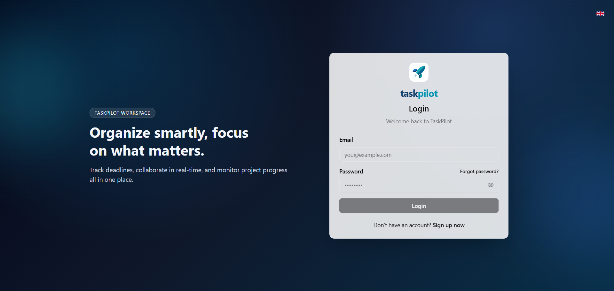

| Field | Value |
| --- | --- |
| Screen ID / Name | Login screen |
| Related use case(s) | [UC01](/docs/srs/#uc01-—-sign-in) |
| Purpose | Sign in to TaskPilot. |
| User actions | Enter credentials, show or hide password, submit login, navigate to registration or recovery. |
| System response | Valid credentials receive tokens and redirect to the workspace; invalid credentials show an error. |
| Validation / error states | Required email/password, invalid credentials, locked account. |

### Main components

| No. | Name | Type | Description |
| ---: | --- | --- | --- |
| 1 | TaskPilot Workspace intro panel | Card | Shows the product message about deadlines, collaboration and project progress. |
| 2 | TaskPilot logo and product name | Brand block | Provides brand identity inside the authentication card. |
| 3 | Login form container | Form | Groups all credential fields and authentication actions. |
| 4 | Email field | Input | Accepts the email address used for sign-in and shows email placeholder text. |
| 5 | Password field | Input | Accepts hidden password input. |
| 6 | Show/hide password control | Button | Toggles password visibility before submitting credentials. |
| 7 | Forgot password link | Button/link | Navigates to the password recovery flow. |
| 8 | Login button | Button | Submits credentials to the backend authentication endpoint. |
| 9 | Sign up link | Button/link | Navigates to account registration for new users. |
| 10 | Language switcher | Button | Switches the interface language from the authentication screen. |

## Register screen

### Screenshot

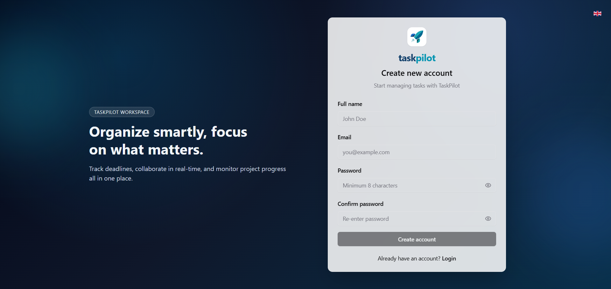

| Field | Value |
| --- | --- |
| Screen ID / Name | Register screen |
| Related use case(s) | [UC02](/docs/srs/#uc02-—-register-sign-up) |
| Purpose | Create a new TaskPilot account. |
| User actions | Enter account information and submit registration. |
| System response | System creates the account when validation passes and guides the user back to sign in. |
| Validation / error states | Required fields, email format, password confirmation and duplicate account checks. |

### Main components

| No. | Name | Type | Description |
| ---: | --- | --- | --- |
| 1 | TaskPilot Workspace intro panel | Card | Repeats the product positioning beside the registration form. |
| 2 | Language switcher | Button | Changes the displayed language before account creation. |
| 3 | Registration form container | Form | Groups the fields needed to create a new account. |
| 4 | TaskPilot logo and title | Brand block | Identifies the product and the create-account context. |
| 5 | Full name field | Input | Collects the display name for the new account. |
| 6 | Email field | Input | Collects the unique email used for login. |
| 7 | Password field | Input | Collects a password with minimum-length guidance. |
| 8 | Confirm password field | Input | Collects password confirmation to reduce typing mistakes. |
| 9 | Password visibility controls | Button | Allow the user to show or hide each password field. |
| 10 | Create account button | Button | Submits the registration request after validation passes. |
| 11 | Login link | Button/link | Returns existing users to the login screen. |

## Forgot password screen

### Screenshot

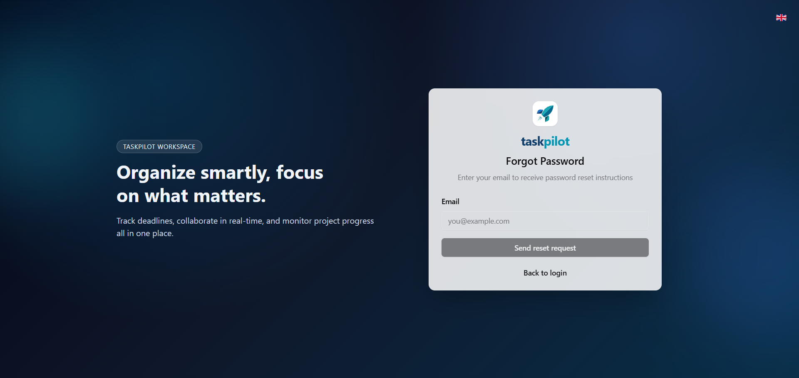

| Field | Value |
| --- | --- |
| Screen ID / Name | Forgot password screen |
| Related use case(s) | [UC03](/docs/srs/#uc03-—-forgot-password), [UC04](/docs/srs/#uc04-—-reset-password) |
| Purpose | Request and complete password recovery. |
| User actions | Submit email for reset instructions or submit a new password after receiving a reset token. |
| System response | System sends reset instructions or updates the password after token validation. |
| Validation / error states | Email format, expired token, password confirmation and invalid token states. |

### Main components

| No. | Name | Type | Description |
| ---: | --- | --- | --- |
| 1 | TaskPilot Workspace intro panel | Card | Keeps the same authentication-page context while the user recovers access. |
| 2 | Language switcher | Button | Changes the displayed language on the recovery screen. |
| 3 | Recovery form container | Form | Groups the password-reset request controls. |
| 4 | TaskPilot logo and title | Brand block | Identifies the recovery flow as part of TaskPilot. |
| 5 | Email field | Input | Collects the account email that should receive reset instructions. |
| 6 | Send reset request button | Button | Submits the reset request to the backend. |
| 7 | Back to login link | Button/link | Returns the user to the sign-in page after or instead of requesting recovery. |
| 8 | Instruction text | Text | Explains that reset instructions will be sent by email. |

## Project dashboard / project list

### Screenshot

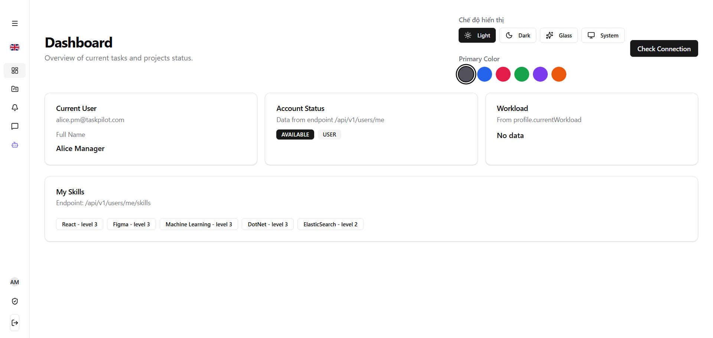

| Field | Value |
| --- | --- |
| Screen ID / Name | Project dashboard / project list |
| Related use case(s) | [UC22](/docs/srs/#uc22-—-view-joined-projects), [UC26](/docs/srs/#uc26-—-join-project) |
| Purpose | Show projects the user has joined and entry points for project actions. |
| User actions | Search, reload, open project, or start join/create actions. |
| System response | System loads joined projects and navigates to the selected workspace. |
| Validation / error states | Empty list, loading state and access errors. |

### Main components

| No. | Name | Type | Description |
| ---: | --- | --- | --- |
| 1 | Side navigation | Sidebar | Provides access to Dashboard, Projects, Notifications, Comments, Copilot and personal pages. |
| 2 | Collapse sidebar button | Button | Expands or collapses the left navigation rail. |
| 3 | Language switcher | Button | Changes the interface language. |
| 4 | Display mode selector | Button group | Lets the user select Light, Dark, Glass or System display mode. |
| 5 | Primary color palette | Button group | Lets the user change the main accent color. |
| 6 | Check Connection button | Button | Checks system connectivity from the user interface. |
| 7 | Current User card | Card | Shows the current user email and full name. |
| 8 | Account Status card | Card | Shows account state and role returned by the profile endpoint. |
| 9 | Account status badges | Badge | Displays labels such as AVAILABLE and USER. |
| 10 | Workload card | Card | Shows the current workload value or an empty-data state. |
| 11 | My Skills card | Card | Lists the user skills loaded from the personal skills endpoint. |
| 12 | Skill badges | Badge | Display skill names and levels, such as React - level 3. |

## Create project screen

### Screenshot

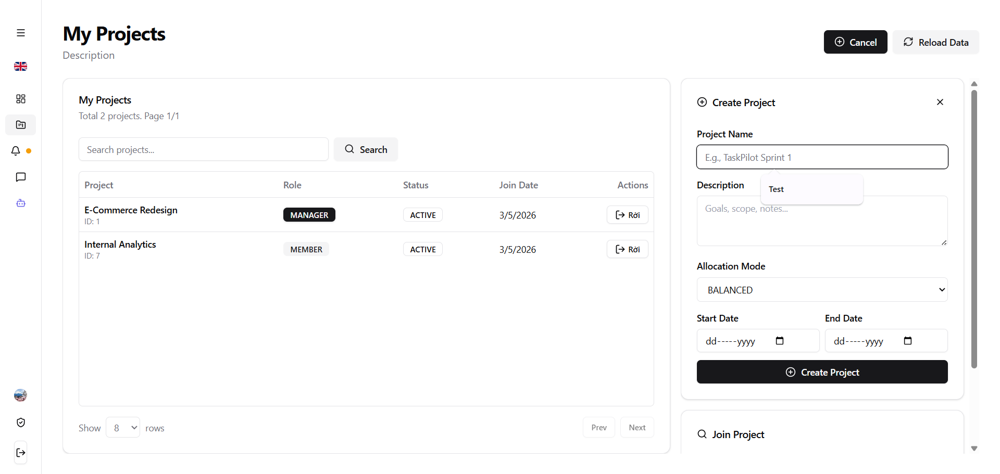

| Field | Value |
| --- | --- |
| Screen ID / Name | Create project screen |
| Related use case(s) | [UC23](/docs/srs/#uc23-—-create-new-project) |
| Purpose | Create a project with initial configuration. |
| User actions | Fill project data and submit creation. |
| System response | System creates the project and adds the creator as manager. |
| Validation / error states | Required project name and invalid date range. |

### Main components

| No. | Name | Type | Description |
| ---: | --- | --- | --- |
| 1 | Side navigation | Sidebar | Keeps the main application navigation while the user manages projects. |
| 2 | My Projects title | Header | Identifies the project management workspace. |
| 3 | Cancel/Create Project toggle | Button | Shows or hides the create-project panel. |
| 4 | Reload Data button | Button | Refreshes the project list from the backend. |
| 5 | Project list panel | Table panel | Shows joined projects with total count and page number. |
| 6 | Project search field | Search input | Filters projects by keyword. |
| 7 | Search button | Button | Runs project search using the entered keyword. |
| 8 | Project table | Table | Displays project name, role, status, join date and row actions. |
| 9 | Role badge | Badge | Shows the user role in a project, such as MANAGER or MEMBER. |
| 10 | Project status badge | Badge | Shows the current project status, such as ACTIVE. |
| 11 | Leave project button | Button | Lets the user leave a joined project when allowed. |
| 12 | Page size selector | Dropdown | Controls how many projects are shown per page. |
| 13 | Pagination buttons | Button group | Moves between project-list pages. |
| 14 | Create Project panel | Form | Collects data needed to create a new project. |
| 15 | Project Name field | Input | Collects the required project name. |
| 16 | Description field | Text area | Collects goals, scope or project notes. |
| 17 | Allocation Mode selector | Dropdown | Selects the assignment heuristic mode, such as BALANCED. |
| 18 | Start Date and End Date fields | Date picker | Set the planned project time range. |
| 19 | Create Project submit button | Button | Submits the create-project request. |
| 20 | Join Project panel | Form | Provides an entry point for joining an existing project by invitation data. |

## Project workspace

### Screenshot

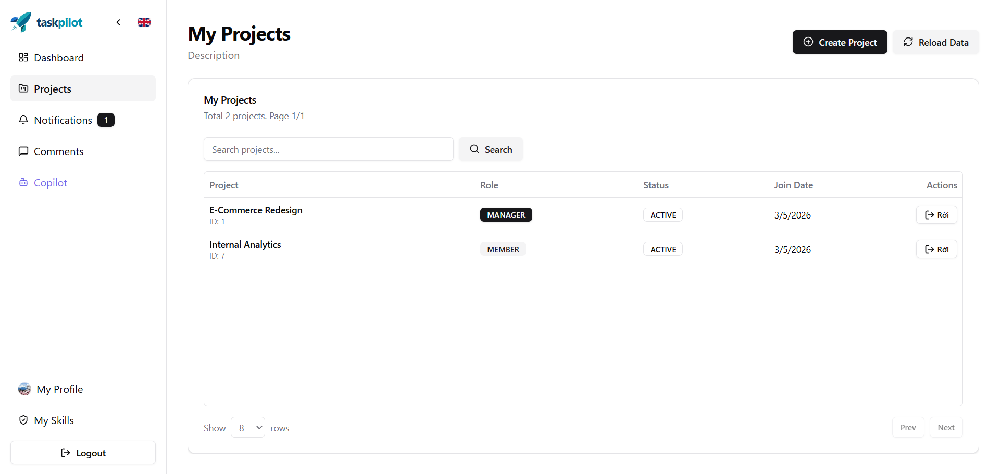

| Field | Value |
| --- | --- |
| Screen ID / Name | Project workspace |
| Related use case(s) | [UC24](/docs/srs/#uc24-—-view-project-details-summary), [UC27](/docs/srs/#uc27-—-leave-project) |
| Purpose | Central workspace for a selected project. |
| User actions | Navigate between overview, backlog, board, timeline and settings. |
| System response | System loads project-scoped data for the selected view. |
| Validation / error states | Project not found, membership/access denied and loading errors. |

### Main components

| No. | Name | Type | Description |
| ---: | --- | --- | --- |
| 1 | Side navigation | Sidebar | Highlights Projects and keeps access to notifications, comments, Copilot and profile pages. |
| 2 | My Projects header | Header | Shows the project-list context and short description. |
| 3 | Create Project button | Button | Opens the create-project panel. |
| 4 | Reload Data button | Button | Reloads the project list. |
| 5 | Project list card | Table panel | Shows total projects, page count and the joined-project table. |
| 6 | Project search field | Search input | Filters joined projects by name or keyword. |
| 7 | Search button | Button | Applies the project-list filter. |
| 8 | Project column | Table column | Shows project name and project identifier. |
| 9 | Role column | Table column | Shows the current member role in each project. |
| 10 | Status column | Table column | Shows whether the project is active or in another state. |
| 11 | Join Date column | Table column | Shows when the user joined the project. |
| 12 | Actions column | Table column | Contains row-level actions such as leaving a project. |
| 13 | Leave project action | Button | Lets the user leave a selected project. |
| 14 | Rows-per-page selector | Dropdown | Controls how many projects appear in the table. |
| 15 | Pagination controls | Button group | Moves between pages of joined projects. |
| 16 | Personal navigation group | Sidebar section | Provides access to My Profile, My Skills and logout. |

## Project overview

### Screenshot

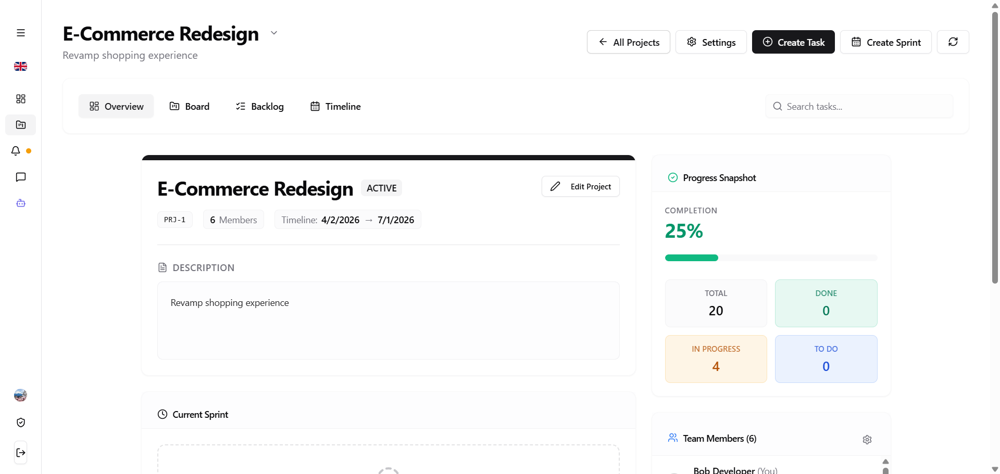

| Field | Value |
| --- | --- |
| Screen ID / Name | Project overview |
| Related use case(s) | [UC24](/docs/srs/#uc24-—-view-project-details-summary) |
| Purpose | Summarize project status and progress. |
| User actions | Inspect project state and navigate to detailed work views. |
| System response | System displays project summary, progress and metadata. |
| Validation / error states | Unavailable project or missing permission. |

### Main components

| No. | Name | Type | Description |
| ---: | --- | --- | --- |
| 1 | Project title area | Card | Shows the project name and short description at the top of the workspace. |
| 2 | All Projects button | Button | Returns to the project list. |
| 3 | Settings button | Button | Opens project configuration. |
| 4 | Create Task button | Button | Starts creating a new task in the project. |
| 5 | Create Sprint button | Button | Starts creating a new sprint. |
| 6 | Reload button | Button | Refreshes project overview data. |
| 7 | Project tab bar | Tab navigation | Switches between Overview, Board, Backlog and Timeline. |
| 8 | Task search field | Search input | Searches tasks within the project context. |
| 9 | Project information card | Card | Displays project name, status, identifier, member count and project dates. |
| 10 | Active status badge | Badge | Indicates that the project is active. |
| 11 | Description card | Card | Shows the project description. |
| 12 | Progress Snapshot card | Card | Shows completion percentage and related progress state. |
| 13 | Progress bar | Progress bar | Visualizes the project completion ratio. |
| 14 | Task statistics group | Card group | Shows total tasks and counts by Done, In Progress and To Do. |
| 15 | Current Sprint card | Card | Shows the current sprint or an empty state when no sprint exists. |
| 16 | Team Members list | List | Shows project members and member count. |

## Sprint backlog

### Screenshot

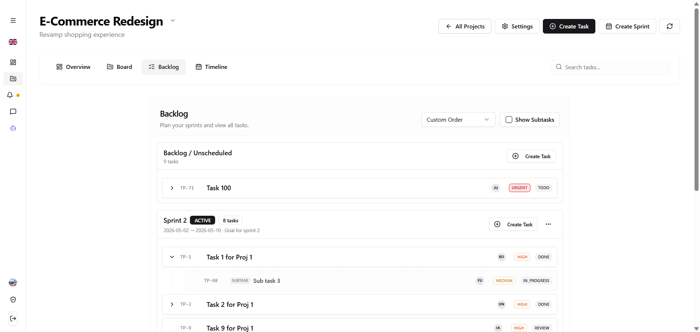

| Field | Value |
| --- | --- |
| Screen ID / Name | Sprint backlog |
| Related use case(s) | [UC34](/docs/srs/#uc34-—-view-sprint-list), [UC35](/docs/srs/#uc35-—-view-sprint-details), [UC36](/docs/srs/#uc36-—-create-new-sprint), [UC37](/docs/srs/#uc37-—-update-sprint-information), [UC38](/docs/srs/#uc38-—-start-complete-sprint), [UC39](/docs/srs/#uc39-—-delete-sprint), [UC41](/docs/srs/#uc41-—-view-backlog) |
| Purpose | Manage sprints and backlog tasks. |
| User actions | Create/update/start/complete/delete sprint and inspect backlog. |
| System response | System updates sprint and backlog state. |
| Validation / error states | Invalid sprint data and permission errors. |

### Main components

| No. | Name | Type | Description |
| ---: | --- | --- | --- |
| 1 | Project title area | Card | Shows the current project context and short description. |
| 2 | Top action group | Button group | Contains All Projects, Settings, Create Task, Create Sprint and reload actions. |
| 3 | Project tab bar | Tab navigation | Switches between Overview, Board, Backlog and Timeline. |
| 4 | Task search field | Search input | Filters tasks in the project. |
| 5 | Backlog panel | List panel | Shows tasks that are not scheduled into a sprint. |
| 6 | Custom Order selector | Dropdown | Changes the task ordering mode. |
| 7 | Show Subtasks toggle | Button | Shows or hides subtasks in the backlog list. |
| 8 | Backlog / Unscheduled group | List | Displays unscheduled task count and related tasks. |
| 9 | Sprint card | Card | Shows sprint name, state, task count and sprint dates. |
| 10 | Sprint status badge | Badge | Displays sprint status such as Active. |
| 11 | Backlog task card | Card | Shows task code, title, assignee, priority and state. |
| 12 | Subtask card | Card | Shows child work items with subtask label and state. |
| 13 | Create Task in group button | Button | Creates a task inside the backlog or selected sprint group. |
| 14 | Sprint action menu | Dropdown | Provides additional sprint operations. |

## Kanban board

### Screenshot

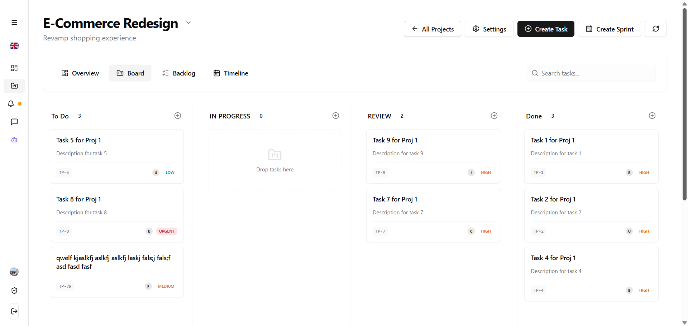

| Field | Value |
| --- | --- |
| Screen ID / Name | Kanban board |
| Related use case(s) | [UC40](/docs/srs/#uc40-—-view-kanban-board), [UC44](/docs/srs/#uc44-—-create-task-or-sub-task), [UC46](/docs/srs/#uc46-—-update-task-status-drag-and-drop-on-kanban), [UC48](/docs/srs/#uc48-—-delete-task) |
| Purpose | Operate tasks visually by status. |
| User actions | Create task, drag task between columns and refresh board. |
| System response | System updates task status and board position. |
| Validation / error states | Invalid transition, missing task or permission error. |

### Main components

| No. | Name | Type | Description |
| ---: | --- | --- | --- |
| 1 | Project tab bar | Tab navigation | Switches between Overview, Board, Backlog and Timeline. |
| 2 | Task search field | Search input | Searches tasks on the board. |
| 3 | To Do column | Board column | Displays tasks that have not started and the task count for the column. |
| 4 | In Progress column | Board column | Displays tasks being worked on and accepts dropped cards. |
| 5 | Review column | Board column | Displays tasks waiting for review. |
| 6 | Done column | Board column | Displays completed tasks. |
| 7 | Add task in column button | Button | Creates a task directly under the selected status column. |
| 8 | Task card | Card | Shows title, short description and compact task metadata. |
| 9 | Task code badge | Badge | Shows identifiers such as TP-5 or TP-9. |
| 10 | Assignee indicator | Badge | Shows the assigned member initials or marker. |
| 11 | Priority badge | Badge | Shows priority such as Low, Medium, High or Urgent. |
| 12 | Drop area | Board column | Accepts drag-and-drop movement into a target status. |
| 13 | Create Task button | Button | Creates a task from the project header area. |
| 14 | Reload button | Button | Refreshes board data after operations. |

## Task detail

### Screenshot

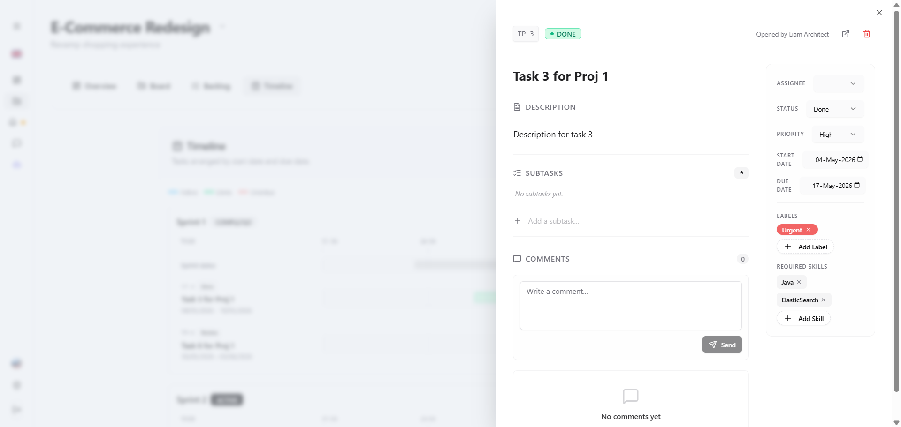

| Field | Value |
| --- | --- |
| Screen ID / Name | Task detail |
| Related use case(s) | [UC43](/docs/srs/#uc43-—-view-task-details), [UC44](/docs/srs/#uc44-—-create-task-or-sub-task), [UC45](/docs/srs/#uc45-—-update-task-information), [UC47](/docs/srs/#uc47-—-assign-assignee-and-reporter), [UC48](/docs/srs/#uc48-—-delete-task) |
| Purpose | View and edit task details, subtasks and assignment. |
| User actions | Inspect task, add subtask, change assignee/reporter or status. |
| System response | System saves task changes and refreshes detail state. |
| Validation / error states | Invalid member, missing task or insufficient permission. |

### Main components

| No. | Name | Type | Description |
| ---: | --- | --- | --- |
| 1 | Task detail panel | Modal/Dialog | Shows task details in a floating panel over the workspace. |
| 2 | Close button | Button | Closes the task detail panel and returns to the underlying page. |
| 3 | Task code badge | Badge | Displays the task identifier, such as TP-3. |
| 4 | Task status badge | Badge | Shows the current status, such as Done. |
| 5 | Task title | Card | Displays the main task title. |
| 6 | Description area | Card | Shows the task description. |
| 7 | Subtasks area | List | Displays subtasks or an empty state. |
| 8 | Add subtask field | Input | Allows quick entry of a new subtask. |
| 9 | Comments area | Card | Hosts task discussion controls and history. |
| 10 | Comment input | Text area | Accepts a new comment for the task. |
| 11 | Send comment button | Button | Submits the entered comment. |
| 12 | Assignee selector | Dropdown | Changes the member responsible for the task. |
| 13 | Status selector | Dropdown | Updates the task status without drag-and-drop. |
| 14 | Priority selector | Dropdown | Updates the task priority. |
| 15 | Start Date and Due Date fields | Date picker | Updates task schedule boundaries. |
| 16 | Labels badges | Badge | Displays task labels such as Urgent. |
| 17 | Add Label button | Button | Adds a project label to the task. |
| 18 | Required Skills badges | Badge | Displays required skills such as Java or ElasticSearch. |
| 19 | Add Skill button | Button | Adds a required skill to the task. |
| 20 | Open task / delete controls | Button | Opens the task separately or deletes it when permissions allow. |

## Notification panel

### Screenshot

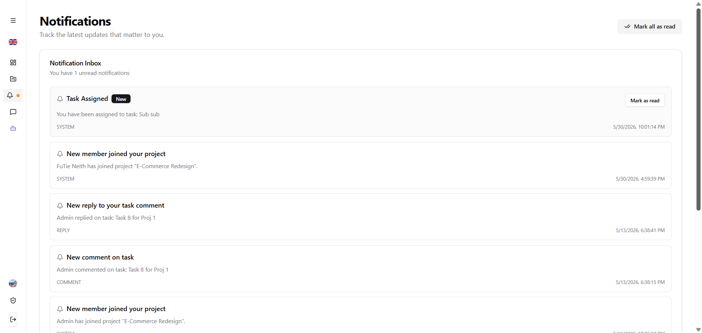

| Field | Value |
| --- | --- |
| Screen ID / Name | Notification panel |
| Related use case(s) | [UC53](/docs/srs/#uc53-—-receive-notification), [UC54](/docs/srs/#uc54-—-mark-notification-as-read) |
| Purpose | Display in-app notifications and unread state. |
| User actions | Open panel, read notification, mark one or all as read. |
| System response | System streams or fetches notifications and updates read state. |
| Validation / error states | Network/SSE disconnection and permission errors. |

### Main components

| No. | Name | Type | Description |
| ---: | --- | --- | --- |
| 1 | Side navigation | Sidebar | Highlights Notifications and shows unread notification indicators. |
| 2 | Notifications title | Card | Identifies the page for tracking important updates. |
| 3 | Mark all as read button | Button | Marks every notification as read. |
| 4 | Notification Inbox panel | List panel | Shows unread count and the notification list. |
| 5 | Notification card | Card | Contains notification title, body, type and timestamp. |
| 6 | Notification icon | Badge | Visually identifies an inbox notification item. |
| 7 | New badge | Badge | Marks unread notifications. |
| 8 | Notification body | Card | Describes events such as assigned tasks, project joins or replies. |
| 9 | Notification type badge | Badge | Shows types such as SYSTEM, REPLY or COMMENT. |
| 10 | Notification timestamp | Text | Shows when the notification was created. |
| 11 | Mark as read button | Button | Marks a single notification as read. |
| 12 | Scrollable list area | List | Allows the user to browse additional notifications. |

## AI chat

### Screenshot

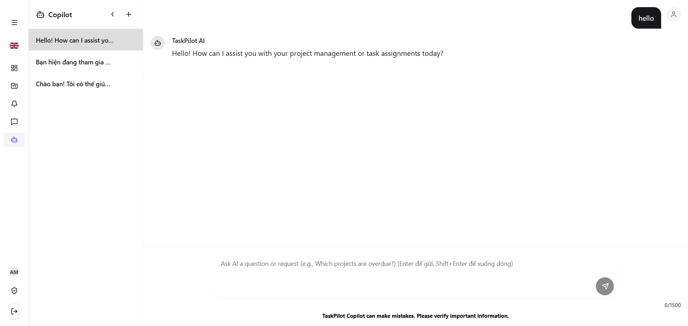

| Field | Value |
| --- | --- |
| Screen ID / Name | AI chat |
| Related use case(s) | [UC55](/docs/srs/#uc55-—-create-new-ai-chat-session), [UC56](/docs/srs/#uc56-—-chat-with-ai), [UC57](/docs/srs/#uc57-—-view-ai-chat-history), [UC58](/docs/srs/#uc58-—-view-ai-activity-logs) |
| Purpose | Chat with AI Copilot and inspect AI outputs. |
| User actions | Create/select session, send message, review answer and inspect tool events. |
| System response | System streams AI response through SSE and persists messages/logs. |
| Validation / error states | Provider timeout, invalid session and authorization errors. |

### Main components

| No. | Name | Type | Description |
| ---: | --- | --- | --- |
| 1 | Side navigation | Sidebar | Highlights Copilot in the main navigation. |
| 2 | Chat sessions sidebar | Sidebar | Lists previous Copilot conversations. |
| 3 | New session button | Button | Creates a new AI chat session. |
| 4 | Conversation item | List item | Displays a short title for each chat session. |
| 5 | Main conversation panel | Chat panel | Shows user messages and TaskPilot AI responses. |
| 6 | User message bubble | Chat panel | Displays user requests aligned to the user side. |
| 7 | AI message bubble | Chat panel | Displays the Copilot response. |
| 8 | Prompt input | Text area | Accepts questions or project-management requests. |
| 9 | Send button | Button | Sends the prompt to AI Copilot. |
| 10 | Character counter | Badge | Shows current prompt length against the input limit. |
| 11 | Verification warning | Card | Reminds users to verify important AI-provided information. |
| 12 | User account button | Button | Provides access to account information from the chat page. |

## Comment

### Screenshot

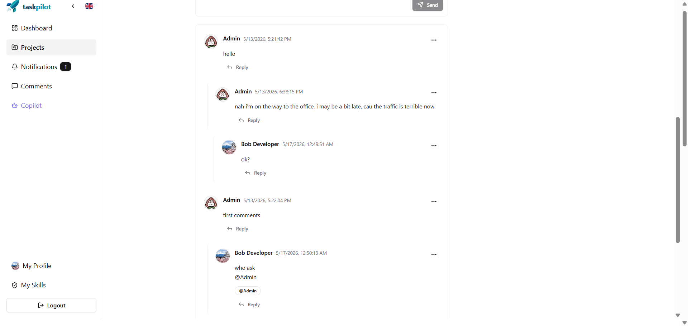

| Field | Value |
| --- | --- |
| Screen ID / Name | Comment |
| Related use case(s) | [UC49](/docs/srs/#uc49-—-view-comments), [UC50](/docs/srs/#uc50-—-write-comment), [UC51](/docs/srs/#uc51-—-edit-comment), [UC52](/docs/srs/#uc52-—-delete-comment) |
| Purpose | Read and write task comments with mentions. |
| User actions | View, add, edit or delete comments. |
| System response | System persists comments and emits realtime events/notifications where configured. |
| Validation / error states | Missing content, deleted comments and permission errors. |

### Main components

| No. | Name | Type | Description |
| ---: | --- | --- | --- |
| 1 | Side navigation | Sidebar | Provides access to Dashboard, Projects, Notifications, Comments and Copilot. |
| 2 | Comment composer | Text area | Accepts a new comment for the selected task. |
| 3 | Send button | Button | Submits the written comment. |
| 4 | Comment list | List | Shows task comments in chronological order. |
| 5 | Comment author avatar | Badge | Identifies the member who wrote a comment. |
| 6 | Author name | Card | Shows the comment author, such as Admin or Bob Developer. |
| 7 | Comment timestamp | Text | Shows when the comment was created. |
| 8 | Comment body | Card | Displays the discussion content. |
| 9 | Reply button | Button | Starts a reply to a specific comment. |
| 10 | Nested replies group | List | Shows replies under the parent comment with visual indentation. |
| 11 | Comment action menu | Dropdown | Provides additional operations for an individual comment. |
| 12 | Mention badge | Badge | Displays mentioned members, such as @Admin. |
| 13 | Scrollable content area | List | Allows the user to continue reading lower comments. |

## AI assignment recommendation

### Screenshot

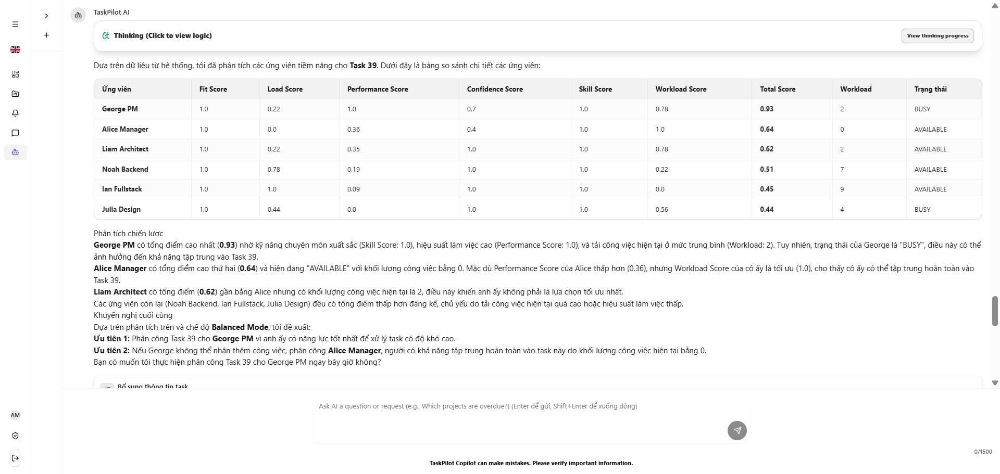

| Field | Value |
| --- | --- |
| Screen ID / Name | AI assignment recommendation |
| Related use case(s) | [UC59](/docs/srs/#uc59-—-request-ai-task-assignment-recommendation) |
| Purpose | Show ranked assignee recommendations. |
| User actions | Request recommendation and accept or reject a suggested assignee. |
| System response | System calculates weighted heuristic scores, logs the result and applies accepted assignment. |
| Validation / error states | No suitable candidates, missing data or manager-only access denied. |

### Main components

| No. | Name | Type | Description |
| ---: | --- | --- | --- |
| 1 | Processing status card | Result card | Shows whether AI is analyzing and exposes processing progress. |
| 2 | View processing progress button | Button | Opens the AI processing progress section when needed. |
| 3 | Task context paragraph | Card | Identifies the task being analyzed for assignment. |
| 4 | Candidate ranking table | Table | Compares project members who can receive the task. |
| 5 | Candidate column | Table column | Shows the evaluated member name. |
| 6 | Fit Score column | Table column | Shows the overall task-fit component. |
| 7 | Load Score column | Table column | Shows the workload-related score as displayed by the UI. |
| 8 | Performance Score column | Table column | Shows the performance component. |
| 9 | Confidence Score column | Table column | Shows evaluation confidence. |
| 10 | Skill Score column | Table column | Shows skill matching quality. |
| 11 | Workload Score column | Table column | Shows the workload balancing component. |
| 12 | Total Score column | Table column | Shows the final score used for ranking. |
| 13 | Workload and status column | Table column | Shows current workload and status such as Busy or Available. |
| 14 | Strategic analysis block | Result card | Explains why candidates are ranked high or low. |
| 15 | Final recommendation block | Result card | Presents the recommended assignee and preferred option. |
| 16 | Follow-up prompt input | Text area | Lets the manager continue asking AI or request an assignment action. |

## Timeline

### Screenshot

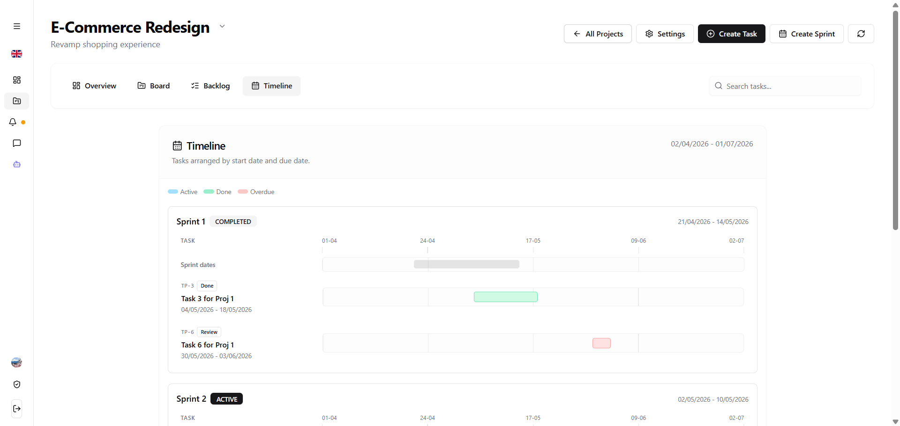

| Field | Value |
| --- | --- |
| Screen ID / Name | Timeline |
| Related use case(s) | [UC24](/docs/srs/#uc24-—-view-project-details-summary) |
| Purpose | Visualize project schedule. |
| User actions | Inspect schedule and compare work periods. |
| System response | System returns timeline data for the project. |
| Validation / error states | Missing dates or access denied. |

### Main components

| No. | Name | Type | Description |
| ---: | --- | --- | --- |
| 1 | Timeline title | Timeline view | Identifies the date-based view for tasks and sprints. |
| 2 | Overall date range | Date range | Shows the visible project timeline range. |
| 3 | Status legend | Badge group | Explains colors for Active, Done and Overdue states. |
| 4 | Sprint card | Card | Groups tasks belonging to the same sprint. |
| 5 | Sprint name and status | Badge | Shows sprint name and state, such as Completed or Active. |
| 6 | Sprint date range | Date range | Shows sprint start and end dates. |
| 7 | Date axis | Timeline view | Displays calendar markers used to position tasks. |
| 8 | Sprint dates row | Timeline view | Visualizes the sprint duration. |
| 9 | Task row | List row | Shows task code, task name, status and dates. |
| 10 | Task time bar | Progress bar | Represents the task duration using status color. |
| 11 | Task status badge | Badge | Shows task state such as Done or Review beside a task. |
| 12 | Project tab bar | Tab navigation | Switches to Overview, Board or Backlog. |
| 13 | Task search field | Search input | Filters tasks within the timeline context. |

## Pending action confirmation

### Screenshot

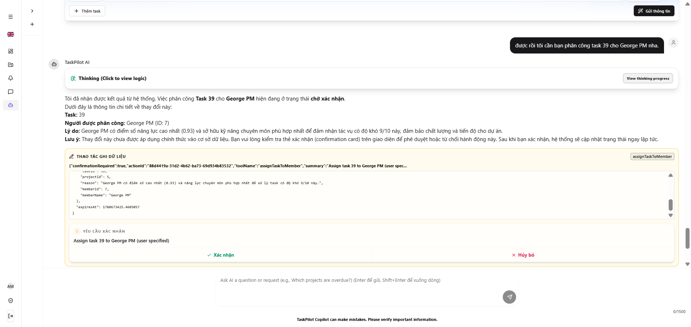

| Field | Value |
| --- | --- |
| Screen ID / Name | Pending action confirmation |
| Related use case(s) | [UC56](/docs/srs/#uc56-—-chat-with-ai), [UC59 extension](/docs/srs/#uc59-—-request-ai-task-assignment-recommendation) |
| Purpose | Confirm or reject AI-proposed write actions. |
| User actions | Review pending action and choose Confirm or Cancel. |
| System response | Confirmed action executes through a domain service; canceled action does not mutate data. |
| Validation / error states | Expired action, wrong user/session or missing authorization. |

### Main components

| No. | Name | Type | Description |
| ---: | --- | --- | --- |
| 1 | User request message | Chat panel | Shows the request that asks AI to perform a data-changing action. |
| 2 | Processing status card | Result card | Shows that AI is processing and can reveal progress. |
| 3 | Result summary card | Result card | Summarizes the task, assignee and recommendation reason. |
| 4 | Not-yet-applied warning | Confirmation card | Makes clear that no data is written until the user confirms. |
| 5 | Write-action container | Confirmation card | Shows the action that AI plans to execute. |
| 6 | Action name badge | Badge | Displays the tool/action name, such as assignTaskToMember. |
| 7 | Parameter preview | Card | Shows values such as projectId, taskId, memberId, memberName and reason. |
| 8 | Confirmation prompt | Confirmation card | Asks the user to approve the pending operation. |
| 9 | Confirm button | Button | Executes the data-changing action. |
| 10 | Cancel button | Button | Rejects the action and leaves data unchanged. |
| 11 | Follow-up prompt input | Text area | Lets the user continue chatting after confirming or canceling. |
| 12 | Verification warning | Card | Reminds users to review important information before relying on AI output. |

## Profile screen

### Screenshot

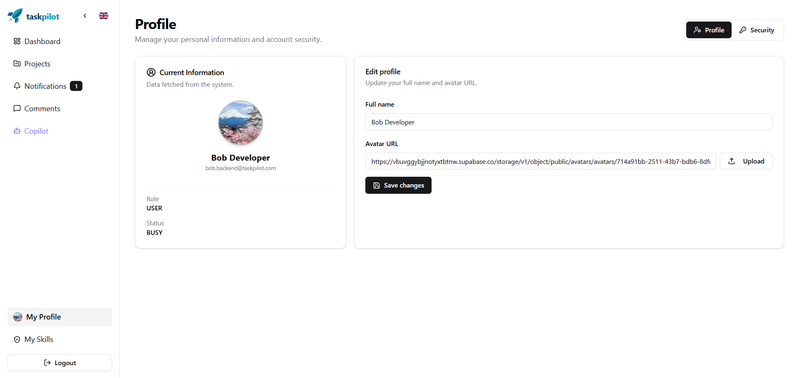

| Field | Value |
| --- | --- |
| Screen ID / Name | Profile screen |
| Related use case(s) | [UC05](/docs/srs/#uc05-—-update-personal-information), [UC06](/docs/srs/#uc06-—-view-user-profile), [UC07](/docs/srs/#uc07-—-delete-personal-account), [UC08](/docs/srs/#uc08-—-view-personal-skill-list), [UC09](/docs/srs/#uc09-—-view-personal-skill-details), [UC10](/docs/srs/#uc10-—-add-personal-skill), [UC11](/docs/srs/#uc11-—-update-personal-skill), [UC12](/docs/srs/#uc12-—-delete-personal-skill) |
| Purpose | View and update personal account and skill information. |
| User actions | View profile, update information, change password or manage personal skills. |
| System response | System validates and persists profile/skill changes. |
| Validation / error states | Invalid fields, duplicate email, wrong current password or invalid skill level. |

### Main components

| No. | Name | Type | Description |
| ---: | --- | --- | --- |
| 1 | Side navigation | Sidebar | Keeps access to Dashboard, Projects, Notifications, Comments and Copilot. |
| 2 | Profile page header | Header | Identifies personal information and account security management. |
| 3 | Profile/Security segmented control | Tab control | Switches between profile information and security settings. |
| 4 | Current Information card | Card | Shows the data currently loaded from the system. |
| 5 | Avatar preview | Image/avatar | Displays the current user avatar. |
| 6 | Display name | Text | Shows the current full name. |
| 7 | Email text | Text | Shows the account email address. |
| 8 | Role field | Text | Shows the current role, such as USER. |
| 9 | Status field | Text | Shows the current status, such as BUSY. |
| 10 | Edit profile form | Form | Allows updating profile fields. |
| 11 | Full name field | Input | Edits the user display name. |
| 12 | Avatar URL field | Input | Stores or edits the avatar image URL. |
| 13 | Upload button | Button | Uploads an avatar file or selects a new avatar source. |
| 14 | Save changes button | Button | Submits profile updates. |
| 15 | Personal menu | Sidebar section | Highlights My Profile and links to My Skills and logout. |

## Admin user management

### Screenshot

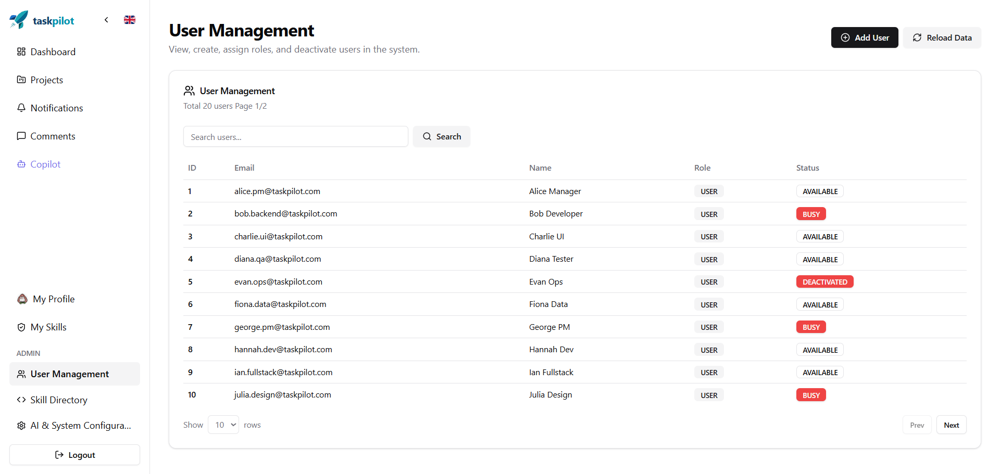

| Field | Value |
| --- | --- |
| Screen ID / Name | Admin user management |
| Related use case(s) | [UC18](/docs/srs/#uc18-—-view-global-user-list), [UC19](/docs/srs/#uc19-—-add-system-user), [UC20](/docs/srs/#uc20-—-edit-system-user), [UC21](/docs/srs/#uc21-—-delete-system-user) |
| Purpose | Manage system users. |
| User actions | View, create, edit or delete users. |
| System response | System applies admin user changes. |
| Validation / error states | Duplicate accounts and admin permission errors. |

### Main components

| No. | Name | Type | Description |
| ---: | --- | --- | --- |
| 1 | Admin side navigation | Sidebar | Shows admin routes such as User Management, Skill Directory and AI & System Configuration. |
| 2 | User Management header | Header | Explains that admins can view, create, assign roles and deactivate users. |
| 3 | Add User button | Button | Opens the user creation flow. |
| 4 | Reload Data button | Button | Refreshes the user list. |
| 5 | User Management panel | Table panel | Shows total users, page number and the user table. |
| 6 | Search users field | Search input | Filters users by text. |
| 7 | Search button | Button | Applies the user search keyword. |
| 8 | User table | Table | Lists users and administrative attributes. |
| 9 | ID column | Table column | Shows the internal user identifier. |
| 10 | Email column | Table column | Shows account email. |
| 11 | Name column | Table column | Shows full name. |
| 12 | Role column | Table column | Shows assigned role, such as USER. |
| 13 | Status column | Table column | Shows AVAILABLE, BUSY or DEACTIVATED status. |
| 14 | Status badge | Badge | Highlights important states such as BUSY or DEACTIVATED. |
| 15 | Rows-per-page selector | Dropdown | Controls the number of user rows shown. |
| 16 | Pagination buttons | Button group | Moves between user-list pages. |
| 17 | Logout button | Button | Signs out from the admin session. |

## Admin skill directory

### Screenshot

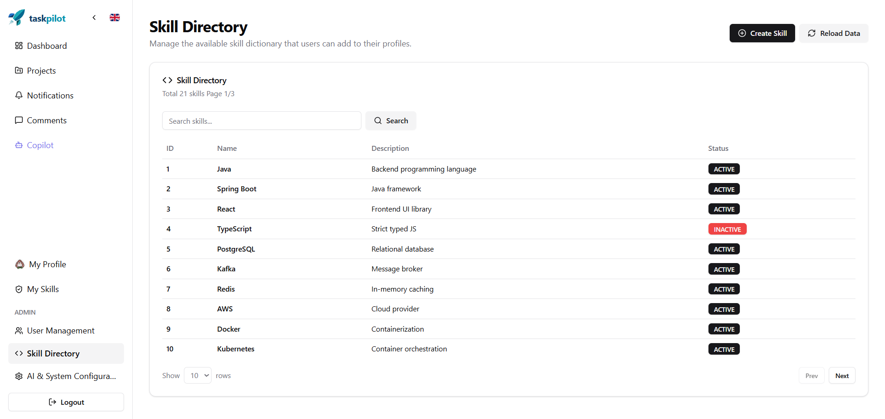

| Field | Value |
| --- | --- |
| Screen ID / Name | Admin skill directory |
| Related use case(s) | [UC14](/docs/srs/#uc14-—-view-system-skill-directory), [UC15](/docs/srs/#uc15-—-add-system-skill), [UC16](/docs/srs/#uc16-—-edit-system-skill), [UC17](/docs/srs/#uc17-—-delete-system-skill) |
| Purpose | Manage global skill directory. |
| User actions | View, create, update or deactivate system skills. |
| System response | System persists skill directory changes. |
| Validation / error states | Duplicate skill names and admin permission errors. |

### Main components

| No. | Name | Type | Description |
| ---: | --- | --- | --- |
| 1 | Admin side navigation | Sidebar | Shows admin routes and highlights Skill Directory. |
| 2 | Skill Directory header | Header | Explains that admins manage the shared skill dictionary. |
| 3 | Create Skill button | Button | Opens the skill creation form. |
| 4 | Reload Data button | Button | Refreshes the skill directory. |
| 5 | Skill Directory panel | Table panel | Shows total skills, page number and the skill table. |
| 6 | Search skills field | Search input | Filters skills by name or description. |
| 7 | Search button | Button | Applies the skill search keyword. |
| 8 | Skill table | Table | Lists skills available for user profiles and task requirements. |
| 9 | ID column | Table column | Shows the internal skill identifier. |
| 10 | Name column | Table column | Shows the skill name, such as Java or React. |
| 11 | Description column | Table column | Describes the skill usage domain. |
| 12 | Status column | Table column | Shows whether the skill is active. |
| 13 | Status badge | Badge | Highlights ACTIVE or INACTIVE state. |
| 14 | Rows-per-page selector | Dropdown | Controls how many skills are shown. |
| 15 | Pagination buttons | Button group | Moves between skill pages. |
| 16 | Logout button | Button | Signs out from the admin session. |

## Admin system configuration

### Screenshot

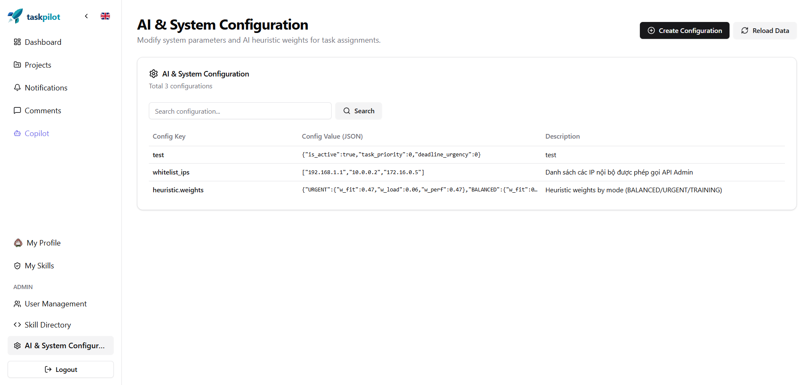

| Field | Value |
| --- | --- |
| Screen ID / Name | Admin system configuration |
| Related use case(s) | [UC13](/docs/srs/#uc13-—-configure-system-parameters) |
| Purpose | Configure system and AI assignment settings. |
| User actions | View and update settings. |
| System response | System saves configuration values. |
| Validation / error states | Invalid configuration format or admin permission error. |

### Main components

| No. | Name | Type | Description |
| ---: | --- | --- | --- |
| 1 | Admin side navigation | Sidebar | Shows User Management, Skill Directory and AI & System Configuration. |
| 2 | AI & System Configuration title | Card | Identifies the screen for system and AI heuristic parameters. |
| 3 | Create Configuration button | Button | Creates a new system configuration entry. |
| 4 | Reload Data button | Button | Reloads system configuration values. |
| 5 | Configuration summary card | Card | Shows the total number of configuration records. |
| 6 | Search configuration field | Search input | Searches by configuration key or related content. |
| 7 | Search button | Button | Filters the configuration list. |
| 8 | Configuration table | Table | Displays system configuration records. |
| 9 | Config Key column | Table column | Shows keys such as heuristic.weights. |
| 10 | Config Value column | Table column | Shows structured values, commonly JSON. |
| 11 | Description column | Table column | Explains the meaning or usage scope of the setting. |
| 12 | heuristic.weights row | Table row | Shows assignment heuristic weights for modes such as Balanced, Urgent or Training. |
| 13 | Personal/admin menu group | Sidebar section | Provides access to My Profile, My Skills and admin routes. |
| 14 | Logout button | Button | Signs out from the current account. |

## Project settings general

### Screenshot

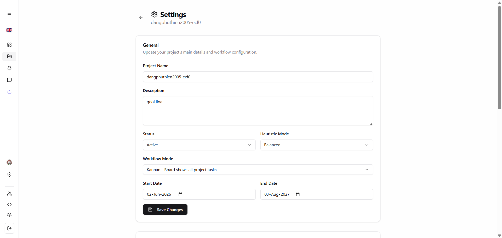

| Field | Value |
| --- | --- |
| Screen ID / Name | Project settings general |
| Related use case(s) | [UC25](/docs/srs/#uc25-—-update-project-information), [UC28](/docs/srs/#uc28-—-close-archive-project) |
| Purpose | Update or archive project metadata. |
| User actions | Edit project metadata, archive or restore where available. |
| System response | System updates the project record. |
| Validation / error states | Invalid fields or manager-only permission error. |

### Main components

| No. | Name | Type | Description |
| ---: | --- | --- | --- |
| 1 | Back button | Button | Returns to the previous project screen. |
| 2 | Settings title | Card | Identifies the configuration context for the current project. |
| 3 | General settings form | Form | Contains the main project information and workflow settings. |
| 4 | Project Name field | Input | Edits the project name. |
| 5 | Description field | Text area | Updates the project description. |
| 6 | Status selector | Dropdown | Changes the project status. |
| 7 | Heuristic Mode selector | Dropdown | Selects the assignment recommendation mode, such as Balanced. |
| 8 | Workflow Mode selector | Dropdown | Selects the project workflow style, such as Kanban. |
| 9 | Start Date field | Date picker | Sets the project start date. |
| 10 | End Date field | Date picker | Sets the project end date. |
| 11 | Save Changes button | Button | Persists the general project settings. |
| 12 | Side navigation | Sidebar | Keeps navigation to other system areas available. |

## Project settings members

### Screenshot

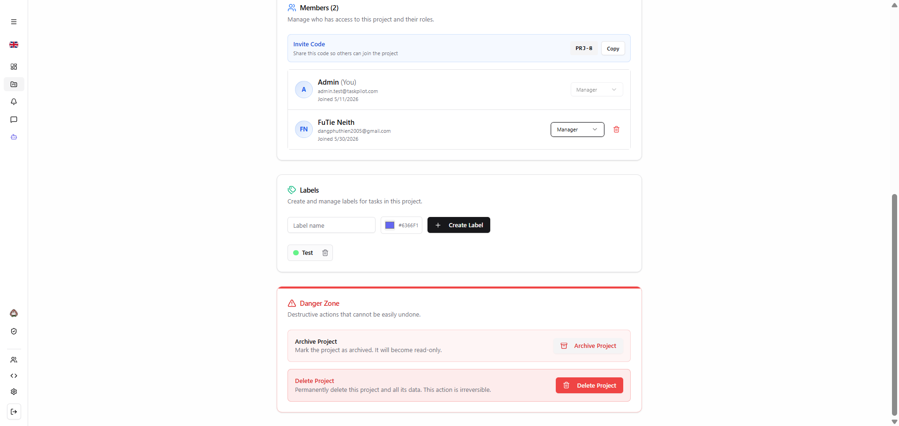

| Field | Value |
| --- | --- |
| Screen ID / Name | Project settings members |
| Related use case(s) | [UC29](/docs/srs/#uc29-—-view-project-member-list), [UC30](/docs/srs/#uc30-—-view-member-details), [UC31](/docs/srs/#uc31-—-add-member-to-project), [UC32](/docs/srs/#uc32-—-update-member-role), [UC33](/docs/srs/#uc33-—-remove-member-from-project), [UC42](/docs/srs/#uc42-—-view-workload) |
| Purpose | Manage members in a project. |
| User actions | View members, inspect details, add/remove members and update role. |
| System response | System changes project member records and refreshes the list. |
| Validation / error states | Invalid target user or manager-only permission error. |

### Main components

| No. | Name | Type | Description |
| ---: | --- | --- | --- |
| 1 | Members panel | Card | Shows project members and summarizes access to the project. |
| 2 | Invite Code field | Input | Displays the invite code that others can use to join the project. |
| 3 | Copy button | Button | Copies the project invite code. |
| 4 | Members list | List | Shows avatar, name, email and join date for each member. |
| 5 | Role selector | Dropdown | Shows or changes member roles such as Manager. |
| 6 | Remove member button | Button | Removes a member when the current user has permission. |
| 7 | Labels panel | Card | Manages labels used to classify tasks in the project. |
| 8 | Label name field | Input | Accepts the name for a new label. |
| 9 | Label color selector | Input | Chooses the label color or color code. |
| 10 | Create Label button | Button | Creates a new project label. |
| 11 | Labels list | List | Shows existing labels with their visual colors. |
| 12 | Delete label button | Button | Deletes a project label. |
| 13 | Archive/delete project section | Action section | Groups high-impact project operations. |
| 14 | Archive Project button | Button | Moves the project into archived state and can make it read-only. |
| 15 | Delete Project button | Button | Permanently deletes the project and related data. |

