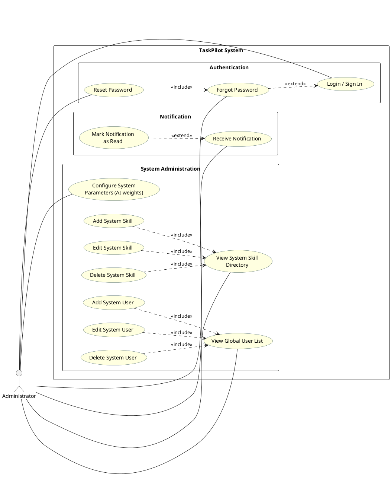

# Use Case Diagram - Administrator

```plantuml
@startuml
left to right direction
skinparam packageStyle rectangle
skinparam usecase {
  BackgroundColor LightYellow
  BorderColor DarkSlateGray
}

actor "Administrator" as AD

rectangle "TaskPilot System" {

  package "Authentication" {
    usecase "Login / Sign In" as UC_LOGIN
    usecase "Forgot Password" as UC_FORGOT
    usecase "Reset Password" as UC_RESET
  }

  package "System Administration" {
    usecase "Configure System\nParameters (AI weights)" as UC_CFG
    usecase "View System Skill\nDirectory" as UC_VIEW_SK
    usecase "Add System Skill" as UC_ADD_SK
    usecase "Edit System Skill" as UC_EDIT_SK
    usecase "Delete System Skill" as UC_DEL_SK
    usecase "View Global User List" as UC_VIEW_US
    usecase "Add System User" as UC_ADD_US
    usecase "Edit System User" as UC_EDIT_US
    usecase "Delete System User" as UC_DEL_US
  }

  package "Notification" {
    usecase "Receive Notification" as UC_NOTI
    usecase "Mark Notification\nas Read" as UC_MARK
  }

  ' === Include ===
  UC_RESET ..> UC_FORGOT : <<include>>
  UC_ADD_SK ..> UC_VIEW_SK : <<include>>
  UC_EDIT_SK ..> UC_VIEW_SK : <<include>>
  UC_DEL_SK ..> UC_VIEW_SK : <<include>>
  UC_ADD_US ..> UC_VIEW_US : <<include>>
  UC_EDIT_US ..> UC_VIEW_US : <<include>>
  UC_DEL_US ..> UC_VIEW_US : <<include>>

  ' === Extend ===
  UC_FORGOT ..> UC_LOGIN : <<extend>>
  UC_MARK ..> UC_NOTI : <<extend>>
}

AD -- UC_LOGIN
AD -- UC_FORGOT
AD -- UC_RESET
AD -- UC_CFG
AD -- UC_VIEW_SK
AD -- UC_VIEW_US
AD -- UC_NOTI

@enduml
```

<!-- diagram id="use-case-admin" -->
