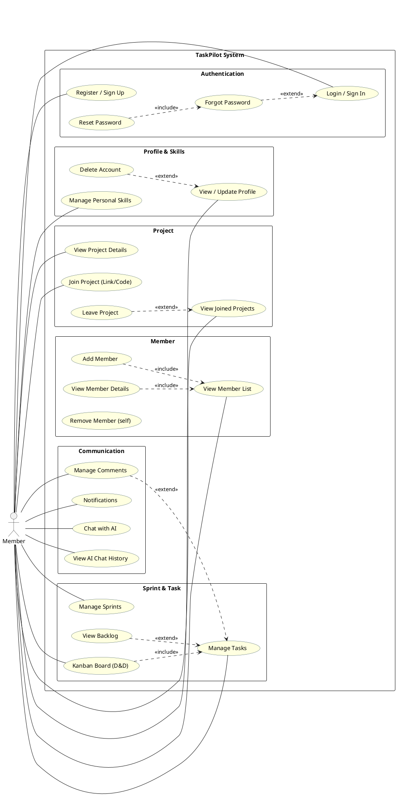

# Use Case Diagram - Project Member

```plantuml
@startuml
left to right direction
skinparam packageStyle rectangle
skinparam usecase {
  BackgroundColor LightYellow
  BorderColor DarkSlateGray
}

actor "Member" as MEM

rectangle "TaskPilot System" {

  package "Authentication" {
    usecase "Login / Sign In" as UC_LOGIN
    usecase "Register / Sign Up" as UC_REG
    usecase "Forgot Password" as UC_FORGOT
    usecase "Reset Password" as UC_RESET
  }

  package "Profile & Skills" {
    usecase "View / Update Profile" as UC_PROFILE
    usecase "Delete Account" as UC_DEL_ACC
    usecase "Manage Personal Skills" as UC_SKILLS
  }

  package "Project" {
    usecase "View Joined Projects" as UC_VIEW_P
    usecase "View Project Details" as UC_DETAIL_P
    usecase "Join Project (Link/Code)" as UC_JOIN_P
    usecase "Leave Project" as UC_LEAVE_P
  }

  package "Member" {
    usecase "View Member List" as UC_VIEW_M
    usecase "View Member Details" as UC_DETAIL_M
    usecase "Add Member" as UC_ADD_M
    usecase "Remove Member (self)" as UC_REMOVE_M
  }

  package "Sprint & Task" {
    usecase "Manage Sprints" as UC_SPRINT
    usecase "Manage Tasks" as UC_TASK
    usecase "Kanban Board (D&D)" as UC_KANBAN
    usecase "View Backlog" as UC_BACKLOG
  }

  package "Communication" {
    usecase "Manage Comments" as UC_COMMENT
    usecase "Notifications" as UC_NOTI
    usecase "Chat with AI" as UC_CHAT
    usecase "View AI Chat History" as UC_HISTORY
  }

  ' === Include ===
  UC_RESET ..> UC_FORGOT : <<include>>
  UC_KANBAN ..> UC_TASK : <<include>>
  UC_DETAIL_M ..> UC_VIEW_M : <<include>>
  UC_ADD_M ..> UC_VIEW_M : <<include>>

  ' === Extend ===
  UC_FORGOT ..> UC_LOGIN : <<extend>>
  UC_DEL_ACC ..> UC_PROFILE : <<extend>>
  UC_LEAVE_P ..> UC_VIEW_P : <<extend>>
  UC_COMMENT ..> UC_TASK : <<extend>>
  UC_BACKLOG ..> UC_TASK : <<extend>>
}

MEM -- UC_LOGIN
MEM -- UC_REG
MEM -- UC_PROFILE
MEM -- UC_SKILLS
MEM -- UC_VIEW_P
MEM -- UC_DETAIL_P
MEM -- UC_JOIN_P
MEM -- UC_VIEW_M
MEM -- UC_SPRINT
MEM -- UC_TASK
MEM -- UC_KANBAN
MEM -- UC_COMMENT
MEM -- UC_NOTI
MEM -- UC_CHAT
MEM -- UC_HISTORY

@enduml
```

<!-- diagram id="use-case-member" -->
