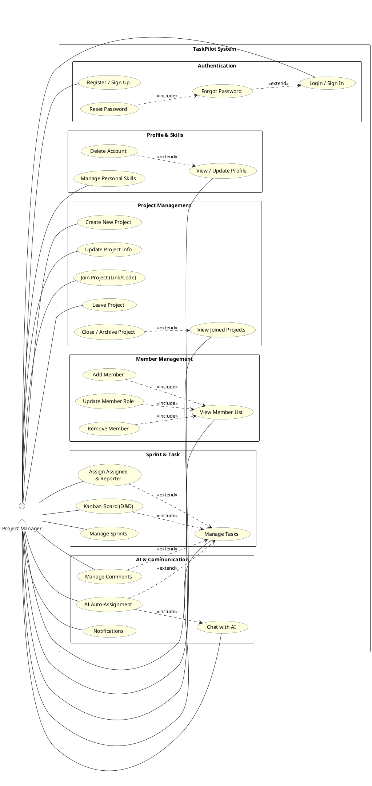

# Use Case Diagram - Project Manager

```plantuml
@startuml
left to right direction
skinparam packageStyle rectangle
skinparam usecase {
  BackgroundColor LightYellow
  BorderColor DarkSlateGray
}

actor "Project Manager" as PM

rectangle "TaskPilot System" {

  package "Authentication" {
    usecase "Login / Sign In" as UC_LOGIN
    usecase "Register / Sign Up" as UC_REG
    usecase "Forgot Password" as UC_FORGOT
    usecase "Reset Password" as UC_RESET
  }

  package "Profile & Skills" {
    usecase "View / Update Profile" as UC_PROFILE
    usecase "Delete Account" as UC_DEL_ACC
    usecase "Manage Personal Skills" as UC_SKILLS
  }

  package "Project Management" {
    usecase "Create New Project" as UC_CREATE_P
    usecase "View Joined Projects" as UC_VIEW_P
    usecase "Update Project Info" as UC_UPDATE_P
    usecase "Join Project (Link/Code)" as UC_JOIN_P
    usecase "Leave Project" as UC_LEAVE_P
    usecase "Close / Archive Project" as UC_CLOSE_P
  }

  package "Member Management" {
    usecase "View Member List" as UC_VIEW_M
    usecase "Add Member" as UC_ADD_M
    usecase "Update Member Role" as UC_ROLE_M
    usecase "Remove Member" as UC_DEL_M
  }

  package "Sprint & Task" {
    usecase "Manage Sprints" as UC_SPRINT
    usecase "Manage Tasks" as UC_TASK
    usecase "Kanban Board (D&D)" as UC_KANBAN
    usecase "Assign Assignee\n& Reporter" as UC_ASSIGN
  }

  package "AI & Communication" {
    usecase "Chat with AI" as UC_CHAT
    usecase "AI Auto-Assignment" as UC_AI
    usecase "Manage Comments" as UC_COMMENT
    usecase "Notifications" as UC_NOTI
  }

  ' === Include ===
  UC_RESET ..> UC_FORGOT : <<include>>
  UC_KANBAN ..> UC_TASK : <<include>>
  UC_AI ..> UC_CHAT : <<include>>
  UC_ADD_M ..> UC_VIEW_M : <<include>>
  UC_ROLE_M ..> UC_VIEW_M : <<include>>
  UC_DEL_M ..> UC_VIEW_M : <<include>>

  ' === Extend ===
  UC_FORGOT ..> UC_LOGIN : <<extend>>
  UC_DEL_ACC ..> UC_PROFILE : <<extend>>
  UC_CLOSE_P ..> UC_VIEW_P : <<extend>>
  UC_ASSIGN ..> UC_TASK : <<extend>>
  UC_AI ..> UC_TASK : <<extend>>
  UC_COMMENT ..> UC_TASK : <<extend>>
}

PM -- UC_LOGIN
PM -- UC_REG
PM -- UC_PROFILE
PM -- UC_SKILLS
PM -- UC_CREATE_P
PM -- UC_VIEW_P
PM -- UC_UPDATE_P
PM -- UC_JOIN_P
PM -- UC_LEAVE_P
PM -- UC_VIEW_M
PM -- UC_SPRINT
PM -- UC_TASK
PM -- UC_KANBAN
PM -- UC_ASSIGN
PM -- UC_CHAT
PM -- UC_AI
PM -- UC_COMMENT
PM -- UC_NOTI

@enduml
```

<!-- diagram id="use-case-project-manager" -->
