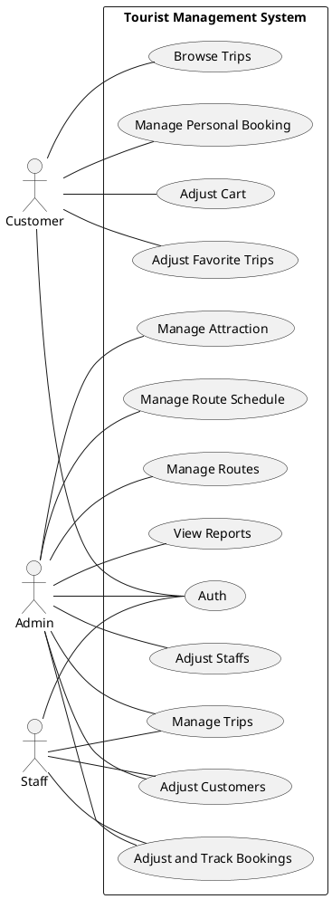

# Use Case System

```plantuml
@startuml
left to right direction
actor Customer
actor Admin
actor Staff

rectangle "Tourist Management System" {
  usecase UC01 as "Manage Personal Booking"
  usecase UC02 as "Adjust Cart"
  usecase UC03 as "Adjust Favorite Trips"
  usecase UC04 as "Browse Trips"
  usecase UC05 as "Manage Attraction"
  usecase UC06 as "Adjust and Track Bookings"
  usecase UC07 as "Manage Route Schedule"
  usecase UC08 as "Manage Routes"
  usecase UC09 as "Manage Trips"
  usecase UC10 as "Auth"
  usecase UC11 as "View Reports"
  usecase UC12 as "Adjust Customers"
  usecase UC13 as "Adjust Staffs"
}

Customer -- UC01
Customer -- UC02
Customer -- UC03
Customer -- UC04
Customer -- UC10

Admin -- UC05
Admin -- UC06
Admin -- UC07
Admin -- UC08
Admin -- UC09
Admin -- UC11
Admin -- UC12
Admin -- UC13
Admin -- UC10

Staff -- UC09
Staff -- UC06
Staff -- UC10
Staff -- UC12


@enduml
```

<!-- diagram id="use-case-staff" -->
