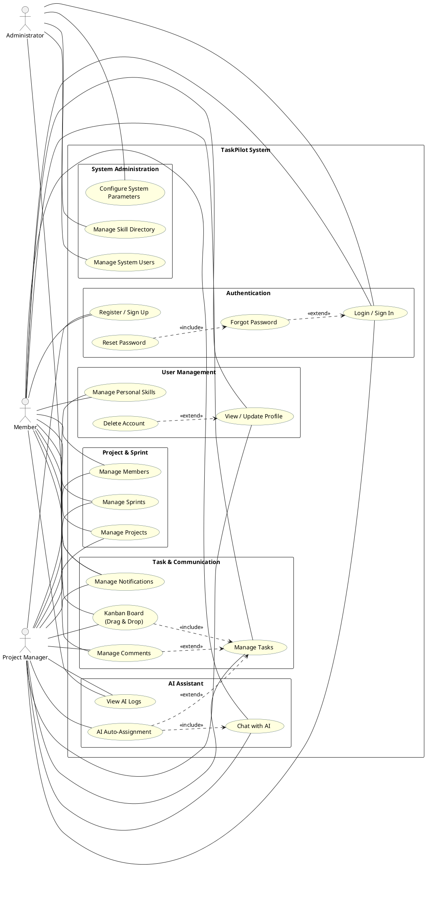

# Use Case Diagram - TaskPilot System (Tổng quan)

```plantuml
@startuml
left to right direction
skinparam packageStyle rectangle
skinparam usecase {
  BackgroundColor LightYellow
  BorderColor DarkSlateGray
}

actor "Project Manager" as PM
actor "Member" as MEM
actor "Administrator" as AD

rectangle "TaskPilot System" {

  package "Authentication" {
    usecase "Login / Sign In" as UC_LOGIN
    usecase "Register / Sign Up" as UC_REG
    usecase "Forgot Password" as UC_FORGOT
    usecase "Reset Password" as UC_RESET
  }

  package "User Management" {
    usecase "View / Update Profile" as UC_PROFILE
    usecase "Manage Personal Skills" as UC_SKILLS
    usecase "Delete Account" as UC_DEL_ACC
  }

  package "System Administration" {
    usecase "Configure System\nParameters" as UC_SYS_CFG
    usecase "Manage Skill Directory" as UC_SYS_SKILL
    usecase "Manage System Users" as UC_SYS_USER
  }

  package "Project & Sprint" {
    usecase "Manage Projects" as UC_PROJECT
    usecase "Manage Members" as UC_MEMBER
    usecase "Manage Sprints" as UC_SPRINT
  }

  package "Task & Communication" {
    usecase "Manage Tasks" as UC_TASK
    usecase "Kanban Board\n(Drag & Drop)" as UC_KANBAN
    usecase "Manage Comments" as UC_COMMENT
    usecase "Manage Notifications" as UC_NOTI
  }

  package "AI Assistant" {
    usecase "Chat with AI" as UC_AI_CHAT
    usecase "AI Auto-Assignment" as UC_AI_ASSIGN
    usecase "View AI Logs" as UC_AI_LOG
  }

  ' === Include relationships ===
  UC_RESET ..> UC_FORGOT : <<include>>
  UC_AI_ASSIGN ..> UC_AI_CHAT : <<include>>
  UC_KANBAN ..> UC_TASK : <<include>>

  ' === Extend relationships ===
  UC_FORGOT ..> UC_LOGIN : <<extend>>
  UC_DEL_ACC ..> UC_PROFILE : <<extend>>
  UC_AI_ASSIGN ..> UC_TASK : <<extend>>
  UC_COMMENT ..> UC_TASK : <<extend>>
}

' === Actor associations ===
AD -- UC_LOGIN
AD -- UC_SYS_CFG
AD -- UC_SYS_SKILL
AD -- UC_SYS_USER
AD -- UC_NOTI

PM -- UC_LOGIN
PM -- UC_REG
PM -- UC_PROFILE
PM -- UC_SKILLS
PM -- UC_PROJECT
PM -- UC_MEMBER
PM -- UC_SPRINT
PM -- UC_TASK
PM -- UC_KANBAN
PM -- UC_COMMENT
PM -- UC_NOTI
PM -- UC_AI_CHAT
PM -- UC_AI_ASSIGN
PM -- UC_AI_LOG

MEM -- UC_LOGIN
MEM -- UC_REG
MEM -- UC_PROFILE
MEM -- UC_SKILLS
MEM -- UC_PROJECT
MEM -- UC_MEMBER
MEM -- UC_SPRINT
MEM -- UC_TASK
MEM -- UC_KANBAN
MEM -- UC_COMMENT
MEM -- UC_NOTI
MEM -- UC_AI_CHAT
MEM -- UC_AI_LOG

@enduml
```

<!-- diagram id="use-case-system" -->
