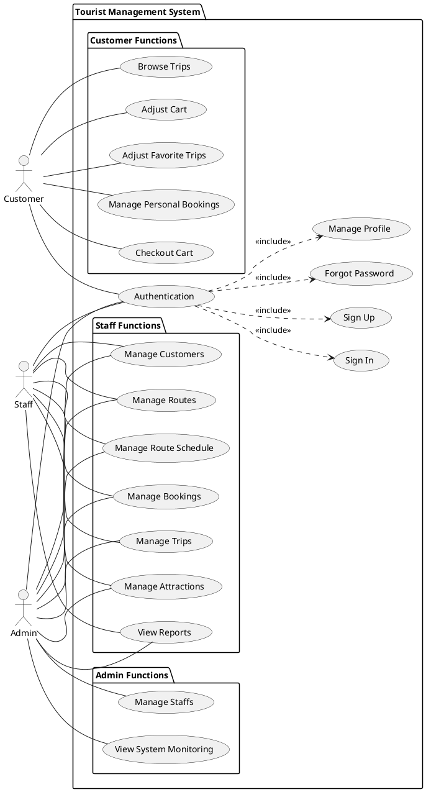

# Use Case System - Tourist Management System

<!-- diagram id="use-case-system" -->

## Description

This diagram shows the complete system overview of the Tourist Management System with all actors and their primary use cases.

### Actors

1. **Customer** - End users who browse and book trips
2. **Staff** - Tourism company employees who manage operations
3. **Admin** - System administrators with full access

### Main Use Case Groups

#### Authentication (All Users)

- Sign In
- Sign Up (Customer only)
- Forgot Password
- Manage Profile

#### Customer Functions

- **Browse Trips** - Search and view available trips
- **Adjust Cart** - Manage shopping cart items
- **Adjust Favorite Trips** - Save favorite trips for later
- **Manage Personal Bookings** - View and manage own bookings
- **Checkout Cart** - Complete booking from cart

#### Staff Functions

- **Manage Routes** - CRUD operations on route templates
- **Manage Route Schedule** - Add/edit/delete attractions in routes (Admin only for add/edit/delete)
- **Manage Attractions** - CRUD operations on attractions (Admin for create)
- **Manage Trips** - Create and manage scheduled trips
- **Manage Bookings** - Handle all customer bookings
- **Manage Customers** - Customer account management
- **View Reports** - Booking, customer, and revenue reports

#### Admin Functions

- **Manage Staffs** - Staff account management (Admin only)
- **View System Monitoring** - System performance and usage monitoring
- All Staff functions are also available to Admin

### Notes

- Admin inherits all Staff permissions plus exclusive admin functions
- Customer functions are isolated from staff operations
- Authentication is required for all actors to access the system
