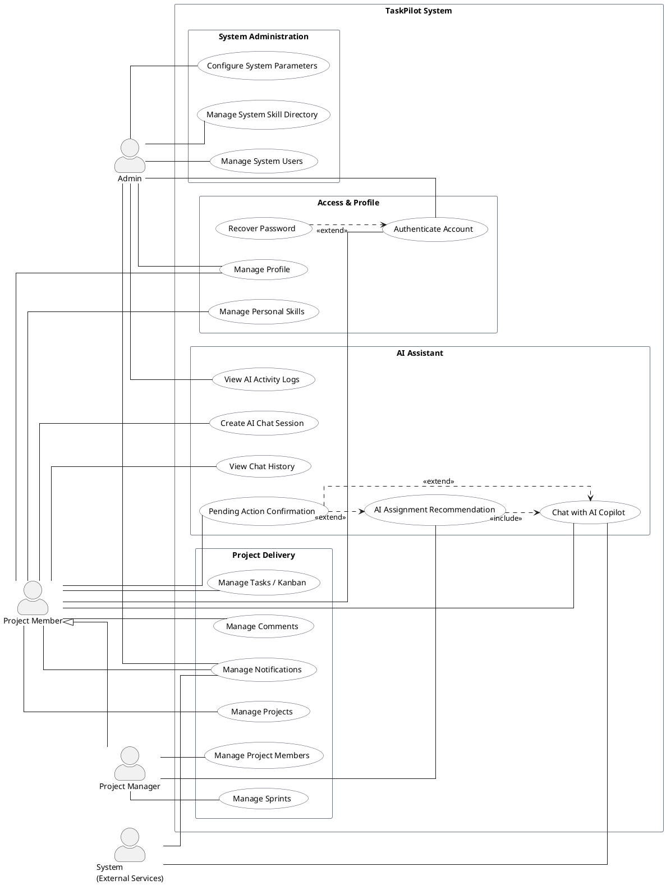

# Use Case Diagram - System Overview

```plantuml
@startuml
left to right direction
skinparam shadowing false
skinparam packageStyle rectangle
skinparam linetype ortho
skinparam actorStyle awesome
skinparam usecase {
  BackgroundColor white
  BorderColor #374151
}
skinparam rectangle {
  BorderColor #6B7280
}

actor "Admin" as AD
actor "Project Member" as MB
actor "Project Manager" as PM
actor "System\n(External Services)" as SYS

MB <|-- PM

rectangle "TaskPilot System" {

  package "System Administration" {
    usecase "Configure System Parameters" as U_Config
    usecase "Manage System Skill Directory" as U_SkillDir
    usecase "Manage System Users" as U_SysUsers
  }
  
  package "Access & Profile" {
    usecase "Authenticate Account" as U_Auth
    usecase "Recover Password" as U_Recovery
    usecase "Manage Profile" as U_Profile
    usecase "Manage Personal Skills" as U_PSkills
  }

  package "Project Delivery" {
    usecase "Manage Projects" as U_Projects
    usecase "Manage Project Members" as U_Members
    usecase "Manage Sprints" as U_Sprints
    usecase "Manage Tasks / Kanban" as U_Tasks
    usecase "Manage Comments" as U_Comments
    usecase "Manage Notifications" as U_Noti
  }

  package "AI Assistant" {
    usecase "Create AI Chat Session" as U_AI_Session
    usecase "Chat with AI Copilot" as U_AI_Chat
    usecase "View Chat History" as U_AI_History
    usecase "View AI Activity Logs" as U_AI_Logs
    usecase "AI Assignment Recommendation" as U_AI_Assign
    usecase "Pending Action Confirmation" as U_AI_Pending
  }
}

U_Recovery ..> U_Auth : <<extend>>
U_AI_Assign ..> U_AI_Chat : <<include>>
U_AI_Pending ..> U_AI_Chat : <<extend>>
U_AI_Pending ..> U_AI_Assign : <<extend>>

AD -- U_Config
AD -- U_SkillDir
AD -- U_SysUsers
AD -- U_Auth
AD -- U_Profile
AD -- U_AI_Logs
AD -- U_Noti

MB -- U_Auth
MB -- U_Profile
MB -- U_PSkills
MB -- U_Projects
MB -- U_Tasks
MB -- U_Comments
MB -- U_Noti
MB -- U_AI_Session
MB -- U_AI_Chat
MB -- U_AI_History
MB -- U_AI_Pending

PM -- U_Members
PM -- U_Sprints
PM -- U_AI_Assign

SYS -- U_Noti
SYS -- U_AI_Chat
@enduml
```

<!-- diagram id="use-case-system-overview" -->
